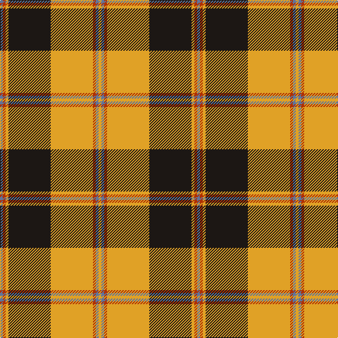

In pattern [BRYKYRBY](/patterns/brykyrby/).

This was sourced from register-of-tartans.  It is a [8 stripes tartan](/stripes/stripes8/).

Original link https://www.tartanregister.gov.uk/tartanDetails.aspx?ref=11503

## Thread count
B/4 R4 Y4 K60 Y60 R4 B4 Y/4

## Palette
Each colour and its ΔE from the base-6 reference it is a variant of.

| Colour | Shade | Base | ΔE (OKLab) |
|---|---|---|---|
| B | <code style="background-color:#5F749C;">#5F749C</code> `#5F749C` | B <code style="background-color:#2A418A;">#2A418A</code> | 0.17 |
| K | <code style="background-color:#1C1714;">#1C1714</code> `#1C1714` | K <code style="background-color:#000000;">#000000</code> | 0.21 |
| R | <code style="background-color:#B03000;">#B03000</code> `#B03000` | R <code style="background-color:#CC0000;">#CC0000</code> | 0.06 |
| Y | <code style="background-color:#E0A126;">#E0A126</code> `#E0A126` | Y <code style="background-color:#F2BF00;">#F2BF00</code> | 0.08 |

# Sample pattern

## Nearest tartans

The nearest existing variants by ΔTartan distance.

1. [Brisbane (Artefact)](/setts/s8/g18w3y1r2y1r3y1r10~g006818-rc80000-wffffff-ye8c000~x4/) — ΔT 1.04
1. [Unidentified (ex Tony Murray)](/setts/s7/r2w10k15y36w2k2w2~k101010-rc80000-we8ccb8-ya08858~x2/) — ΔT 1.09
1. [Scrymgeour](/setts/s7/r15k1y2b3r2k1y15~b000052-k000000-raa0000-yaaaa00~x6/) — ΔT 1.10
1. [Scrymgeour](/setts/s7/r15k1y2b3r2k1y15~b000052-k000000-raa0000-yaaaa00~x3/) — ΔT 1.10
1. [Fort William (Fashion)](/setts/s11/r10w2y3w2b24w4b4r34b2w3b2~b381c0c-rb07430-w94acfc-y38c438~x2/) — ΔT 1.19
1. [Merrick, Camel](/setts/s7/r1w5k8ra18w1k1w1~k101010-rc80000-raa07c58-wc0c0c0~x4/) — ΔT 1.19
1. [Braemar or Blair Atholl](/setts/s8/b2w2k6b3k2r14k1r1~b441800-k101010-ra07c58-wffffff~x4/) — ΔT 1.21
1. [Vaughan (Welsh Series)](/setts/s11/w2k35g30k3y30k2y4k2y30k3w2~g00643c-k101010-wfcfcfc-ydc943c/) — ΔT 1.23
1. [Atlas Textile (Corporate)](/setts/s8/w1y1k1y12k12y1k1y1~k101010-we0e0e0-yd87c00~x4/) — ΔT 1.25
1. [Wilson's No.005](/setts/s10/g5r4g17w5r32w5g17r4g5wa2~g044028-rc80000-w00fcfc-wafcfcfc~x2/) — ΔT 1.29

## Neighbour map

Every grey dot is one of 15726 variants placed by the first two principal components of the ΔTartan feature space (44% of its variance). Red is this tartan; blue dots are its nearest — click one to open its page.

<svg viewBox="0 0 640 380" role="img" style="max-width:100%;height:auto;border:1px solid #e0e0e0;border-radius:4px;display:block" xmlns="http://www.w3.org/2000/svg"><image href="/nn/cloud.v1.png" width="640" height="380"/><a href="/setts/s8/g18w3y1r2y1r3y1r10~g006818-rc80000-wffffff-ye8c000~x4/"><circle cx="281.6" cy="140.8" r="4" fill="#3465a4"><title>Brisbane (Artefact)</title></circle></a><a href="/setts/s7/r2w10k15y36w2k2w2~k101010-rc80000-we8ccb8-ya08858~x2/"><circle cx="290.7" cy="141.8" r="4" fill="#3465a4"><title>Unidentified (ex Tony Murray)</title></circle></a><a href="/setts/s7/r15k1y2b3r2k1y15~b000052-k000000-raa0000-yaaaa00~x6/"><circle cx="266.2" cy="153.6" r="4" fill="#3465a4"><title>Scrymgeour</title></circle></a><a href="/setts/s7/r15k1y2b3r2k1y15~b000052-k000000-raa0000-yaaaa00~x3/"><circle cx="266.2" cy="153.6" r="4" fill="#3465a4"><title>Scrymgeour</title></circle></a><a href="/setts/s11/r10w2y3w2b24w4b4r34b2w3b2~b381c0c-rb07430-w94acfc-y38c438~x2/"><circle cx="297.0" cy="128.7" r="4" fill="#3465a4"><title>Fort William (Fashion)</title></circle></a><a href="/setts/s7/r1w5k8ra18w1k1w1~k101010-rc80000-raa07c58-wc0c0c0~x4/"><circle cx="293.7" cy="146.0" r="4" fill="#3465a4"><title>Merrick, Camel</title></circle></a><a href="/setts/s8/b2w2k6b3k2r14k1r1~b441800-k101010-ra07c58-wffffff~x4/"><circle cx="254.5" cy="157.5" r="4" fill="#3465a4"><title>Braemar or Blair Atholl</title></circle></a><a href="/setts/s11/w2k35g30k3y30k2y4k2y30k3w2~g00643c-k101010-wfcfcfc-ydc943c/"><circle cx="233.5" cy="131.4" r="4" fill="#3465a4"><title>Vaughan (Welsh Series)</title></circle></a><a href="/setts/s8/w1y1k1y12k12y1k1y1~k101010-we0e0e0-yd87c00~x4/"><circle cx="323.4" cy="166.1" r="4" fill="#3465a4"><title>Atlas Textile (Corporate)</title></circle></a><a href="/setts/s10/g5r4g17w5r32w5g17r4g5wa2~g044028-rc80000-w00fcfc-wafcfcfc~x2/"><circle cx="260.1" cy="151.7" r="4" fill="#3465a4"><title>Wilson's No.005</title></circle></a><circle cx="282.4" cy="133.9" r="5" fill="#c00000"/></svg>

ID: /setts/s8/b1r1y1k15y15r1b1y1~b5f749c-k1c1714-rb03000-ye0a126~x4/
