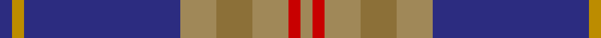

In pattern [BYBYGYRY](/patterns/bybygyry/).

This was sourced from register-of-tartans.  It is a [8 stripes tartan](/stripes/stripes8/).

Original link https://www.tartanregister.gov.uk/tartanDetails.aspx?ref=1385

## Attestations

This cloth appears in 2 source records; the oldest owns this page.

- 01/04/2004 — Glen Moray (register-of-tartans, [record](https://www.tartanregister.gov.uk/tartanDetails.aspx?ref=1385))
- Apr 2004 — Glen Moray (Corporate) (tartans-authority, [record](http://www.tartansauthority.com/tartan-ferret/display/6249/))

## Thread count
DB/4 DY4 DB52 LTa12 LT12 LTa12 R4 LTa/4

## Palette
Each colour and its ΔE from the base-6 reference it is a variant of.

| Colour | Shade | Base | ΔE (OKLab) |
|---|---|---|---|
| DB | <code style="background-color:#2C2C80;">#2C2C80</code> `#2C2C80` | B <code style="background-color:#2A418A;">#2A418A</code> | 0.06 |
| DY | <code style="background-color:#BC8C00;">#BC8C00</code> `#BC8C00` | Y <code style="background-color:#F2BF00;">#F2BF00</code> | 0.16 |
| LT | <code style="background-color:#8C7038;">#8C7038</code> `#8C7038` | G <code style="background-color:#006100;">#006100</code> | 0.18 |
| LTa | <code style="background-color:#A08858;">#A08858</code> `#A08858` | Y <code style="background-color:#F2BF00;">#F2BF00</code> | 0.21 |
| R | <code style="background-color:#C80000;">#C80000</code> `#C80000` | R <code style="background-color:#CC0000;">#CC0000</code> | 0.01 |

# Sample pattern

## Nearest tartans

The nearest existing variants by ΔTartan distance.

1. [Falkirk](/setts/s12/b8r27y2ra3y2r27b22k2b4k2b4k4~b304080-k000000-r806050-rac00000-yf0c000~x2/) — ΔT 1.06
1. [Burt #2 (Name)](/setts/s9/b8w2k8g12r2b3r2b24r2~b2c2c80-g006818-k101010-rc80000-we0e0e0~x2/) — ΔT 1.06
1. [St. Leonards (Corporate)](/setts/s8/r16b2ra6r3k4ba2b40ba6~b2c2c80-ba2888c4-k101010-rc80000-ra888888~x2/) — ΔT 1.09
1. [International Pairs (Corporate)](/setts/s10/b34y6g6r2w2r2g10y8b23w2~b2c2c80-g007460-rc80000-we0e0e0-ybc8c00~x2/) — ΔT 1.14
1. [Keogh (Name)](/setts/s10/r4b18r4ba3r4k12r3b24k2y3~b1474b4-ba5c8ca8-k101010-rc80000-yfccc00~x2/) — ΔT 1.16
1. [Kelvinside Academy (School)](/setts/s8/w4g15b8k4b28k2b4w2~b3c3c68-g6c6c6c-k101010-we0e0e0/) — ΔT 1.19
1. [Unnamed C20th - USA](/setts/s7/b2y1b18g7r7b1g1~b2c2c80-g006818-rc80000-ye8c000~x2/) — ΔT 1.20
1. [Reese (Personal)](/setts/s6/r4g2r2k5b22w2~b003c64-g006818-k101010-rc80000-we0e0e0~x4/) — ΔT 1.23
1. [Moorpark Primary School (Corporate)](/setts/s8/b3ba10b3k3w10r4ba28k2~b1c0070-ba506878-k101010-rc8002c-we0e0e0~x2/) — ΔT 1.24
1. [Singh](/setts/s8/b3r3b34g18y2g18w2r3~b6c0070-g006818-r880000-wc0c0c0-yd09800~x2/) — ΔT 1.24

## Neighbour map

Every grey dot is one of 15726 variants placed by the first two principal components of the ΔTartan feature space (44% of its variance). Red is this tartan; blue dots are its nearest — click one to open its page.

<svg viewBox="0 0 640 380" role="img" style="max-width:100%;height:auto;border:1px solid #e0e0e0;border-radius:4px;display:block" xmlns="http://www.w3.org/2000/svg"><image href="/nn/cloud.v1.png" width="640" height="380"/><a href="/setts/s12/b8r27y2ra3y2r27b22k2b4k2b4k4~b304080-k000000-r806050-rac00000-yf0c000~x2/"><circle cx="290.1" cy="143.9" r="4" fill="#3465a4"><title>Falkirk</title></circle></a><a href="/setts/s9/b8w2k8g12r2b3r2b24r2~b2c2c80-g006818-k101010-rc80000-we0e0e0~x2/"><circle cx="285.2" cy="169.2" r="4" fill="#3465a4"><title>Burt #2 (Name)</title></circle></a><a href="/setts/s8/r16b2ra6r3k4ba2b40ba6~b2c2c80-ba2888c4-k101010-rc80000-ra888888~x2/"><circle cx="316.8" cy="134.7" r="4" fill="#3465a4"><title>St. Leonards (Corporate)</title></circle></a><a href="/setts/s10/b34y6g6r2w2r2g10y8b23w2~b2c2c80-g007460-rc80000-we0e0e0-ybc8c00~x2/"><circle cx="321.8" cy="142.3" r="4" fill="#3465a4"><title>International Pairs (Corporate)</title></circle></a><a href="/setts/s10/r4b18r4ba3r4k12r3b24k2y3~b1474b4-ba5c8ca8-k101010-rc80000-yfccc00~x2/"><circle cx="256.6" cy="154.5" r="4" fill="#3465a4"><title>Keogh (Name)</title></circle></a><a href="/setts/s8/w4g15b8k4b28k2b4w2~b3c3c68-g6c6c6c-k101010-we0e0e0/"><circle cx="350.0" cy="185.2" r="4" fill="#3465a4"><title>Kelvinside Academy (School)</title></circle></a><a href="/setts/s7/b2y1b18g7r7b1g1~b2c2c80-g006818-rc80000-ye8c000~x2/"><circle cx="348.4" cy="172.5" r="4" fill="#3465a4"><title>Unnamed C20th - USA</title></circle></a><a href="/setts/s6/r4g2r2k5b22w2~b003c64-g006818-k101010-rc80000-we0e0e0~x4/"><circle cx="319.9" cy="176.6" r="4" fill="#3465a4"><title>Reese (Personal)</title></circle></a><a href="/setts/s8/b3ba10b3k3w10r4ba28k2~b1c0070-ba506878-k101010-rc8002c-we0e0e0~x2/"><circle cx="302.3" cy="151.4" r="4" fill="#3465a4"><title>Moorpark Primary School (Corporate)</title></circle></a><a href="/setts/s8/b3r3b34g18y2g18w2r3~b6c0070-g006818-r880000-wc0c0c0-yd09800~x2/"><circle cx="286.5" cy="152.7" r="4" fill="#3465a4"><title>Singh</title></circle></a><circle cx="304.6" cy="155.2" r="5" fill="#c00000"/></svg>

ID: /setts/s8/b1y1b13ya3g3ya3r1ya1~b2c2c80-g8c7038-rc80000-ybc8c00-yaa08858~x4/
