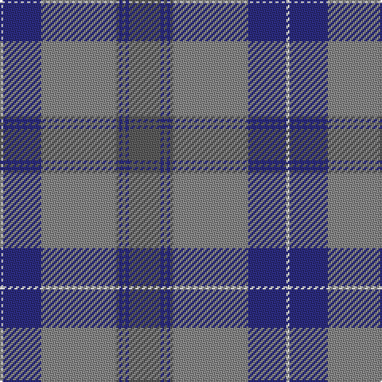

In pattern [BBBBBRBW](/patterns/bbbbbrbw/).

This was sourced from register-of-tartans.  It is a [8 stripes tartan](/stripes/stripes8/).

Original link https://www.tartanregister.gov.uk/tartanDetails.aspx?ref=396

## Attestations

This cloth appears in 2 source records; the oldest owns this page.

- 01/07/2006 — Browne (Personal) (register-of-tartans, [record](https://www.tartanregister.gov.uk/tartanDetails.aspx?ref=396))
- 2006 July — Browne, Thomas (Personal) (tartans-authority, [record](http://www.tartansauthority.com/tartan-ferret/display/6983/))

## Register references

External register numbers recorded for this tartan.

- Scottish Register of Tartans: [396](https://www.tartanregister.gov.uk/tartanDetails.aspx?ref=396)
- Scottish Tartans Authority (ITI): 6983

## Thread count
LN/2 DB24 N47 Na2 DB2 Na2 DB2 Na/20

## Palette
Each colour and its ΔE from the base-6 reference it is a variant of.

| Colour | Shade | Base | ΔE (OKLab) |
|---|---|---|---|
| DB | <code style="background-color:#2C2C80;">#2C2C80</code> `#2C2C80` | B <code style="background-color:#2A418A;">#2A418A</code> | 0.06 |
| LN | <code style="background-color:#E0E0E0;">#E0E0E0</code> `#E0E0E0` | W <code style="background-color:#F7F7F7;">#F7F7F7</code> | 0.07 |
| N | <code style="background-color:#888888;">#888888</code> `#888888` | R <code style="background-color:#CC0000;">#CC0000</code> | 0.24 |
| Na | <code style="background-color:#5C5C5C;">#5C5C5C</code> `#5C5C5C` | B <code style="background-color:#2A418A;">#2A418A</code> | 0.15 |

# Sample pattern

## Nearest tartans

The nearest existing variants by ΔTartan distance.

1. [Historic Scotland (pre 1998) (Corp)](/setts/s9/b4y1b1y3b24r9k1r9k3~b3c405c-k101010-r888888-ya0a0a0~x2/) — ΔT 1.05
1. [U.S. Merchant Marine Academy (Corpo](/setts/s7/r37y2ra6y2r8b49r3~b2c2c80-r888888-ra901c38-ybc8c00~x2/) — ΔT 1.36
1. [Musselburgh](/setts/s9/b14w1b3y2b3w1b4ba24r3~b5480b0-ba304080-rc00000-we0e0e0-yf0c000~x2/) — ΔT 1.37
1. [Royal Deeside (District)](/setts/s6/r4g2b4g35ba27ra3~b1c1c50-ba2888c4-g746440-re87878-rac80000~x2/) — ΔT 1.43
1. [Ailsa, Grey (Fashion)](/setts/s9/r9w9r9b25r1w1r1w1g3~b5c5c5c-g00881c-r888888-we0e0e0~x2/) — ΔT 1.43
1. [Hilton Hotel Hong Kong (Corporate)](/setts/s10/r4g10r2g2r24g2r2g16r2g1~g006818-rb468ac~x2/) — ΔT 1.45
1. [Titanium (Fashion)](/setts/s9/b44r8b8r22w4r4w11r2wa2~b5c5c5c-r888888-wc0c0c0-wae8ccb8~x2/) — ΔT 1.48
1. [Peter of Lee (Personal)](/setts/s8/r3g1k1g12b12k1b1k1~b1474b4-g408060-k101010-rc80000~x4/) — ΔT 1.49
1. [Lawrie](/setts/s7/b6g2b1ga25ba16k2ba4~b700070-ba2c2c84-g784400-ga007040-k101010~x2/) — ΔT 1.50
1. [George (Personal)](/setts/s9/r6b2r1b16r3b16g28w2g4~b2c4084-g005020-rdc0000-we0e0e0~x2/) — ΔT 1.52

## Neighbour map

Every grey dot is one of 15726 variants placed by the first two principal components of the ΔTartan feature space (44% of its variance). Red is this tartan; blue dots are its nearest — click one to open its page.

<svg viewBox="0 0 640 380" role="img" style="max-width:100%;height:auto;border:1px solid #e0e0e0;border-radius:4px;display:block" xmlns="http://www.w3.org/2000/svg"><image href="/nn/cloud.v1.png" width="640" height="380"/><a href="/setts/s9/b4y1b1y3b24r9k1r9k3~b3c405c-k101010-r888888-ya0a0a0~x2/"><circle cx="362.4" cy="157.1" r="4" fill="#3465a4"><title>Historic Scotland (pre 1998) (Corp)</title></circle></a><a href="/setts/s7/r37y2ra6y2r8b49r3~b2c2c80-r888888-ra901c38-ybc8c00~x2/"><circle cx="344.3" cy="159.1" r="4" fill="#3465a4"><title>U.S. Merchant Marine Academy (Corpo</title></circle></a><a href="/setts/s9/b14w1b3y2b3w1b4ba24r3~b5480b0-ba304080-rc00000-we0e0e0-yf0c000~x2/"><circle cx="309.0" cy="134.8" r="4" fill="#3465a4"><title>Musselburgh</title></circle></a><a href="/setts/s6/r4g2b4g35ba27ra3~b1c1c50-ba2888c4-g746440-re87878-rac80000~x2/"><circle cx="340.4" cy="179.7" r="4" fill="#3465a4"><title>Royal Deeside (District)</title></circle></a><a href="/setts/s9/r9w9r9b25r1w1r1w1g3~b5c5c5c-g00881c-r888888-we0e0e0~x2/"><circle cx="296.0" cy="144.0" r="4" fill="#3465a4"><title>Ailsa, Grey (Fashion)</title></circle></a><a href="/setts/s10/r4g10r2g2r24g2r2g16r2g1~g006818-rb468ac~x2/"><circle cx="293.9" cy="129.3" r="4" fill="#3465a4"><title>Hilton Hotel Hong Kong (Corporate)</title></circle></a><a href="/setts/s9/b44r8b8r22w4r4w11r2wa2~b5c5c5c-r888888-wc0c0c0-wae8ccb8~x2/"><circle cx="378.6" cy="172.5" r="4" fill="#3465a4"><title>Titanium (Fashion)</title></circle></a><a href="/setts/s8/r3g1k1g12b12k1b1k1~b1474b4-g408060-k101010-rc80000~x4/"><circle cx="279.5" cy="185.9" r="4" fill="#3465a4"><title>Peter of Lee (Personal)</title></circle></a><a href="/setts/s7/b6g2b1ga25ba16k2ba4~b700070-ba2c2c84-g784400-ga007040-k101010~x2/"><circle cx="308.3" cy="163.9" r="4" fill="#3465a4"><title>Lawrie</title></circle></a><a href="/setts/s9/r6b2r1b16r3b16g28w2g4~b2c4084-g005020-rdc0000-we0e0e0~x2/"><circle cx="314.0" cy="159.8" r="4" fill="#3465a4"><title>George (Personal)</title></circle></a><circle cx="343.4" cy="158.7" r="5" fill="#c00000"/></svg>

ID: /setts/s8/b20ba2b2ba2b2r47ba24w2~b5c5c5c-ba2c2c80-r888888-we0e0e0/
