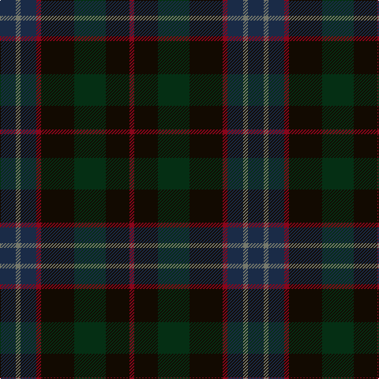

In pattern [BGBRKGKR](/patterns/bgbrkgkr/).

This was sourced from house-of-tartan.  It is a [8 stripes tartan](/stripes/stripes8/).

Original link http://www.house-of-tartan.scotland.net/house/TartanViewjs.asp?colr=Def&tnam=10696

## Thread count
DN/20 N6 DN20 DR6 K42 DG40 K30 DR/6

## Palette
Each colour and its ΔE from the base-6 reference it is a variant of.

| Colour | Shade | Base | ΔE (OKLab) |
|---|---|---|---|
| DG | <code style="background-color:#052F14;">#052F14</code> `#052F14` | G <code style="background-color:#006400;">#006400</code> | 0.19 |
| DN | <code style="background-color:#1A2B47;">#1A2B47</code> `#1A2B47` | B <code style="background-color:#2C4084;">#2C4084</code> | 0.12 |
| DR | <code style="background-color:#89051B;">#89051B</code> `#89051B` | R <code style="background-color:#C80000;">#C80000</code> | 0.14 |
| K | <code style="background-color:#120A01;">#120A01</code> `#120A01` | K <code style="background-color:#000000;">#000000</code> | 0.15 |
| N | <code style="background-color:#75786C;">#75786C</code> `#75786C` | G <code style="background-color:#006400;">#006400</code> | 0.19 |

# Sample pattern

ID: /setts/s8/b20g6b20r6k42ga40k30r6-b1a2b47-g75786c-ga052f14-k120a01-r89051b/
