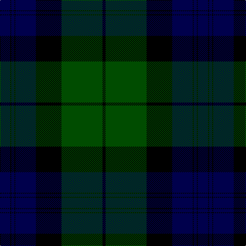

In pattern [BKBKBKGK](/patterns/bkbkbkgk/).

This was sourced from weddslist.  It is a [8 stripes tartan](/stripes/stripes8/).

Original link http://www.weddslist.com/cgi-bin/tartans/pg.pl?source=rb

## Thread count
DB/20 K2 DB6 K2 DB40 K50 G80 K/6

## Palette
Each colour and its ΔE from the base-6 reference it is a variant of.

| Colour | Shade | Base | ΔE (OKLab) |
|---|---|---|---|
| DB | <code style="background-color:#00004C;">#00004C</code> `#00004C` | B <code style="background-color:#2A418A;">#2A418A</code> | 0.21 |
| G | <code style="background-color:#004C00;">#004C00</code> `#004C00` | G <code style="background-color:#006100;">#006100</code> | 0.07 |
| K | <code style="background-color:#000000;">#000000</code> `#000000` | K <code style="background-color:#000000;">#000000</code> | 0.00 |

# Sample pattern

## Nearest tartans

The nearest existing variants by ΔTartan distance.

1. [Kerr Hunting](/setts/s10/g40k2g4k2g6k28b56k2b4k8-b000064-g004c00-k000000/) — ΔT 0.98
1. [Kerr Hunting](/setts/s10/g40k2g4k2g6k28b56k2b4k8-b000052-g11450d-k000000/) — ΔT 1.05
1. [Dundas](/setts/s7/k8b32k24g48r2g4k4-b000052-g11450d-k000000-raa0000/) — ΔT 1.25
1. [Common Kilt](/setts/s8/r6k4b50k56g50k4r2b4-b000048-g044028-k000000-rc80000/) — ΔT 1.28
1. [Dundas](/setts/s7/k8b32k24g48r2g4k4-b000064-g004c00-k000000-rc80000/) — ΔT 1.30
1. [MacThomas](/setts/s9/b2b2r4b42k22g42r4g2g2-b000060-g004c00-k000000-rc80000/) — ΔT 1.54
1. [Common Kilt Tartan Tartan Number: 554. Earliest known date: c. 1790 A version of the Blatck Watch tartan produced by Wilson's of Bannockburn before the widespread use of clan names for tartan. The military Black Watch tartan was also woven with a red stripe. See products available Copyright © Blair Urquhart, Comrie, 2015](/setts/s8/r6k4b50k56g50k4r2b4-b2c2c80-g006818-k101010-rc80000/) — ΔT 1.58
1. [Armstrong](/setts/s10/r6b24k2b2k2b4k24g60k2g4-b000052-g11450d-k000000-raa0000/) — ΔT 1.61
1. [Armstrong](/setts/s10/r3b12k1b1k1b2k12g30k1g2-b000052-g11450d-k000000-raa0000/) — ΔT 1.61
1. [Johnston](/setts/s8/y6g4k2g60b48k4b4k4-b000052-g11450d-k000000-yaaaa00/) — ΔT 1.64

## Neighbour map

Every grey dot is one of 15726 variants placed by the first two principal components of the ΔTartan feature space (44% of its variance). Red is this tartan; blue dots are its nearest — click one to open its page.

<svg viewBox="0 0 640 380" role="img" style="max-width:100%;height:auto;border:1px solid #e0e0e0;border-radius:4px;display:block" xmlns="http://www.w3.org/2000/svg"><image href="/nn/cloud.v1.png" width="640" height="380"/><a href="/setts/s10/g40k2g4k2g6k28b56k2b4k8-b000064-g004c00-k000000/"><circle cx="301.4" cy="165.2" r="4" fill="#3465a4"><title>Kerr Hunting</title></circle></a><a href="/setts/s10/g40k2g4k2g6k28b56k2b4k8-b000052-g11450d-k000000/"><circle cx="316.7" cy="171.6" r="4" fill="#3465a4"><title>Kerr Hunting</title></circle></a><a href="/setts/s7/k8b32k24g48r2g4k4-b000052-g11450d-k000000-raa0000/"><circle cx="284.0" cy="188.5" r="4" fill="#3465a4"><title>Dundas</title></circle></a><a href="/setts/s8/r6k4b50k56g50k4r2b4-b000048-g044028-k000000-rc80000/"><circle cx="268.3" cy="168.9" r="4" fill="#3465a4"><title>Common Kilt</title></circle></a><a href="/setts/s7/k8b32k24g48r2g4k4-b000064-g004c00-k000000-rc80000/"><circle cx="270.3" cy="183.0" r="4" fill="#3465a4"><title>Dundas</title></circle></a><a href="/setts/s9/b2b2r4b42k22g42r4g2g2-b000060-g004c00-k000000-rc80000/"><circle cx="253.3" cy="155.6" r="4" fill="#3465a4"><title>MacThomas</title></circle></a><a href="/setts/s8/r6k4b50k56g50k4r2b4-b2c2c80-g006818-k101010-rc80000/"><circle cx="268.2" cy="162.9" r="4" fill="#3465a4"><title>Common Kilt Tartan Tartan Number: 554. Earliest known date: c. 1790 A version of the Blatck Watch tartan produced by Wilson's of Bannockburn before the widespread use of clan names for tartan. The military Black Watch tartan was also woven with a red stripe. See products available Copyright © Blair Urquhart, Comrie, 2015</title></circle></a><a href="/setts/s10/r6b24k2b2k2b4k24g60k2g4-b000052-g11450d-k000000-raa0000/"><circle cx="332.7" cy="136.8" r="4" fill="#3465a4"><title>Armstrong</title></circle></a><a href="/setts/s10/r3b12k1b1k1b2k12g30k1g2-b000052-g11450d-k000000-raa0000/"><circle cx="332.7" cy="136.8" r="4" fill="#3465a4"><title>Armstrong</title></circle></a><a href="/setts/s8/y6g4k2g60b48k4b4k4-b000052-g11450d-k000000-yaaaa00/"><circle cx="349.2" cy="150.4" r="4" fill="#3465a4"><title>Johnston</title></circle></a><circle cx="308.5" cy="173.8" r="5" fill="#c00000"/></svg>

ID: /setts/s8/b20k2b6k2b40k50g80k6-b00004c-g004c00-k000000/
