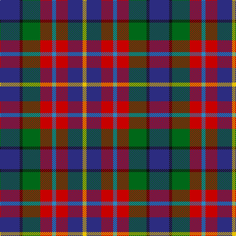

In pattern [BKGRBRBY](/patterns/bkgrbrby/).

This was sourced from tartans-authority.  It is a [8 stripes tartan](/stripes/stripes8/).

Original link http://www.tartansauthority.com/tartan-ferret/display/6693/

## Thread count
DB/40 K6 G36 R24 B8 R24 DB30 Y/8

## Palette
Each colour and its ΔE from the base-6 reference it is a variant of.

| Colour | Shade | Base | ΔE (OKLab) |
|---|---|---|---|
| B | <code style="background-color:#2888C4;">#2888C4</code> `#2888C4` | B <code style="background-color:#2A418A;">#2A418A</code> | 0.21 |
| DB | <code style="background-color:#2C2C80;">#2C2C80</code> `#2C2C80` | B <code style="background-color:#2A418A;">#2A418A</code> | 0.06 |
| G | <code style="background-color:#006818;">#006818</code> `#006818` | G <code style="background-color:#006100;">#006100</code> | 0.02 |
| K | <code style="background-color:#101010;">#101010</code> `#101010` | K <code style="background-color:#000000;">#000000</code> | 0.17 |
| R | <code style="background-color:#C80000;">#C80000</code> `#C80000` | R <code style="background-color:#CC0000;">#CC0000</code> | 0.01 |
| Y | <code style="background-color:#E8C000;">#E8C000</code> `#E8C000` | Y <code style="background-color:#F2BF00;">#F2BF00</code> | 0.02 |

# Sample pattern

## Nearest tartans

The nearest existing variants by ΔTartan distance.

1. [Cherokee](/setts/s8/g4b2g9k4g2r6ba12w2~b5c8ca8-ba1c0070-g408060-k101010-rc80000-wf8f8f8~x2/) — ΔT 1.04
1. [Feis An Eilein (Corporate)](/setts/s7/w2r9b8ra4b8g2y2~b2c2c80-g006818-rc80000-ra880000-w98c8e8-ye8c000~x4/) — ΔT 1.11
1. [Feis An Eilein](/setts/s7/g2r9b8ra4b8ga2y2~b2c4084-g808080-ga005020-rdc0000-ra781c38-ye8c000~x8/) — ΔT 1.13
1. [Wilson's No.229](/setts/s8/g14b11ba3k5ba3b11g14w2~b780078-ba5c8ca8-g285800-k101010-wfcfcfc~x2/) — ΔT 1.17
1. [Reekie (Name)](/setts/s6/k8r12w8g15b30y5~b2c2c80-g006818-k101010-rc80000-we0e0e0-ye8c000~x2/) — ΔT 1.17
1. [Devon Companion](/setts/s7/r5b4y1b4k4g4w1~b2c2c80-g603800-k101010-r888888-wfcfcfc-ye8c000~x4/) — ΔT 1.20
1. [Galway County Crest (Fashion)](/setts/s9/r10b5ba15k3ba15k5ra25k3w4~b2888c4-ba2c2c80-k101010-r888888-ra880000-we0e0e0~x2/) — ΔT 1.20
1. [Devon Companion District Tartan Tartan Number: 1283. Earliest known date: 1984 The Devon Original and Devon Companion owe their origin to the success of the Cornish St Piran sett, which was woven by Coldharbour Mill in the early 1980's. The accreditation certificate was presented to the Mayor of Barnstaple in 1991. In a poem describing the tartan, Miss M. Miles says, "So, in the mind, Devon's beauty is retrieved By contemplating Devon's tartan's weave." See products available Copyright © Blair Urquhart, Comrie, 2015](/setts/s7/r5b4y1b4k4ba4w1~b202060-ba480800-k101010-r888888-we0e0e0-ye8c000~x4/) — ΔT 1.23
1. [Nicolson of Lewis (Clan?)](/setts/s6/b3ba5bb2g5r11w3~b344054-ba003c64-bb5c5c5c-g003820-rc80000-we0e0e0~x4/) — ΔT 1.24
1. [Thom(p)son's, Fancy](/setts/s6/r2ra8b2ba4k4ba1~b304080-ba5480b0-k000000-rc00000-ra806050~x6/) — ΔT 1.25

## Neighbour map

Every grey dot is one of 15726 variants placed by the first two principal components of the ΔTartan feature space (44% of its variance). Red is this tartan; blue dots are its nearest — click one to open its page.

<svg viewBox="0 0 640 380" role="img" style="max-width:100%;height:auto;border:1px solid #e0e0e0;border-radius:4px;display:block" xmlns="http://www.w3.org/2000/svg"><image href="/nn/cloud.v1.png" width="640" height="380"/><a href="/setts/s8/g4b2g9k4g2r6ba12w2~b5c8ca8-ba1c0070-g408060-k101010-rc80000-wf8f8f8~x2/"><circle cx="87.2" cy="189.0" r="4" fill="#3465a4"><title>Cherokee</title></circle></a><a href="/setts/s7/w2r9b8ra4b8g2y2~b2c2c80-g006818-rc80000-ra880000-w98c8e8-ye8c000~x4/"><circle cx="135.9" cy="212.5" r="4" fill="#3465a4"><title>Feis An Eilein (Corporate)</title></circle></a><a href="/setts/s7/g2r9b8ra4b8ga2y2~b2c4084-g808080-ga005020-rdc0000-ra781c38-ye8c000~x8/"><circle cx="150.9" cy="218.4" r="4" fill="#3465a4"><title>Feis An Eilein</title></circle></a><a href="/setts/s8/g14b11ba3k5ba3b11g14w2~b780078-ba5c8ca8-g285800-k101010-wfcfcfc~x2/"><circle cx="181.0" cy="217.0" r="4" fill="#3465a4"><title>Wilson's No.229</title></circle></a><a href="/setts/s6/k8r12w8g15b30y5~b2c2c80-g006818-k101010-rc80000-we0e0e0-ye8c000~x2/"><circle cx="81.4" cy="199.3" r="4" fill="#3465a4"><title>Reekie (Name)</title></circle></a><a href="/setts/s7/r5b4y1b4k4g4w1~b2c2c80-g603800-k101010-r888888-wfcfcfc-ye8c000~x4/"><circle cx="50.0" cy="227.7" r="4" fill="#3465a4"><title>Devon Companion</title></circle></a><a href="/setts/s9/r10b5ba15k3ba15k5ra25k3w4~b2888c4-ba2c2c80-k101010-r888888-ra880000-we0e0e0~x2/"><circle cx="121.9" cy="169.4" r="4" fill="#3465a4"><title>Galway County Crest (Fashion)</title></circle></a><a href="/setts/s7/r5b4y1b4k4ba4w1~b202060-ba480800-k101010-r888888-we0e0e0-ye8c000~x4/"><circle cx="52.3" cy="229.4" r="4" fill="#3465a4"><title>Devon Companion District Tartan Tartan Number: 1283. Earliest known date: 1984 The Devon Original and Devon Companion owe their origin to the success of the Cornish St Piran sett, which was woven by Coldharbour Mill in the early 1980's. The accreditation certificate was presented to the Mayor of Barnstaple in 1991. In a poem describing the tartan, Miss M. Miles says, &quot;So, in the mind, Devon's beauty is retrieved By contemplating Devon's tartan's weave.&quot; See products available Copyright © Blair Urquhart, Comrie, 2015</title></circle></a><a href="/setts/s6/b3ba5bb2g5r11w3~b344054-ba003c64-bb5c5c5c-g003820-rc80000-we0e0e0~x4/"><circle cx="97.9" cy="206.2" r="4" fill="#3465a4"><title>Nicolson of Lewis (Clan?)</title></circle></a><a href="/setts/s6/r2ra8b2ba4k4ba1~b304080-ba5480b0-k000000-rc00000-ra806050~x6/"><circle cx="132.8" cy="210.0" r="4" fill="#3465a4"><title>Thom(p)son's, Fancy</title></circle></a><circle cx="119.2" cy="200.7" r="5" fill="#c00000"/></svg>

ID: /setts/s8/b20k3g18r12ba4r12b15y4~b2c2c80-ba2888c4-g006818-k101010-rc80000-ye8c000~x2/
