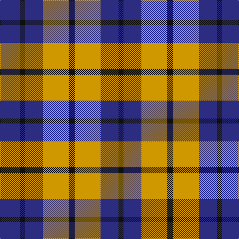

In pattern [BKBYKYBK](/patterns/bkbykybk/).

This was sourced from register-of-tartans.  It is a [8 stripes tartan](/stripes/stripes8/).

Original link https://www.tartanregister.gov.uk/tartanDetails.aspx?ref=1903

## Thread count
DB/40 K10 DB36 DY52 K12 DY52 DB36 K/10

## Palette
Each colour and its ΔE from the base-6 reference it is a variant of.

| Colour | Shade | Base | ΔE (OKLab) |
|---|---|---|---|
| DB | <code style="background-color:#2C2C80;">#2C2C80</code> `#2C2C80` | B <code style="background-color:#2A418A;">#2A418A</code> | 0.06 |
| DBa | <code style="background-color:#1C0070;">#1C0070</code> `#1C0070` | B <code style="background-color:#2A418A;">#2A418A</code> | 0.14 |
| DY | <code style="background-color:#D09800;">#D09800</code> `#D09800` | Y <code style="background-color:#F2BF00;">#F2BF00</code> | 0.12 |
| K | <code style="background-color:#101010;">#101010</code> `#101010` | K <code style="background-color:#000000;">#000000</code> | 0.17 |

# Sample pattern

## Nearest tartans

The nearest existing variants by ΔTartan distance.

1. [Johore Regiment (Military)](/setts/s5/b20k5b18y26k6x2~b2c2c80-k101010-yd09800/) — ΔT 1.14
1. [Jahore](/setts/s5/b20k5b18y26k6x2~b304080-k000000-yf0c000/) — ΔT 1.23
1. [Tyndrum](/setts/s10/r6k1r1k1r2k4y6k1r2k2x8~k101010-r888888-ya08858/) — ΔT 1.29
1. [Tamer of Wolves](/setts/s9/w9b2g8ba6g9ba15g13ba3b4x2~b0000cd-ba666666-g603311-wffffff/) — ΔT 1.34
1. [Fiddes (Artefact)](/setts/s11/b18g5b6r25b6r5b5r6b18r12g16x2~b2c2c80-g289c18-rc80000/) — ΔT 1.34
1. [Canyon County Idaho Sheriff](/setts/s6/k5y5w1y5k5r1x10~k101010-rc80000-wf8f8f8-ya08858/) — ΔT 1.37
1. [Grey Watch Dress (Fashion)](/setts/s8/b12ba2b2ba2b2ba10w12ba3x2~b5c5c5c-ba1c1c1c-we0e0e0/) — ΔT 1.39
1. [Longford County, Crest Range](/setts/s6/w7k6y15k16k8w3x2~k101010-we0e0e0-ybc8c00/) — ΔT 1.41
1. [Glasgow District Tartan Tartan Number: 534. Earliest known date: pre 1992 Originally from the Sindex cards and now woven by House of Edgar in their Old and Rare collection. Need to check if it actually appears in the Old and Rare book. See products available Copyright © Blair Urquhart, Comrie, 2015](/setts/s8/r10g14r3b14r10g14r3b4x2~b2c2c80-g006818-rd46868/) — ΔT 1.42
1. [Little Dress](/setts/s10/k4r4k4r4k4w8k2w8k8y1x4~k101010-rac0040-we0e0e0-yd09800/) — ΔT 1.45

## Neighbour map

Every grey dot is one of 15726 variants placed by the first two principal components of the ΔTartan feature space (44% of its variance). Red is this tartan; blue dots are its nearest — click one to open its page.

<svg viewBox="0 0 640 380" role="img" style="max-width:100%;height:auto;border:1px solid #e0e0e0;border-radius:4px;display:block" xmlns="http://www.w3.org/2000/svg"><image href="/nn/cloud.v1.png" width="640" height="380"/><a href="/setts/s5/b20k5b18y26k6x2~b2c2c80-k101010-yd09800/"><circle cx="224.9" cy="278.8" r="4" fill="#3465a4"><title>Johore Regiment (Military)</title></circle></a><a href="/setts/s5/b20k5b18y26k6x2~b304080-k000000-yf0c000/"><circle cx="203.9" cy="270.8" r="4" fill="#3465a4"><title>Jahore</title></circle></a><a href="/setts/s10/r6k1r1k1r2k4y6k1r2k2x8~k101010-r888888-ya08858/"><circle cx="200.8" cy="225.8" r="4" fill="#3465a4"><title>Tyndrum</title></circle></a><a href="/setts/s9/w9b2g8ba6g9ba15g13ba3b4x2~b0000cd-ba666666-g603311-wffffff/"><circle cx="172.3" cy="223.0" r="4" fill="#3465a4"><title>Tamer of Wolves</title></circle></a><a href="/setts/s11/b18g5b6r25b6r5b5r6b18r12g16x2~b2c2c80-g289c18-rc80000/"><circle cx="205.9" cy="239.2" r="4" fill="#3465a4"><title>Fiddes (Artefact)</title></circle></a><a href="/setts/s6/k5y5w1y5k5r1x10~k101010-rc80000-wf8f8f8-ya08858/"><circle cx="185.2" cy="258.2" r="4" fill="#3465a4"><title>Canyon County Idaho Sheriff</title></circle></a><a href="/setts/s8/b12ba2b2ba2b2ba10w12ba3x2~b5c5c5c-ba1c1c1c-we0e0e0/"><circle cx="169.9" cy="220.2" r="4" fill="#3465a4"><title>Grey Watch Dress (Fashion)</title></circle></a><a href="/setts/s6/w7k6y15k16k8w3x2~k101010-we0e0e0-ybc8c00/"><circle cx="215.8" cy="267.3" r="4" fill="#3465a4"><title>Longford County, Crest Range</title></circle></a><a href="/setts/s8/r10g14r3b14r10g14r3b4x2~b2c2c80-g006818-rd46868/"><circle cx="178.4" cy="272.2" r="4" fill="#3465a4"><title>Glasgow District Tartan Tartan Number: 534. Earliest known date: pre 1992 Originally from the Sindex cards and now woven by House of Edgar in their Old and Rare collection. Need to check if it actually appears in the Old and Rare book. See products available Copyright © Blair Urquhart, Comrie, 2015</title></circle></a><a href="/setts/s10/k4r4k4r4k4w8k2w8k8y1x4~k101010-rac0040-we0e0e0-yd09800/"><circle cx="159.7" cy="208.7" r="4" fill="#3465a4"><title>Little Dress</title></circle></a><circle cx="193.7" cy="255.6" r="5" fill="#c00000"/></svg>

ID: /setts/s8/b20k5b18y26k6y26b18k5x2~b2c2c80-k101010-yd09800/
