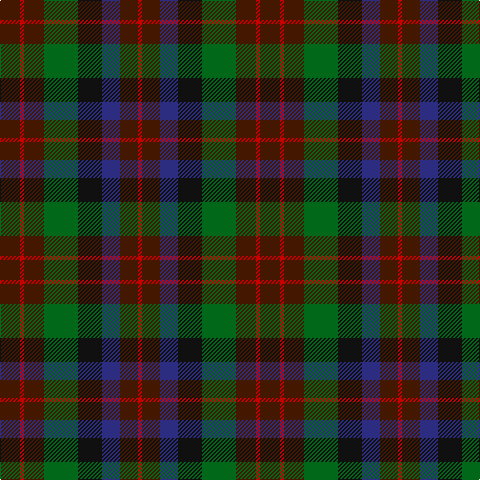

In pattern [BRBGKBBR](/patterns/brbgkbbr/).

This was sourced from register-of-tartans.  It is a [8 stripes tartan](/stripes/stripes8/).

Original link https://www.tartanregister.gov.uk/tartanDetails.aspx?ref=2424

## Attestations

This cloth appears in 2 source records; the oldest owns this page.

- 01/01/1906 — MacDuff Hunting (register-of-tartans, [record](https://www.tartanregister.gov.uk/tartanDetails.aspx?ref=2424))
- pre 1906 — MacDuff Htg - 1906 (Clan) (tartans-authority, [record](http://www.tartansauthority.com/tartan-ferret/display/1654/))

## Thread count
DR/20 R4 DR20 G34 K24 DB18 DR18 R/4

## Palette
Each colour and its ΔE from the base-6 reference it is a variant of.

| Colour | Shade | Base | ΔE (OKLab) |
|---|---|---|---|
| DB | <code style="background-color:#2C2C80;">#2C2C80</code> `#2C2C80` | B <code style="background-color:#2C4084;">#2C4084</code> | 0.05 |
| DR | <code style="background-color:#441800;">#441800</code> `#441800` | B <code style="background-color:#2C4084;">#2C4084</code> | 0.22 |
| G | <code style="background-color:#006818;">#006818</code> `#006818` | G <code style="background-color:#006400;">#006400</code> | 0.02 |
| K | <code style="background-color:#101010;">#101010</code> `#101010` | K <code style="background-color:#000000;">#000000</code> | 0.17 |
| R | <code style="background-color:#C80000;">#C80000</code> `#C80000` | R <code style="background-color:#C80000;">#C80000</code> | 0.00 |

# Sample pattern

## Nearest tartans

The nearest existing variants by ΔTartan distance.

1. [Tennant Family Tartan Tartan Number: 1653. Earliest known date: 1930 MacGregor-Hastie made few notes about his sample collection. In December 1967, Captain Tennant wrote to the Scottish Tartans Society, saying, ".. and I have no objection to other Tennants wearing it (Tennant tartan) but their problem will be to get hold of it ... I don't know of any other Tennant tartan and that is why I think my father designed this one." The head of the Tennant family is Lord Glenconner, descended from John Tennant of Blairston, Ayr. (1635). See products available Copyright © Blair Urquhart, Comrie, 2015](/setts/s7/r4g28b28k28ga28g28r4-b2c2c80-g604000-ga006818-k101010-rc80000/) — ΔT 0.64
1. [MacDuff Hunting Clan Tartan Tartan Number: 1654. Earliest known date: 1906 STS records (sic) 'Sett may be quite wrong. (S.S. May 86)' See products available Copyright © Blair Urquhart, Comrie, 2015](/setts/s8/g16r2g16ga16k16b16g16r4-b2c2c80-g604000-ga006818-k101010-rc80000/) — ΔT 0.87
1. [Tennant (Clan)](/setts/s7/r4g28b28k28ga28g28r4-b1474b4-g604000-ga006818-k101010-rc80000/) — ΔT 1.01
1. [Huntly #3](/setts/s10/g8y4g20k16b20r4b20k16g20y4-b4c3428-g604000-k101010-rb84c00-yb8b8b8/) — ΔT 1.24
1. [Wcwm 1310](/setts/s8/b20r6b20g28k24ba24b28r8-b441800-ba1c0070-g006818-k101010-r880000/) — ΔT 1.28
1. [Longford, County](/setts/s10/b10k6b36g12k12g12ga24r10ga24r6-b202060-g003820-ga604000-k101010-rc80000/) — ΔT 1.34
1. [Dorward/Dogwood](/setts/s7/g14r6g18ga30b38g28r8-b2c2c80-g604000-ga006818-rc80000/) — ΔT 1.36
1. [Gleneagles Group Corporate Tartan Tartan Number: 2107. Earliest known date: 1989 Designed for a range of tartan goods called the Gleneagles Collection. See products available Copyright © Blair Urquhart, Comrie, 2015](/setts/s7/b10g12ga2g12b10ba12b2-b680028-ba2c2c80-g006818-ga604000/) — ΔT 1.36
1. [Unidentified Pinafore](/setts/s7/g48k8g48k48b14r48b14-b3c82af-g005020-k101010-r960028/) — ΔT 1.38
1. [Scottish Parliament (unofficial)](/setts/s7/b28g36k6g36r40k28y6-b1c0070-g006818-k101010-r880000-yd09800/) — ΔT 1.38

## Neighbour map

Every grey dot is one of 15726 variants placed by the first two principal components of the ΔTartan feature space (44% of its variance). Red is this tartan; blue dots are its nearest — click one to open its page.

<svg viewBox="0 0 640 380" role="img" style="max-width:100%;height:auto;border:1px solid #e0e0e0;border-radius:4px;display:block" xmlns="http://www.w3.org/2000/svg"><image href="/nn/cloud.v1.png" width="640" height="380"/><a href="/setts/s7/r4g28b28k28ga28g28r4-b2c2c80-g604000-ga006818-k101010-rc80000/"><circle cx="164.8" cy="255.2" r="4" fill="#3465a4"><title>Tennant Family Tartan Tartan Number: 1653. Earliest known date: 1930 MacGregor-Hastie made few notes about his sample collection. In December 1967, Captain Tennant wrote to the Scottish Tartans Society, saying, &quot;.. and I have no objection to other Tennants wearing it (Tennant tartan) but their problem will be to get hold of it ... I don't know of any other Tennant tartan and that is why I think my father designed this one.&quot; The head of the Tennant family is Lord Glenconner, descended from John Tennant of Blairston, Ayr. (1635). See products available Copyright © Blair Urquhart, Comrie, 2015</title></circle></a><a href="/setts/s8/g16r2g16ga16k16b16g16r4-b2c2c80-g604000-ga006818-k101010-rc80000/"><circle cx="213.9" cy="257.7" r="4" fill="#3465a4"><title>MacDuff Hunting Clan Tartan Tartan Number: 1654. Earliest known date: 1906 STS records (sic) 'Sett may be quite wrong. (S.S. May 86)' See products available Copyright © Blair Urquhart, Comrie, 2015</title></circle></a><a href="/setts/s7/r4g28b28k28ga28g28r4-b1474b4-g604000-ga006818-k101010-rc80000/"><circle cx="148.8" cy="248.6" r="4" fill="#3465a4"><title>Tennant (Clan)</title></circle></a><a href="/setts/s10/g8y4g20k16b20r4b20k16g20y4-b4c3428-g604000-k101010-rb84c00-yb8b8b8/"><circle cx="164.6" cy="254.0" r="4" fill="#3465a4"><title>Huntly #3</title></circle></a><a href="/setts/s8/b20r6b20g28k24ba24b28r8-b441800-ba1c0070-g006818-k101010-r880000/"><circle cx="172.8" cy="286.9" r="4" fill="#3465a4"><title>Wcwm 1310</title></circle></a><a href="/setts/s10/b10k6b36g12k12g12ga24r10ga24r6-b202060-g003820-ga604000-k101010-rc80000/"><circle cx="150.9" cy="239.8" r="4" fill="#3465a4"><title>Longford, County</title></circle></a><a href="/setts/s7/g14r6g18ga30b38g28r8-b2c2c80-g604000-ga006818-rc80000/"><circle cx="227.9" cy="273.7" r="4" fill="#3465a4"><title>Dorward/Dogwood</title></circle></a><a href="/setts/s7/b10g12ga2g12b10ba12b2-b680028-ba2c2c80-g006818-ga604000/"><circle cx="211.3" cy="278.5" r="4" fill="#3465a4"><title>Gleneagles Group Corporate Tartan Tartan Number: 2107. Earliest known date: 1989 Designed for a range of tartan goods called the Gleneagles Collection. See products available Copyright © Blair Urquhart, Comrie, 2015</title></circle></a><a href="/setts/s7/g48k8g48k48b14r48b14-b3c82af-g005020-k101010-r960028/"><circle cx="190.4" cy="264.7" r="4" fill="#3465a4"><title>Unidentified Pinafore</title></circle></a><a href="/setts/s7/b28g36k6g36r40k28y6-b1c0070-g006818-k101010-r880000-yd09800/"><circle cx="140.8" cy="242.8" r="4" fill="#3465a4"><title>Scottish Parliament (unofficial)</title></circle></a><circle cx="188.7" cy="242.9" r="5" fill="#c00000"/></svg>

ID: /setts/s8/b20r4b20g34k24ba18b18r4-b441800-ba2c2c80-g006818-k101010-rc80000/
