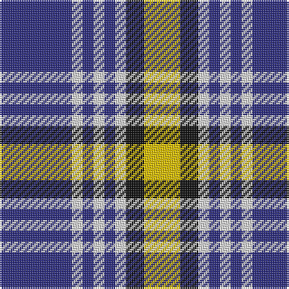

In pattern [BWBWBWKY](/patterns/bwbwbwky/).

This was sourced from house-of-tartan.  It is a [8 stripes tartan](/stripes/stripes8/).

Original link http://www.house-of-tartan.scotland.net/house/TartanViewjs.asp?colr=Def&tnam=1320

## Thread count
DB/40 LN6 DB6 LN6 DB6 LN6 K10 Y/20

## Palette
Each colour and its ΔE from the base-6 reference it is a variant of.

| Colour | Shade | Base | ΔE (OKLab) |
|---|---|---|---|
| DB | <code style="background-color:#2C2C80;">#2C2C80</code> `#2C2C80` | B <code style="background-color:#2A418A;">#2A418A</code> | 0.06 |
| K | <code style="background-color:#101010;">#101010</code> `#101010` | K <code style="background-color:#000000;">#000000</code> | 0.17 |
| LN | <code style="background-color:#E0E0E0;">#E0E0E0</code> `#E0E0E0` | W <code style="background-color:#F7F7F7;">#F7F7F7</code> | 0.07 |
| Y | <code style="background-color:#E8C000;">#E8C000</code> `#E8C000` | Y <code style="background-color:#F2BF00;">#F2BF00</code> | 0.02 |

# Sample pattern

## Nearest tartans

The nearest existing variants by ΔTartan distance.

1. [Kile (No red line) (Personal)](/setts/s8/b20w3b3w3b3w3k5y10x2~b2c2c80-k101010-wfcfcfc-ye8c000/) — ΔT 0.19
1. [Kile](/setts/s8/b20w3b3w3b3w3k5y10x2~b304080-k000000-we0e0e0-yf0c000/) — ΔT 0.34
1. [Nevada State](/setts/s9/b32r4b4y4b9ya9b4ya16w7x2~b202060-rc80000-we0e0e0-ye8c000-yab8b8b8/) — ΔT 1.09
1. [Breton District Tartan Tartan Number: 3902. Earliest known date: 2001 Commissioned by Richard Duclos of Le Coudray-Montceaux, France and produced by House of Tartan. See products available Copyright © Blair Urquhart, Comrie, 2015](/setts/s9/g6b11w8k4w8k4w8k27w4x2~b2c2c80-g289c18-k101010-we0e0e0/) — ΔT 1.16
1. [MacPherson Dress, Royal Blue (Dance)](/setts/s7/w5k3w26b21w3b8y3x2~b1c0070-k101010-we0e0e0-ye8c000/) — ΔT 1.18
1. [Clemens and August (Personal)](/setts/s8/w32b3r4b3r8b32wa3b4x2~b1c0070-rc80000-wf0e4bc-wae0e0e0/) — ΔT 1.19
1. [Yale College of Wrexham (Corporate)](/setts/s8/r9w5b57k5b9r29k18w9~b2888c4-k101010-rc80000-we0e0e0/) — ΔT 1.19
1. [Yusra Personal Tartan Tartan Number: 10455. Earliest known date: 6th April 2011 The colours used in the design are based on the colours of the Malaysian flag (blue/navy, red, yellow and white/cream) to represent the country of origin of part of the Yusra family. A woven sample of this tartan has been received by the Scottish Register of Tartans for permanent preservation in the National Archives of Scotland. See products available Copyright © Blair Urquhart, Comrie, 2015](/setts/s7/r12k3w14b10k2b24r2x2~b003c64-k000000-rc80000-we0e0e0/) — ΔT 1.22
1. [Breifne](/setts/s12/w3y4w12g2w3g2w3g2w12k4g18y3x2~g003820-k101010-wa8ace8-ya0a0a0/) — ΔT 1.24
1. [Thom(p)son, Navy](/setts/s7/r3b15w13ra6b2ra2r2x2~b000050-r900030-ra806050-we0e0e0/) — ΔT 1.25

## Neighbour map

Every grey dot is one of 15726 variants placed by the first two principal components of the ΔTartan feature space (44% of its variance). Red is this tartan; blue dots are its nearest — click one to open its page.

<svg viewBox="0 0 640 380" role="img" style="max-width:100%;height:auto;border:1px solid #e0e0e0;border-radius:4px;display:block" xmlns="http://www.w3.org/2000/svg"><image href="/nn/cloud.v1.png" width="640" height="380"/><a href="/setts/s8/b20w3b3w3b3w3k5y10x2~b2c2c80-k101010-wfcfcfc-ye8c000/"><circle cx="203.7" cy="186.4" r="4" fill="#3465a4"><title>Kile (No red line) (Personal)</title></circle></a><a href="/setts/s8/b20w3b3w3b3w3k5y10x2~b304080-k000000-we0e0e0-yf0c000/"><circle cx="205.3" cy="187.8" r="4" fill="#3465a4"><title>Kile</title></circle></a><a href="/setts/s9/b32r4b4y4b9ya9b4ya16w7x2~b202060-rc80000-we0e0e0-ye8c000-yab8b8b8/"><circle cx="225.1" cy="168.4" r="4" fill="#3465a4"><title>Nevada State</title></circle></a><a href="/setts/s9/g6b11w8k4w8k4w8k27w4x2~b2c2c80-g289c18-k101010-we0e0e0/"><circle cx="155.8" cy="194.7" r="4" fill="#3465a4"><title>Breton District Tartan Tartan Number: 3902. Earliest known date: 2001 Commissioned by Richard Duclos of Le Coudray-Montceaux, France and produced by House of Tartan. See products available Copyright © Blair Urquhart, Comrie, 2015</title></circle></a><a href="/setts/s7/w5k3w26b21w3b8y3x2~b1c0070-k101010-we0e0e0-ye8c000/"><circle cx="227.5" cy="182.4" r="4" fill="#3465a4"><title>MacPherson Dress, Royal Blue (Dance)</title></circle></a><a href="/setts/s8/w32b3r4b3r8b32wa3b4x2~b1c0070-rc80000-wf0e4bc-wae0e0e0/"><circle cx="226.3" cy="153.2" r="4" fill="#3465a4"><title>Clemens and August (Personal)</title></circle></a><a href="/setts/s8/r9w5b57k5b9r29k18w9~b2888c4-k101010-rc80000-we0e0e0/"><circle cx="223.7" cy="169.1" r="4" fill="#3465a4"><title>Yale College of Wrexham (Corporate)</title></circle></a><a href="/setts/s7/r12k3w14b10k2b24r2x2~b003c64-k000000-rc80000-we0e0e0/"><circle cx="225.6" cy="186.6" r="4" fill="#3465a4"><title>Yusra Personal Tartan Tartan Number: 10455. Earliest known date: 6th April 2011 The colours used in the design are based on the colours of the Malaysian flag (blue/navy, red, yellow and white/cream) to represent the country of origin of part of the Yusra family. A woven sample of this tartan has been received by the Scottish Register of Tartans for permanent preservation in the National Archives of Scotland. See products available Copyright © Blair Urquhart, Comrie, 2015</title></circle></a><a href="/setts/s12/w3y4w12g2w3g2w3g2w12k4g18y3x2~g003820-k101010-wa8ace8-ya0a0a0/"><circle cx="217.1" cy="168.5" r="4" fill="#3465a4"><title>Breifne</title></circle></a><a href="/setts/s7/r3b15w13ra6b2ra2r2x2~b000050-r900030-ra806050-we0e0e0/"><circle cx="148.6" cy="191.9" r="4" fill="#3465a4"><title>Thom(p)son, Navy</title></circle></a><circle cx="208.2" cy="188.8" r="5" fill="#c00000"/></svg>

ID: /setts/s8/b20w3b3w3b3w3k5y10x2~b2c2c80-k101010-we0e0e0-ye8c000/
