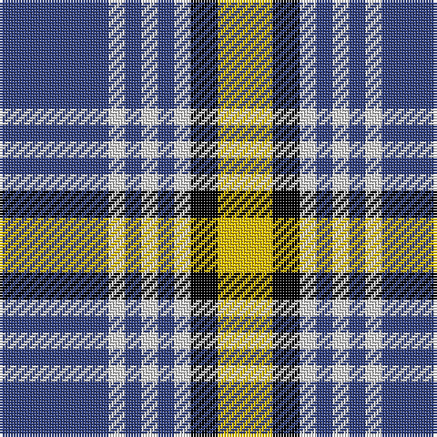

In pattern [BWBWBWKY](/patterns/bwbwbwky/).

This was sourced from weddslist.  It is a [8 stripes tartan](/stripes/stripes8/).

Original link http://www.weddslist.com/cgi-bin/tartans/pg.pl?source=sts

## Thread count
B/40 LN6 B6 LN6 B6 LN6 K10 Y/20

## Palette
Each colour and its ΔE from the base-6 reference it is a variant of.

| Colour | Shade | Base | ΔE (OKLab) |
|---|---|---|---|
| B | <code style="background-color:#304080;">#304080</code> `#304080` | B <code style="background-color:#2A418A;">#2A418A</code> | 0.02 |
| K | <code style="background-color:#000000;">#000000</code> `#000000` | K <code style="background-color:#000000;">#000000</code> | 0.00 |
| LN | <code style="background-color:#E0E0E0;">#E0E0E0</code> `#E0E0E0` | W <code style="background-color:#F7F7F7;">#F7F7F7</code> | 0.07 |
| Y | <code style="background-color:#F0C000;">#F0C000</code> `#F0C000` | Y <code style="background-color:#F2BF00;">#F2BF00</code> | 0.00 |

# Sample pattern

## Nearest tartans

The nearest existing variants by ΔTartan distance.

1. [Kile (No red line) (Personal)](/setts/s8/b20w3b3w3b3w3k5y10~b2c2c80-k101010-wfcfcfc-ye8c000~x2/) — ΔT 0.34
1. [Kile Family Tartan Tartan Number: 1320. Earliest known date: January, 1983 This sett was recorded by Peter MacDonald on the 17th of January, 1983. MacDonald was engaged in research work for the Scottish Tartans Society at the time but the correspondence up until 1985 does not indicate whether the design was ever finalised or even woven. There is a similarity in structure with the Kyle tartan recorded in 1984. Interest in the Kile tartan was revived in 1995. (Scottish Tartans Society correspondence) The name, Kyle or Kile, is associated with the Carrick District. See products available Copyright © Blair Urquhart, Comrie, 2015](/setts/s8/b20w3b3w3b3w3k5y10~b2c2c80-k101010-we0e0e0-ye8c000~x2/) — ΔT 0.34
1. [Breton District Tartan Tartan Number: 3902. Earliest known date: 2001 Commissioned by Richard Duclos of Le Coudray-Montceaux, France and produced by House of Tartan. See products available Copyright © Blair Urquhart, Comrie, 2015](/setts/s9/g6b11w8k4w8k4w8k27w4~b2c2c80-g289c18-k101010-we0e0e0~x2/) — ΔT 1.01
1. [MacMillan](/setts/s9/k6r2k12g3k6w16g3w16k2~g8c7038-k101010-r980044-wc0c0c0~x2/) — ΔT 1.07
1. [Hill of Banchory Primary (School)](/setts/s7/b1y6b8r1b8g6y1~b2c2c80-g289c18-rc80000-ye8c000~x4/) — ΔT 1.15
1. [Puffin](/setts/s9/k3w1k1w6g1w1g1w1r3~g008000-k000000-r806050-we0e0e0~x4/) — ΔT 1.16
1. [Eglinton](/setts/s7/k3g3k3w16k3r3k3~g004c00-k000000-rc80000-wd0d0d0/) — ΔT 1.16
1. [Yusra (Personal)](/setts/s7/r12y3w14b10y2b24r2~b003c64-rc80000-we0e0e0-yfccc00~x2/) — ΔT 1.20
1. [Yusra (Malay) (Personal)](/setts/s7/r12y3w14b10y2b24r2~b003c64-rc80000-we0e0e0-ye8c000~x2/) — ΔT 1.21
1. [MacPherson Dress, Blue (Dance)](/setts/s7/w5r3w26k21w3k8y3~k000000-r800028-we0e0e0-ye8c000~x2/) — ΔT 1.21

## Neighbour map

Every grey dot is one of 15726 variants placed by the first two principal components of the ΔTartan feature space (44% of its variance). Red is this tartan; blue dots are its nearest — click one to open its page.

<svg viewBox="0 0 640 380" role="img" style="max-width:100%;height:auto;border:1px solid #e0e0e0;border-radius:4px;display:block" xmlns="http://www.w3.org/2000/svg"><image href="/nn/cloud.v1.png" width="640" height="380"/><a href="/setts/s8/b20w3b3w3b3w3k5y10~b2c2c80-k101010-wfcfcfc-ye8c000~x2/"><circle cx="203.7" cy="186.4" r="4" fill="#3465a4"><title>Kile (No red line) (Personal)</title></circle></a><a href="/setts/s8/b20w3b3w3b3w3k5y10~b2c2c80-k101010-we0e0e0-ye8c000~x2/"><circle cx="208.2" cy="188.8" r="4" fill="#3465a4"><title>Kile Family Tartan Tartan Number: 1320. Earliest known date: January, 1983 This sett was recorded by Peter MacDonald on the 17th of January, 1983. MacDonald was engaged in research work for the Scottish Tartans Society at the time but the correspondence up until 1985 does not indicate whether the design was ever finalised or even woven. There is a similarity in structure with the Kyle tartan recorded in 1984. Interest in the Kile tartan was revived in 1995. (Scottish Tartans Society correspondence) The name, Kyle or Kile, is associated with the Carrick District. See products available Copyright © Blair Urquhart, Comrie, 2015</title></circle></a><a href="/setts/s9/g6b11w8k4w8k4w8k27w4~b2c2c80-g289c18-k101010-we0e0e0~x2/"><circle cx="155.8" cy="194.7" r="4" fill="#3465a4"><title>Breton District Tartan Tartan Number: 3902. Earliest known date: 2001 Commissioned by Richard Duclos of Le Coudray-Montceaux, France and produced by House of Tartan. See products available Copyright © Blair Urquhart, Comrie, 2015</title></circle></a><a href="/setts/s9/k6r2k12g3k6w16g3w16k2~g8c7038-k101010-r980044-wc0c0c0~x2/"><circle cx="206.2" cy="191.4" r="4" fill="#3465a4"><title>MacMillan</title></circle></a><a href="/setts/s7/b1y6b8r1b8g6y1~b2c2c80-g289c18-rc80000-ye8c000~x4/"><circle cx="231.8" cy="215.5" r="4" fill="#3465a4"><title>Hill of Banchory Primary (School)</title></circle></a><a href="/setts/s9/k3w1k1w6g1w1g1w1r3~g008000-k000000-r806050-we0e0e0~x4/"><circle cx="169.6" cy="186.2" r="4" fill="#3465a4"><title>Puffin</title></circle></a><a href="/setts/s7/k3g3k3w16k3r3k3~g004c00-k000000-rc80000-wd0d0d0/"><circle cx="183.6" cy="196.7" r="4" fill="#3465a4"><title>Eglinton</title></circle></a><a href="/setts/s7/r12y3w14b10y2b24r2~b003c64-rc80000-we0e0e0-yfccc00~x2/"><circle cx="226.7" cy="183.7" r="4" fill="#3465a4"><title>Yusra (Personal)</title></circle></a><a href="/setts/s7/r12y3w14b10y2b24r2~b003c64-rc80000-we0e0e0-ye8c000~x2/"><circle cx="227.9" cy="184.4" r="4" fill="#3465a4"><title>Yusra (Malay) (Personal)</title></circle></a><a href="/setts/s7/w5r3w26k21w3k8y3~k000000-r800028-we0e0e0-ye8c000~x2/"><circle cx="226.0" cy="184.0" r="4" fill="#3465a4"><title>MacPherson Dress, Blue (Dance)</title></circle></a><circle cx="205.3" cy="187.8" r="5" fill="#c00000"/></svg>

ID: /setts/s8/b20w3b3w3b3w3k5y10~b304080-k000000-we0e0e0-yf0c000~x2/
