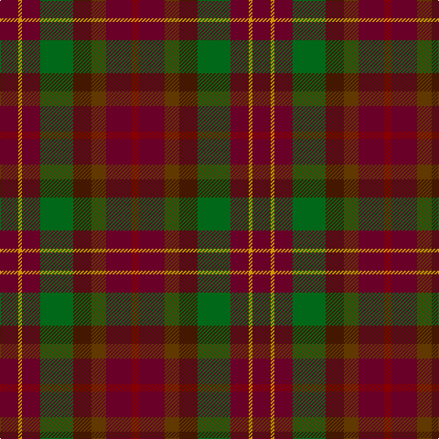

In pattern [BYBGBGBR](/patterns/bybgbgbr/).

This was sourced from tartans-authority.  It is a [8 stripes tartan](/stripes/stripes8/).

Original link http://www.tartansauthority.com/tartan-ferret/display/2483/

## Thread count
DR/20 DY4 DR20 G36 DRa20 T16 DR28 DRb/8

## Palette
Each colour and its ΔE from the base-6 reference it is a variant of.

| Colour | Shade | Base | ΔE (OKLab) |
|---|---|---|---|
| DR | <code style="background-color:#680028;">#680028</code> `#680028` | B <code style="background-color:#2A418A;">#2A418A</code> | 0.21 |
| DRa | <code style="background-color:#441800;">#441800</code> `#441800` | B <code style="background-color:#2A418A;">#2A418A</code> | 0.23 |
| DRb | <code style="background-color:#880000;">#880000</code> `#880000` | R <code style="background-color:#CC0000;">#CC0000</code> | 0.15 |
| DY | <code style="background-color:#D09800;">#D09800</code> `#D09800` | Y <code style="background-color:#F2BF00;">#F2BF00</code> | 0.12 |
| G | <code style="background-color:#006818;">#006818</code> `#006818` | G <code style="background-color:#006100;">#006100</code> | 0.02 |
| T | <code style="background-color:#603800;">#603800</code> `#603800` | G <code style="background-color:#006100;">#006100</code> | 0.16 |

# Sample pattern

## Nearest tartans

The nearest existing variants by ΔTartan distance.

1. [Leighton (Personal)](/setts/s8/b20y4b20g35ba20ga16b28r8-b680028-ba441800-g006818-ga603800-r880000-yd09800/) — ΔT 0.07
1. [Unidentified #40](/setts/s8/g26y6g26ga46gb32gc26g46r10-g703200-ga005020-gb5b360b-gc2a2303-rdc0000-yfadc00/) — ΔT 1.25
1. [Unidentified 2](/setts/s8/r26y6r26g46ga32b26r46ra10-b401000-g008000-ga402000-r703000-rac00000-yffe000/) — ΔT 1.35
1. [Caledonian Maple (Fashion)](/setts/s7/r44g4r12ga28g28gb20ra12-g004c00-ga7c583c-gb583014-r8c0000-raa47c00/) — ΔT 1.56
1. [MacDuff Hunting Clan Tartan Tartan Number: 1654. Earliest known date: 1906 STS records (sic) 'Sett may be quite wrong. (S.S. May 86)' See products available Copyright © Blair Urquhart, Comrie, 2015](/setts/s8/g16r2g16ga16k16b16g16r4-b2c2c80-g604000-ga006818-k101010-rc80000/) — ΔT 1.58
1. [Heather MacRae](/setts/s7/g4b24ba22y12ga12b24g4-b680028-ba1c1c50-g285800-ga604000-ya08858/) — ΔT 1.60
1. [Amazing Union (Personal)](/setts/s9/r8g60ga48g8b48g8ga48g60ra8-b101034-g682400-ga005c34-ra47800-raa80020/) — ΔT 1.64
1. [United Distillers Corporate Tartan Tartan Number: 2098. Earliest known date: 1989 An expression of evocative Scottish colours to reflect the corporate image of quality and style. (weft) lb4 b24 lb2 dg24 g24 r4 See products available Copyright © Blair Urquhart, Comrie, 2015](/setts/s10/b24g2ga24g24y4g24ga24g2b24ba4-b680028-ba2888c4-g604000-ga003820-ye8c000/) — ΔT 1.67
1. [Huntly #3](/setts/s10/g8y4g20k16b20r4b20k16g20y4-b4c3428-g604000-k101010-rb84c00-yb8b8b8/) — ΔT 1.73
1. [MacDuff Hunting](/setts/s8/b20r4b20g34k24ba18b18r4-b441800-ba2c2c80-g006818-k101010-rc80000/) — ΔT 1.75

## Neighbour map

Every grey dot is one of 15726 variants placed by the first two principal components of the ΔTartan feature space (44% of its variance). Red is this tartan; blue dots are its nearest — click one to open its page.

<svg viewBox="0 0 640 380" role="img" style="max-width:100%;height:auto;border:1px solid #e0e0e0;border-radius:4px;display:block" xmlns="http://www.w3.org/2000/svg"><image href="/nn/cloud.v1.png" width="640" height="380"/><a href="/setts/s8/b20y4b20g35ba20ga16b28r8-b680028-ba441800-g006818-ga603800-r880000-yd09800/"><circle cx="220.1" cy="235.9" r="4" fill="#3465a4"><title>Leighton (Personal)</title></circle></a><a href="/setts/s8/g26y6g26ga46gb32gc26g46r10-g703200-ga005020-gb5b360b-gc2a2303-rdc0000-yfadc00/"><circle cx="226.5" cy="250.4" r="4" fill="#3465a4"><title>Unidentified #40</title></circle></a><a href="/setts/s8/r26y6r26g46ga32b26r46ra10-b401000-g008000-ga402000-r703000-rac00000-yffe000/"><circle cx="183.0" cy="227.6" r="4" fill="#3465a4"><title>Unidentified 2</title></circle></a><a href="/setts/s7/r44g4r12ga28g28gb20ra12-g004c00-ga7c583c-gb583014-r8c0000-raa47c00/"><circle cx="239.5" cy="242.2" r="4" fill="#3465a4"><title>Caledonian Maple (Fashion)</title></circle></a><a href="/setts/s8/g16r2g16ga16k16b16g16r4-b2c2c80-g604000-ga006818-k101010-rc80000/"><circle cx="213.9" cy="257.7" r="4" fill="#3465a4"><title>MacDuff Hunting Clan Tartan Tartan Number: 1654. Earliest known date: 1906 STS records (sic) 'Sett may be quite wrong. (S.S. May 86)' See products available Copyright © Blair Urquhart, Comrie, 2015</title></circle></a><a href="/setts/s7/g4b24ba22y12ga12b24g4-b680028-ba1c1c50-g285800-ga604000-ya08858/"><circle cx="226.8" cy="252.6" r="4" fill="#3465a4"><title>Heather MacRae</title></circle></a><a href="/setts/s9/r8g60ga48g8b48g8ga48g60ra8-b101034-g682400-ga005c34-ra47800-raa80020/"><circle cx="268.4" cy="235.1" r="4" fill="#3465a4"><title>Amazing Union (Personal)</title></circle></a><a href="/setts/s10/b24g2ga24g24y4g24ga24g2b24ba4-b680028-ba2888c4-g604000-ga003820-ye8c000/"><circle cx="230.5" cy="217.9" r="4" fill="#3465a4"><title>United Distillers Corporate Tartan Tartan Number: 2098. Earliest known date: 1989 An expression of evocative Scottish colours to reflect the corporate image of quality and style. (weft) lb4 b24 lb2 dg24 g24 r4 See products available Copyright © Blair Urquhart, Comrie, 2015</title></circle></a><a href="/setts/s10/g8y4g20k16b20r4b20k16g20y4-b4c3428-g604000-k101010-rb84c00-yb8b8b8/"><circle cx="164.6" cy="254.0" r="4" fill="#3465a4"><title>Huntly #3</title></circle></a><a href="/setts/s8/b20r4b20g34k24ba18b18r4-b441800-ba2c2c80-g006818-k101010-rc80000/"><circle cx="188.7" cy="242.9" r="4" fill="#3465a4"><title>MacDuff Hunting</title></circle></a><circle cx="220.0" cy="233.5" r="5" fill="#c00000"/></svg>

ID: /setts/s8/b20y4b20g36ba20ga16b28r8-b680028-ba441800-g006818-ga603800-r880000-yd09800/
