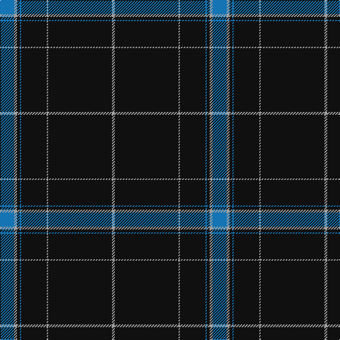

In pattern [BYKBKYKY](/patterns/bykbkyky/).

This was sourced from tartans-authority.  It is a [8 stripes tartan](/stripes/stripes8/).

Original link http://www.tartansauthority.com/tartan-ferret/display/7105/

## Thread count
Ba/20 Na4 K4 B2 K36 N2 Ka90 N/4

## Palette
Each colour and its ΔE from the base-6 reference it is a variant of.

| Colour | Shade | Base | ΔE (OKLab) |
|---|---|---|---|
| B | <code style="background-color:#1474B4;">#1474B4</code> `#1474B4` | B <code style="background-color:#2C4084;">#2C4084</code> | 0.15 |
| Ba | <code style="background-color:#1474B4;">#1474B4</code> `#1474B4` | B <code style="background-color:#2C4084;">#2C4084</code> | 0.15 |
| K | <code style="background-color:#101010;">#101010</code> `#101010` | K <code style="background-color:#000000;">#000000</code> | 0.17 |
| Ka | <code style="background-color:#101010;">#101010</code> `#101010` | K <code style="background-color:#000000;">#000000</code> | 0.17 |
| N | <code style="background-color:#A0A0A0;">#A0A0A0</code> `#A0A0A0` | Y <code style="background-color:#E8C000;">#E8C000</code> | 0.20 |
| Na | <code style="background-color:#A0A0A0;">#A0A0A0</code> `#A0A0A0` | Y <code style="background-color:#E8C000;">#E8C000</code> | 0.20 |

# Sample pattern

## Nearest tartans

The nearest existing variants by ΔTartan distance.

1. [Downs](/setts/s8/b20y4g4w2g36r2k90r4-b1c1c50-g003820-k101010-rc80000-we0e0e0-ye8c000/) — ΔT 0.60
1. [RCACA](/setts/s10/k8r2w2r4k96b8w2ba60y4r4-b680028-ba141e46-k101010-rc80000-wf8f8f8-ye8c000/) — ΔT 0.83
1. [Henschke, Felix (Personal)](/setts/s7/b84y2k46r14w2ba8y6-b002814-ba00008c-k1c1714-r960000-wf8f8f8-yd87c00/) — ΔT 1.09
1. [Pilkington (2016)](/setts/s10/w4g30b16g4b64wa2b16k26r4wa2-b141e46-g005020-k101010-rc82828-wffffff-wac8c8c8/) — ΔT 1.23
1. [Victorian Highland Pipe Band Association (Australia)](/setts/s8/b92w2y6g26w2r14ga6w2-b14283c-g004028-ga649848-r89051b-wf0e0c8-yd87c00/) — ΔT 1.24
1. [Scotland the Brave](/setts/s10/k12w2k80b2ka24g24b12g4ba4g8-b800080-ba800070-g003000-k000030-ka000000-we0e0e0/) — ΔT 1.31
1. [Heart of Scotland (Fashion)](/setts/s10/b10w2b88ba2g24k24ba10k4r4k6-b202060-ba6c0070-g006818-k101010-r9c68a4-wf8f8f8/) — ΔT 1.32
1. [Scotland the Brave (Fashion)](/setts/s10/b12w2b80r2k24g24r12g4ba4g8-b202060-ba780078-g285800-k101010-rb468ac-wf8f8f8/) — ΔT 1.39
1. [Brighton Mac Dermotte](/setts/s9/b94y2ba54ya8g10y2ya16bb2ba2-b1e2025-ba3d3134-bb5f749c-g23321b-yf8e38c-yaccbaaf/) — ΔT 1.40
1. [Police College Tulliallan](/setts/s7/b4k8ka72g2kb68b8w4-b00008c-g007800-k000000-ka001c00-kb000034-wfcfcfc/) — ΔT 1.43

## Neighbour map

Every grey dot is one of 15726 variants placed by the first two principal components of the ΔTartan feature space (44% of its variance). Red is this tartan; blue dots are its nearest — click one to open its page.

<svg viewBox="0 0 640 380" role="img" style="max-width:100%;height:auto;border:1px solid #e0e0e0;border-radius:4px;display:block" xmlns="http://www.w3.org/2000/svg"><image href="/nn/cloud.v1.png" width="640" height="380"/><a href="/setts/s8/b20y4g4w2g36r2k90r4-b1c1c50-g003820-k101010-rc80000-we0e0e0-ye8c000/"><circle cx="385.9" cy="111.6" r="4" fill="#3465a4"><title>Downs</title></circle></a><a href="/setts/s10/k8r2w2r4k96b8w2ba60y4r4-b680028-ba141e46-k101010-rc80000-wf8f8f8-ye8c000/"><circle cx="382.8" cy="82.5" r="4" fill="#3465a4"><title>RCACA</title></circle></a><a href="/setts/s7/b84y2k46r14w2ba8y6-b002814-ba00008c-k1c1714-r960000-wf8f8f8-yd87c00/"><circle cx="357.1" cy="127.7" r="4" fill="#3465a4"><title>Henschke, Felix (Personal)</title></circle></a><a href="/setts/s10/w4g30b16g4b64wa2b16k26r4wa2-b141e46-g005020-k101010-rc82828-wffffff-wac8c8c8/"><circle cx="337.0" cy="121.7" r="4" fill="#3465a4"><title>Pilkington (2016)</title></circle></a><a href="/setts/s8/b92w2y6g26w2r14ga6w2-b14283c-g004028-ga649848-r89051b-wf0e0c8-yd87c00/"><circle cx="397.4" cy="90.5" r="4" fill="#3465a4"><title>Victorian Highland Pipe Band Association (Australia)</title></circle></a><a href="/setts/s10/k12w2k80b2ka24g24b12g4ba4g8-b800080-ba800070-g003000-k000030-ka000000-we0e0e0/"><circle cx="339.2" cy="107.6" r="4" fill="#3465a4"><title>Scotland the Brave</title></circle></a><a href="/setts/s10/b10w2b88ba2g24k24ba10k4r4k6-b202060-ba6c0070-g006818-k101010-r9c68a4-wf8f8f8/"><circle cx="377.1" cy="97.7" r="4" fill="#3465a4"><title>Heart of Scotland (Fashion)</title></circle></a><a href="/setts/s10/b12w2b80r2k24g24r12g4ba4g8-b202060-ba780078-g285800-k101010-rb468ac-wf8f8f8/"><circle cx="332.6" cy="97.4" r="4" fill="#3465a4"><title>Scotland the Brave (Fashion)</title></circle></a><a href="/setts/s9/b94y2ba54ya8g10y2ya16bb2ba2-b1e2025-ba3d3134-bb5f749c-g23321b-yf8e38c-yaccbaaf/"><circle cx="316.9" cy="80.7" r="4" fill="#3465a4"><title>Brighton Mac Dermotte</title></circle></a><a href="/setts/s7/b4k8ka72g2kb68b8w4-b00008c-g007800-k000000-ka001c00-kb000034-wfcfcfc/"><circle cx="314.8" cy="137.4" r="4" fill="#3465a4"><title>Police College Tulliallan</title></circle></a><circle cx="372.3" cy="106.9" r="5" fill="#c00000"/></svg>

ID: /setts/s8/b20y4k4b2k36y2k90y4-b1474b4-k101010-ya0a0a0/
