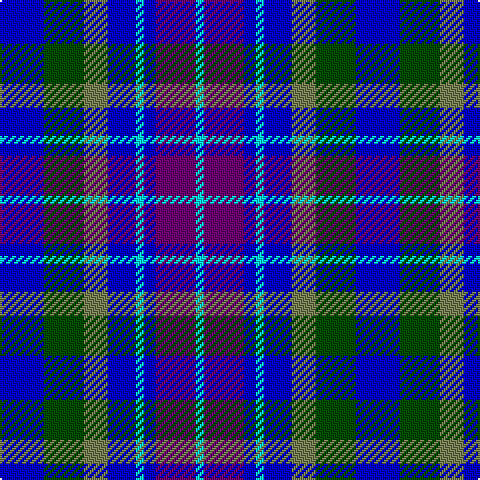

In pattern [BGGBWBBW](/patterns/bggbwbbw/).

This was sourced from register-of-tartans.  It is a [8 stripes tartan](/stripes/stripes8/).

Original link https://www.tartanregister.gov.uk/tartanDetails.aspx?ref=11591

## Thread count
B/22 G20 Ga12 B14 LB4 B6 P20 LB/4

## Palette
Each colour and its ΔE from the base-6 reference it is a variant of.

| Colour | Shade | Base | ΔE (OKLab) |
|---|---|---|---|
| B | <code style="background-color:#0000CD;">#0000CD</code> `#0000CD` | B <code style="background-color:#2A418A;">#2A418A</code> | 0.14 |
| G | <code style="background-color:#004C00;">#004C00</code> `#004C00` | G <code style="background-color:#006100;">#006100</code> | 0.07 |
| Ga | <code style="background-color:#767E52;">#767E52</code> `#767E52` | G <code style="background-color:#006100;">#006100</code> | 0.17 |
| LB | <code style="background-color:#00FCFC;">#00FCFC</code> `#00FCFC` | W <code style="background-color:#F7F7F7;">#F7F7F7</code> | 0.17 |
| P | <code style="background-color:#6C0070;">#6C0070</code> `#6C0070` | B <code style="background-color:#2A418A;">#2A418A</code> | 0.16 |

# Sample pattern

## Nearest tartans

The nearest existing variants by ΔTartan distance.

1. [Ballater](/setts/s10/b12ba4b24r8bb24k4r4k4bb24r12-b00008c-ba788cb4-bb3474fc-k000000-r8c0000/) — ΔT 1.15
1. [American Express Corporate Tartan Tartan Number: 2354. Earliest known date: April 1997 American Express began operating in Glasgow in 1903 and in 1920 acquired WA Williamson Ltd of Glasgow. This tartan (commissioned by VP Donald Daly) was designed for the 1997 American Association of Travel Agents conference in Glasgow and based on the MacWilliam tartan. For more details see archives. See products available Copyright © Blair Urquhart, Comrie, 2015](/setts/s10/b36r4ba20g20w8g20ba20r4b36ba8-b3474fc-ba000064-g007800-r8c0000-wc8c8c8/) — ΔT 1.16
1. [Blue](/setts/s7/r4b22r6b22ba24bb20w4-b304080-ba5480b0-bb000050-rc00000-we0e0e0/) — ΔT 1.22
1. [American Express](/setts/s6/b8ba36r4b20g20w8-b000064-ba3474fc-g007800-r8c0000-wc8c8c8/) — ΔT 1.29
1. [Greer (Name?)](/setts/s8/b32ba6b6r6b6ba20ra24w8-b2888c4-ba000064-r888888-ra880000-wf8f8f8/) — ΔT 1.35
1. [Blue Family Tartan Tartan Number: 1420. Earliest known date: 1985 Blue is a Sept name of MacMillan. See products available Copyright © Blair Urquhart, Comrie, 2015](/setts/s7/r4b22r6b22ba24bb20w4-b2c2c80-ba5c8ca8-bb202060-rc80000-we0e0e0/) — ΔT 1.45
1. [Black Watch (Pendleton)](/setts/s6/b6k4b16ba16g16ba4-b2474e8-ba1c0070-g006818-k101010/) — ΔT 1.46
1. [Blue](/setts/s6/b28r8b28ba30bb26w6-b404c64-ba5c8ca8-bb000078-rc80000-wffffff/) — ΔT 1.50
1. [Mary Washington](/setts/s7/k6b36ba6ka36ba36k6w6-b304080-ba8080d0-k000000-ka000030-we0e0e0/) — ΔT 1.50
1. [Culloden - 1977 (Fashion)](/setts/s8/b8w16k8w4b16k4b4g4-b002cc0-g48783c-k000000-wc8c8c8/) — ΔT 1.56

## Neighbour map

Every grey dot is one of 15726 variants placed by the first two principal components of the ΔTartan feature space (44% of its variance). Red is this tartan; blue dots are its nearest — click one to open its page.

<svg viewBox="0 0 640 380" role="img" style="max-width:100%;height:auto;border:1px solid #e0e0e0;border-radius:4px;display:block" xmlns="http://www.w3.org/2000/svg"><image href="/nn/cloud.v1.png" width="640" height="380"/><a href="/setts/s10/b12ba4b24r8bb24k4r4k4bb24r12-b00008c-ba788cb4-bb3474fc-k000000-r8c0000/"><circle cx="128.9" cy="198.7" r="4" fill="#3465a4"><title>Ballater</title></circle></a><a href="/setts/s10/b36r4ba20g20w8g20ba20r4b36ba8-b3474fc-ba000064-g007800-r8c0000-wc8c8c8/"><circle cx="131.6" cy="192.1" r="4" fill="#3465a4"><title>American Express Corporate Tartan Tartan Number: 2354. Earliest known date: April 1997 American Express began operating in Glasgow in 1903 and in 1920 acquired WA Williamson Ltd of Glasgow. This tartan (commissioned by VP Donald Daly) was designed for the 1997 American Association of Travel Agents conference in Glasgow and based on the MacWilliam tartan. For more details see archives. See products available Copyright © Blair Urquhart, Comrie, 2015</title></circle></a><a href="/setts/s7/r4b22r6b22ba24bb20w4-b304080-ba5480b0-bb000050-rc00000-we0e0e0/"><circle cx="159.7" cy="234.4" r="4" fill="#3465a4"><title>Blue</title></circle></a><a href="/setts/s6/b8ba36r4b20g20w8-b000064-ba3474fc-g007800-r8c0000-wc8c8c8/"><circle cx="124.6" cy="206.5" r="4" fill="#3465a4"><title>American Express</title></circle></a><a href="/setts/s8/b32ba6b6r6b6ba20ra24w8-b2888c4-ba000064-r888888-ra880000-wf8f8f8/"><circle cx="121.2" cy="202.8" r="4" fill="#3465a4"><title>Greer (Name?)</title></circle></a><a href="/setts/s7/r4b22r6b22ba24bb20w4-b2c2c80-ba5c8ca8-bb202060-rc80000-we0e0e0/"><circle cx="165.2" cy="235.2" r="4" fill="#3465a4"><title>Blue Family Tartan Tartan Number: 1420. Earliest known date: 1985 Blue is a Sept name of MacMillan. See products available Copyright © Blair Urquhart, Comrie, 2015</title></circle></a><a href="/setts/s6/b6k4b16ba16g16ba4-b2474e8-ba1c0070-g006818-k101010/"><circle cx="126.2" cy="277.9" r="4" fill="#3465a4"><title>Black Watch (Pendleton)</title></circle></a><a href="/setts/s6/b28r8b28ba30bb26w6-b404c64-ba5c8ca8-bb000078-rc80000-wffffff/"><circle cx="145.8" cy="259.4" r="4" fill="#3465a4"><title>Blue</title></circle></a><a href="/setts/s7/k6b36ba6ka36ba36k6w6-b304080-ba8080d0-k000000-ka000030-we0e0e0/"><circle cx="96.7" cy="202.0" r="4" fill="#3465a4"><title>Mary Washington</title></circle></a><a href="/setts/s8/b8w16k8w4b16k4b4g4-b002cc0-g48783c-k000000-wc8c8c8/"><circle cx="121.4" cy="236.1" r="4" fill="#3465a4"><title>Culloden - 1977 (Fashion)</title></circle></a><circle cx="104.4" cy="228.3" r="5" fill="#c00000"/></svg>

ID: /setts/s8/b22g20ga12b14w4b6ba20w4-b0000cd-ba6c0070-g004c00-ga767e52-w00fcfc/
