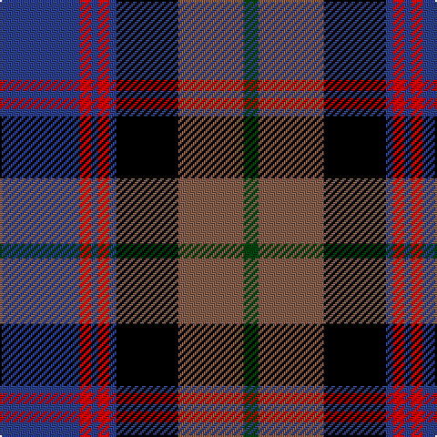

In pattern [BRBRBKRG](/patterns/brbrbkrg/).

This was sourced from weddslist.  It is a [8 stripes tartan](/stripes/stripes8/).

Original link http://www.weddslist.com/cgi-bin/tartans/pg.pl?source=sts

## Thread count
B/44 R6 B4 R6 B4 K34 LT36 DG/8

## Palette
Each colour and its ΔE from the base-6 reference it is a variant of.

| Colour | Shade | Base | ΔE (OKLab) |
|---|---|---|---|
| B | <code style="background-color:#304080;">#304080</code> `#304080` | B <code style="background-color:#2A418A;">#2A418A</code> | 0.02 |
| DG | <code style="background-color:#004010;">#004010</code> `#004010` | G <code style="background-color:#006100;">#006100</code> | 0.11 |
| K | <code style="background-color:#000000;">#000000</code> `#000000` | K <code style="background-color:#000000;">#000000</code> | 0.00 |
| LT | <code style="background-color:#806050;">#806050</code> `#806050` | R <code style="background-color:#CC0000;">#CC0000</code> | 0.17 |
| R | <code style="background-color:#C00000;">#C00000</code> `#C00000` | R <code style="background-color:#CC0000;">#CC0000</code> | 0.03 |

# Sample pattern

## Nearest tartans

The nearest existing variants by ΔTartan distance.

1. [Sandberg of Greenock (Personal)](/setts/s8/y3k12b1g5b12r1k2r1x4~b2c2c80-g006818-k101010-rc80000-ye8c000/) — ΔT 0.57
1. [MacRae Hunting #2](/setts/s9/g14k2g4r2g4k14b15k1w3x2~b5a008c-g006428-k101010-r960028-we0e0e0/) — ΔT 0.86
1. [Royal College of Surgeons of Edinburgh](/setts/s9/b4ba16k2ba2k2ba2k13bb20w4x2~b5480b0-ba102040-bb505050-k000000-we0e0e0/) — ΔT 0.87
1. [Curry (Personal)](/setts/s8/r3g2r6g20k15g3b18w2x2~b2c2c80-g00643c-k101010-rc80000-wfcfcfc/) — ΔT 0.87
1. [Colquhoun #3](/setts/s7/b6k3b21k23w3g24r3x2~b5a008c-g005020-k101010-rdc0000-we0e0e0/) — ΔT 0.89
1. [Zangenberg (Personal)](/setts/s7/b2r2b16k17g16k2y2x2~b780078-g285800-k101010-rc80000-ye8c000/) — ΔT 0.90
1. [Bootneck 350](/setts/s8/k6r4k19g4b25r5g3y2x2~b202060-g285800-k101010-rc80000-ye8c000/) — ΔT 0.92
1. [MacDonald of Borrodale (Clan)](/setts/s8/r6b3r3b32k30g30y3r3x2~b2c2c80-g006818-k000000-rc80000-ye8c000/) — ΔT 0.92
1. [Land's End (Unnamed Maroon)](/setts/s9/k23g2r3b7r3g2ga15r21g5x2~b304080-g908000-ga004010-k000030-r802040/) — ΔT 0.93
1. [Genet, Citizen (Commem)](/setts/s7/r2k9g12b8r1b1w1x4~b1c0070-g006818-k101010-rc80000-we0e0e0/) — ΔT 0.95

## Neighbour map

Every grey dot is one of 15726 variants placed by the first two principal components of the ΔTartan feature space (44% of its variance). Red is this tartan; blue dots are its nearest — click one to open its page.

<svg viewBox="0 0 640 380" role="img" style="max-width:100%;height:auto;border:1px solid #e0e0e0;border-radius:4px;display:block" xmlns="http://www.w3.org/2000/svg"><image href="/nn/cloud.v1.png" width="640" height="380"/><a href="/setts/s8/y3k12b1g5b12r1k2r1x4~b2c2c80-g006818-k101010-rc80000-ye8c000/"><circle cx="184.8" cy="167.4" r="4" fill="#3465a4"><title>Sandberg of Greenock (Personal)</title></circle></a><a href="/setts/s9/g14k2g4r2g4k14b15k1w3x2~b5a008c-g006428-k101010-r960028-we0e0e0/"><circle cx="180.5" cy="162.7" r="4" fill="#3465a4"><title>MacRae Hunting #2</title></circle></a><a href="/setts/s9/b4ba16k2ba2k2ba2k13bb20w4x2~b5480b0-ba102040-bb505050-k000000-we0e0e0/"><circle cx="129.9" cy="168.5" r="4" fill="#3465a4"><title>Royal College of Surgeons of Edinburgh</title></circle></a><a href="/setts/s8/r3g2r6g20k15g3b18w2x2~b2c2c80-g00643c-k101010-rc80000-wfcfcfc/"><circle cx="160.4" cy="184.1" r="4" fill="#3465a4"><title>Curry (Personal)</title></circle></a><a href="/setts/s7/b6k3b21k23w3g24r3x2~b5a008c-g005020-k101010-rdc0000-we0e0e0/"><circle cx="155.1" cy="203.3" r="4" fill="#3465a4"><title>Colquhoun #3</title></circle></a><a href="/setts/s7/b2r2b16k17g16k2y2x2~b780078-g285800-k101010-rc80000-ye8c000/"><circle cx="169.9" cy="192.1" r="4" fill="#3465a4"><title>Zangenberg (Personal)</title></circle></a><a href="/setts/s8/k6r4k19g4b25r5g3y2x2~b202060-g285800-k101010-rc80000-ye8c000/"><circle cx="209.4" cy="176.2" r="4" fill="#3465a4"><title>Bootneck 350</title></circle></a><a href="/setts/s8/r6b3r3b32k30g30y3r3x2~b2c2c80-g006818-k000000-rc80000-ye8c000/"><circle cx="134.7" cy="165.9" r="4" fill="#3465a4"><title>MacDonald of Borrodale (Clan)</title></circle></a><a href="/setts/s9/k23g2r3b7r3g2ga15r21g5x2~b304080-g908000-ga004010-k000030-r802040/"><circle cx="168.5" cy="174.2" r="4" fill="#3465a4"><title>Land's End (Unnamed Maroon)</title></circle></a><a href="/setts/s7/r2k9g12b8r1b1w1x4~b1c0070-g006818-k101010-rc80000-we0e0e0/"><circle cx="167.4" cy="180.1" r="4" fill="#3465a4"><title>Genet, Citizen (Commem)</title></circle></a><circle cx="164.7" cy="171.9" r="5" fill="#c00000"/></svg>

ID: /setts/s8/b22r3b2r3b2k17ra18g4x2~b304080-g004010-k000000-rc00000-ra806050/
