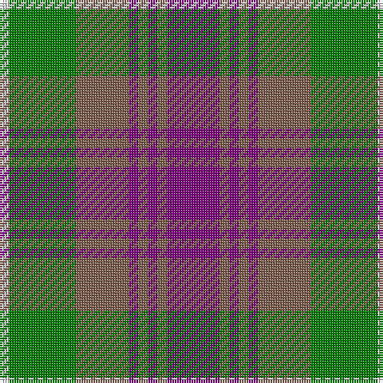

In pattern [BRBRBRGW](/patterns/brbrbrgw/).

This was sourced from weddslist.  It is a [8 stripes tartan](/stripes/stripes8/).

Original link http://www.weddslist.com/cgi-bin/tartans/pg.pl?source=sts

## Thread count
LN/4 G28 LT22 P4 LT4 P4 LT4 P/22

## Palette
Each colour and its ΔE from the base-6 reference it is a variant of.

| Colour | Shade | Base | ΔE (OKLab) |
|---|---|---|---|
| G | <code style="background-color:#008000;">#008000</code> `#008000` | G <code style="background-color:#006100;">#006100</code> | 0.10 |
| LN | <code style="background-color:#E0E0E0;">#E0E0E0</code> `#E0E0E0` | W <code style="background-color:#F7F7F7;">#F7F7F7</code> | 0.07 |
| LT | <code style="background-color:#806050;">#806050</code> `#806050` | R <code style="background-color:#CC0000;">#CC0000</code> | 0.17 |
| P | <code style="background-color:#800080;">#800080</code> `#800080` | B <code style="background-color:#2A418A;">#2A418A</code> | 0.17 |

# Sample pattern

## Nearest tartans

The nearest existing variants by ΔTartan distance.

1. [Logan #2](/setts/s7/b18r6y2r6g18r6y2-b2c4084-g005020-rdc0000-ye8c000/) — ΔT 0.96
1. [Carnegie #3](/setts/s8/r33g17b50g17r11g17r9k7-b2c4084-g005020-k101010-rdc0000/) — ΔT 0.98
1. [Logan](/setts/s7/b18r6y2r6g18r6y2-b304080-g008000-rc00000-yf0c000/) — ΔT 1.04
1. [Beck-McSorley](/setts/s8/r6g6r6g42ra42r6ra6rb6-g003820-r9c68a4-ra888888-rbe87878/) — ΔT 1.09
1. [Cercle de Fermieres de St-Elie . . .](/setts/s7/r12y6b48r6g42y6r12-b1474b4-g006818-rc80000-yfccc00/) — ΔT 1.09
1. [Roxburgh Red](/setts/s10/b6g52b6r6b40r6b6r52g10w6-b2c2c80-g006818-rc80000-wfcfcfc/) — ΔT 1.10
1. [Carnegie](/setts/s8/r33g17b50g17r11g17r9k7-b304080-g008000-k000000-rc00000/) — ΔT 1.10
1. [Unidentified, specimen](/setts/s10/b2g8b2r2b2y2b10r12b2y2-b304080-g008000-rc00000-yf0c000/) — ΔT 1.11
1. [Wilson's No.193](/setts/s8/g24k4r4b8r8b8r4k4-b2888c4-g006818-k101010-rc80000/) — ΔT 1.15
1. [Red Remony](/setts/s8/r34b4r4b26r4b4g34b4-b304080-g008000-rc00000/) — ΔT 1.18

## Neighbour map

Every grey dot is one of 15726 variants placed by the first two principal components of the ΔTartan feature space (44% of its variance). Red is this tartan; blue dots are its nearest — click one to open its page.

<svg viewBox="0 0 640 380" role="img" style="max-width:100%;height:auto;border:1px solid #e0e0e0;border-radius:4px;display:block" xmlns="http://www.w3.org/2000/svg"><image href="/nn/cloud.v1.png" width="640" height="380"/><a href="/setts/s7/b18r6y2r6g18r6y2-b2c4084-g005020-rdc0000-ye8c000/"><circle cx="166.0" cy="205.3" r="4" fill="#3465a4"><title>Logan #2</title></circle></a><a href="/setts/s8/r33g17b50g17r11g17r9k7-b2c4084-g005020-k101010-rdc0000/"><circle cx="169.8" cy="224.2" r="4" fill="#3465a4"><title>Carnegie #3</title></circle></a><a href="/setts/s7/b18r6y2r6g18r6y2-b304080-g008000-rc00000-yf0c000/"><circle cx="164.7" cy="206.1" r="4" fill="#3465a4"><title>Logan</title></circle></a><a href="/setts/s8/r6g6r6g42ra42r6ra6rb6-g003820-r9c68a4-ra888888-rbe87878/"><circle cx="232.6" cy="200.5" r="4" fill="#3465a4"><title>Beck-McSorley</title></circle></a><a href="/setts/s7/r12y6b48r6g42y6r12-b1474b4-g006818-rc80000-yfccc00/"><circle cx="182.6" cy="201.8" r="4" fill="#3465a4"><title>Cercle de Fermieres de St-Elie . . .</title></circle></a><a href="/setts/s10/b6g52b6r6b40r6b6r52g10w6-b2c2c80-g006818-rc80000-wfcfcfc/"><circle cx="189.6" cy="172.7" r="4" fill="#3465a4"><title>Roxburgh Red</title></circle></a><a href="/setts/s8/r33g17b50g17r11g17r9k7-b304080-g008000-k000000-rc00000/"><circle cx="156.1" cy="220.0" r="4" fill="#3465a4"><title>Carnegie</title></circle></a><a href="/setts/s10/b2g8b2r2b2y2b10r12b2y2-b304080-g008000-rc00000-yf0c000/"><circle cx="186.7" cy="195.5" r="4" fill="#3465a4"><title>Unidentified, specimen</title></circle></a><a href="/setts/s8/g24k4r4b8r8b8r4k4-b2888c4-g006818-k101010-rc80000/"><circle cx="161.7" cy="216.6" r="4" fill="#3465a4"><title>Wilson's No.193</title></circle></a><a href="/setts/s8/r34b4r4b26r4b4g34b4-b304080-g008000-rc00000/"><circle cx="240.3" cy="210.7" r="4" fill="#3465a4"><title>Red Remony</title></circle></a><circle cx="184.6" cy="208.9" r="5" fill="#c00000"/></svg>

ID: /setts/s8/b22r4b4r4b4r22g28w4-b800080-g008000-r806050-we0e0e0/
