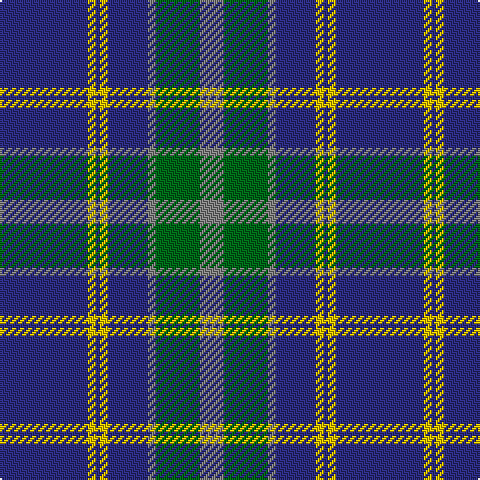

In pattern [BYBYBGGG](/patterns/bybybggg/).

This was sourced from tartans-authority.  It is a [8 stripes tartan](/stripes/stripes8/).

Original link http://www.tartansauthority.com/tartan-ferret/display/2343/

## Thread count
DB/44 Y4 DB2 Y4 DB20 N4 G22 N/12

## Palette
Each colour and its ΔE from the base-6 reference it is a variant of.

| Colour | Shade | Base | ΔE (OKLab) |
|---|---|---|---|
| DB | <code style="background-color:#2C2C80;">#2C2C80</code> `#2C2C80` | B <code style="background-color:#2A418A;">#2A418A</code> | 0.06 |
| G | <code style="background-color:#006818;">#006818</code> `#006818` | G <code style="background-color:#006100;">#006100</code> | 0.02 |
| N | <code style="background-color:#808080;">#808080</code> `#808080` | G <code style="background-color:#006100;">#006100</code> | 0.23 |
| Y | <code style="background-color:#E8C000;">#E8C000</code> `#E8C000` | Y <code style="background-color:#F2BF00;">#F2BF00</code> | 0.02 |

# Sample pattern

## Nearest tartans

The nearest existing variants by ΔTartan distance.

1. [Katsushika Corporate Tartan Tartan Number: 2343. Earliest known date: 1997 Designed for Katsushika Scottish country dancers from Hiroshima. See products available Copyright © Blair Urquhart, Comrie, 2015](/setts/s8/b22y2b1y2b10r2g11r6x2~b2c2c80-g006818-rc80000-ye8c000/) — ΔT 0.75
1. [Tern House](/setts/s7/g23b3k8b4g4b56y8~b2c2c80-g006818-k101010-yd8b000/) — ΔT 0.82
1. [Katsushika Scottish Country Dancers](/setts/s8/b22y2b1y2b10r2g11r6x2~b304080-g008000-rc00000-yf0c000/) — ΔT 0.84
1. [Bedford Academy](/setts/s9/g8y4g35b2w8b2g4b21g4x2~b000080-g707070-w86c3e3-yeec327/) — ΔT 0.85
1. [Connecticut State Police PB (Cor.)](/setts/s6/b42ba2b2ba17y8ba4x2~b646464-ba00008c-yc88c00/) — ΔT 0.93
1. [Kelvinside Academy (School)](/setts/s8/w4g15b8k4b28k2b4w2~b3c3c68-g6c6c6c-k101010-we0e0e0/) — ΔT 0.94
1. [Unnamed C20th - USA](/setts/s7/b2y1b18g7r7b1g1x2~b2c2c80-g006818-rc80000-ye8c000/) — ΔT 1.00
1. [Fujisankei Serene (Corporate)](/setts/s9/r1w6b4w1b16ba1b4ba6w1x4~b2c2c80-ba5c5c5c-r888888-wc0c0c0/) — ΔT 1.06
1. [MacHardy](/setts/s8/b3r3g18b16w2b26r3g3x2~b304080-g008000-rc00000-we0e0e0/) — ΔT 1.13
1. [Kinross (Fashion)](/setts/s8/g20b2ga6b2g4b27y2b8x2~b1c0070-g285800-ga408060-yd09800/) — ΔT 1.15

## Neighbour map

Every grey dot is one of 15726 variants placed by the first two principal components of the ΔTartan feature space (44% of its variance). Red is this tartan; blue dots are its nearest — click one to open its page.

<svg viewBox="0 0 640 380" role="img" style="max-width:100%;height:auto;border:1px solid #e0e0e0;border-radius:4px;display:block" xmlns="http://www.w3.org/2000/svg"><image href="/nn/cloud.v1.png" width="640" height="380"/><a href="/setts/s8/b22y2b1y2b10r2g11r6x2~b2c2c80-g006818-rc80000-ye8c000/"><circle cx="341.7" cy="165.2" r="4" fill="#3465a4"><title>Katsushika Corporate Tartan Tartan Number: 2343. Earliest known date: 1997 Designed for Katsushika Scottish country dancers from Hiroshima. See products available Copyright © Blair Urquhart, Comrie, 2015</title></circle></a><a href="/setts/s7/g23b3k8b4g4b56y8~b2c2c80-g006818-k101010-yd8b000/"><circle cx="368.4" cy="173.5" r="4" fill="#3465a4"><title>Tern House</title></circle></a><a href="/setts/s8/b22y2b1y2b10r2g11r6x2~b304080-g008000-rc00000-yf0c000/"><circle cx="344.9" cy="166.2" r="4" fill="#3465a4"><title>Katsushika Scottish Country Dancers</title></circle></a><a href="/setts/s9/g8y4g35b2w8b2g4b21g4x2~b000080-g707070-w86c3e3-yeec327/"><circle cx="334.6" cy="159.4" r="4" fill="#3465a4"><title>Bedford Academy</title></circle></a><a href="/setts/s6/b42ba2b2ba17y8ba4x2~b646464-ba00008c-yc88c00/"><circle cx="379.1" cy="177.4" r="4" fill="#3465a4"><title>Connecticut State Police PB (Cor.)</title></circle></a><a href="/setts/s8/w4g15b8k4b28k2b4w2~b3c3c68-g6c6c6c-k101010-we0e0e0/"><circle cx="350.0" cy="185.2" r="4" fill="#3465a4"><title>Kelvinside Academy (School)</title></circle></a><a href="/setts/s7/b2y1b18g7r7b1g1x2~b2c2c80-g006818-rc80000-ye8c000/"><circle cx="348.4" cy="172.5" r="4" fill="#3465a4"><title>Unnamed C20th - USA</title></circle></a><a href="/setts/s9/r1w6b4w1b16ba1b4ba6w1x4~b2c2c80-ba5c5c5c-r888888-wc0c0c0/"><circle cx="342.2" cy="168.2" r="4" fill="#3465a4"><title>Fujisankei Serene (Corporate)</title></circle></a><a href="/setts/s8/b3r3g18b16w2b26r3g3x2~b304080-g008000-rc00000-we0e0e0/"><circle cx="358.1" cy="196.6" r="4" fill="#3465a4"><title>MacHardy</title></circle></a><a href="/setts/s8/g20b2ga6b2g4b27y2b8x2~b1c0070-g285800-ga408060-yd09800/"><circle cx="331.0" cy="195.1" r="4" fill="#3465a4"><title>Kinross (Fashion)</title></circle></a><circle cx="346.7" cy="171.8" r="5" fill="#c00000"/></svg>

ID: /setts/s8/b22y2b1y2b10g2ga11g6x2~b2c2c80-g808080-ga006818-ye8c000/
