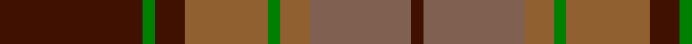

In pattern [BGBRGRRB](/patterns/bgbrgrrb/).

This was sourced from weddslist.  It is a [8 stripes tartan](/stripes/stripes8/).

Original link http://www.weddslist.com/cgi-bin/tartans/pg.pl?source=sts

## Thread count
DR/48 G4 DR10 LT28 G4 LT10 LTa34 DR/4

## Palette
Each colour and its ΔE from the base-6 reference it is a variant of.

| Colour | Shade | Base | ΔE (OKLab) |
|---|---|---|---|
| DR | <code style="background-color:#401000;">#401000</code> `#401000` | B <code style="background-color:#2A418A;">#2A418A</code> | 0.24 |
| G | <code style="background-color:#008000;">#008000</code> `#008000` | G <code style="background-color:#006100;">#006100</code> | 0.10 |
| LT | <code style="background-color:#906030;">#906030</code> `#906030` | R <code style="background-color:#CC0000;">#CC0000</code> | 0.15 |
| LTa | <code style="background-color:#806050;">#806050</code> `#806050` | R <code style="background-color:#CC0000;">#CC0000</code> | 0.17 |

# Sample pattern

## Nearest tartans

The nearest existing variants by ΔTartan distance.

1. [Loch Rannoch Trade Tartan Tartan Number: 1735. Earliest known date: 1975 Nothing See products available Copyright © Blair Urquhart, Comrie, 2015](/setts/s8/b24g2b5y14g2y5ga17b2x2~b441800-g006818-ga604000-ya08858/) — ΔT 0.61
1. [MacNab VS](/setts/s7/g6r2b2g4b2r12k1x2~b59110d-g11450d-k000000-raa0000/) — ΔT 1.12
1. [Hubbard (2016)](/setts/s9/b5r19ba2g8r3g18ba2g9ba2x2~b003c64-ba1c1c1c-g5c6428-rc80000/) — ΔT 1.19
1. [Ballantrae (Macnaughtons)](/setts/s7/g6r3g34k16y3b22r4x2~b1c1c1c-g604000-k101010-rc80000-ye8c000/) — ΔT 1.21
1. [McCall/MacCall](/setts/s11/b8k5b8g27b13g3b13r27b8r3b3x2~b600030-g006030-k000000-r806050/) — ΔT 1.25
1. [Strathspey (Fashion)](/setts/s6/g3r22b5g10k10g2x2~b48748c-g006818-k101010-r880000/) — ΔT 1.27
1. [Scott Htg (Clan)](/setts/s8/r3g16ga10r3ga3w2ga3r3x2~g604000-ga006818-rc80000-wc0c0c0/) — ΔT 1.28
1. [McInery (Personal)](/setts/s8/r8g2r12k6r3b3g24k2x2~b1c0070-g006818-k101010-r880000/) — ΔT 1.30
1. [Invertere, (Daks)](/setts/s8/r5g12ra4b4ra22g3ra4r5~b000050-g003000-r900030-ra906030/) — ΔT 1.30
1. [Montrose (Macnaughton variation)](/setts/s9/b1k1r12g12k6b5r12k1b1x4~b1c0070-g006818-k101010-r880000/) — ΔT 1.33

## Neighbour map

Every grey dot is one of 15726 variants placed by the first two principal components of the ΔTartan feature space (44% of its variance). Red is this tartan; blue dots are its nearest — click one to open its page.

<svg viewBox="0 0 640 380" role="img" style="max-width:100%;height:auto;border:1px solid #e0e0e0;border-radius:4px;display:block" xmlns="http://www.w3.org/2000/svg"><image href="/nn/cloud.v1.png" width="640" height="380"/><a href="/setts/s8/b24g2b5y14g2y5ga17b2x2~b441800-g006818-ga604000-ya08858/"><circle cx="276.5" cy="201.4" r="4" fill="#3465a4"><title>Loch Rannoch Trade Tartan Tartan Number: 1735. Earliest known date: 1975 Nothing See products available Copyright © Blair Urquhart, Comrie, 2015</title></circle></a><a href="/setts/s7/g6r2b2g4b2r12k1x2~b59110d-g11450d-k000000-raa0000/"><circle cx="319.7" cy="208.8" r="4" fill="#3465a4"><title>MacNab VS</title></circle></a><a href="/setts/s9/b5r19ba2g8r3g18ba2g9ba2x2~b003c64-ba1c1c1c-g5c6428-rc80000/"><circle cx="317.0" cy="208.7" r="4" fill="#3465a4"><title>Hubbard (2016)</title></circle></a><a href="/setts/s7/g6r3g34k16y3b22r4x2~b1c1c1c-g604000-k101010-rc80000-ye8c000/"><circle cx="263.0" cy="198.3" r="4" fill="#3465a4"><title>Ballantrae (Macnaughtons)</title></circle></a><a href="/setts/s11/b8k5b8g27b13g3b13r27b8r3b3x2~b600030-g006030-k000000-r806050/"><circle cx="264.3" cy="209.0" r="4" fill="#3465a4"><title>McCall/MacCall</title></circle></a><a href="/setts/s6/g3r22b5g10k10g2x2~b48748c-g006818-k101010-r880000/"><circle cx="250.4" cy="222.5" r="4" fill="#3465a4"><title>Strathspey (Fashion)</title></circle></a><a href="/setts/s8/r3g16ga10r3ga3w2ga3r3x2~g604000-ga006818-rc80000-wc0c0c0/"><circle cx="246.8" cy="220.1" r="4" fill="#3465a4"><title>Scott Htg (Clan)</title></circle></a><a href="/setts/s8/r8g2r12k6r3b3g24k2x2~b1c0070-g006818-k101010-r880000/"><circle cx="279.7" cy="197.6" r="4" fill="#3465a4"><title>McInery (Personal)</title></circle></a><a href="/setts/s8/r5g12ra4b4ra22g3ra4r5~b000050-g003000-r900030-ra906030/"><circle cx="284.5" cy="221.5" r="4" fill="#3465a4"><title>Invertere, (Daks)</title></circle></a><a href="/setts/s9/b1k1r12g12k6b5r12k1b1x4~b1c0070-g006818-k101010-r880000/"><circle cx="271.3" cy="195.3" r="4" fill="#3465a4"><title>Montrose (Macnaughton variation)</title></circle></a><circle cx="291.7" cy="206.2" r="5" fill="#c00000"/></svg>

ID: /setts/s8/b24g2b5r14g2r5ra17b2x2~b401000-g008000-r906030-ra806050/
