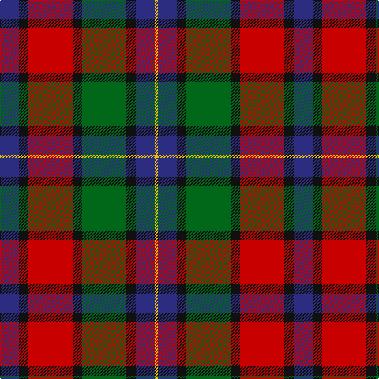

In pattern [BKRKGKBY](/patterns/bkrkgkby/).

This was sourced from register-of-tartans.  It is a [8 stripes tartan](/stripes/stripes8/).

Original link https://www.tartanregister.gov.uk/tartanDetails.aspx?ref=1968

## Attestations

This cloth appears in 2 source records; the oldest owns this page.

- 01/01/1880 — Kilgour (Asymmetrical) (register-of-tartans, [record](https://www.tartanregister.gov.uk/tartanDetails.aspx?ref=1968))
- 1880 — Kilgour (Clan) (tartans-authority, [record](http://www.tartansauthority.com/tartan-ferret/display/1979/))

## Thread count
DBa/24 K12 R56 K12 G56 K12 DBa24 Y/4

## Palette
Each colour and its ΔE from the base-6 reference it is a variant of.

| Colour | Shade | Base | ΔE (OKLab) |
|---|---|---|---|
| DB | <code style="background-color:#202060;">#202060</code> `#202060` | B <code style="background-color:#2C4084;">#2C4084</code> | 0.11 |
| DBa | <code style="background-color:#2C2C80;">#2C2C80</code> `#2C2C80` | B <code style="background-color:#2C4084;">#2C4084</code> | 0.05 |
| DG | <code style="background-color:#003820;">#003820</code> `#003820` | G <code style="background-color:#006400;">#006400</code> | 0.16 |
| G | <code style="background-color:#006818;">#006818</code> `#006818` | G <code style="background-color:#006400;">#006400</code> | 0.02 |
| K | <code style="background-color:#101010;">#101010</code> `#101010` | K <code style="background-color:#000000;">#000000</code> | 0.17 |
| R | <code style="background-color:#C80000;">#C80000</code> `#C80000` | R <code style="background-color:#C80000;">#C80000</code> | 0.00 |
| Y | <code style="background-color:#E8C000;">#E8C000</code> `#E8C000` | Y <code style="background-color:#E8C000;">#E8C000</code> | 0.00 |

# Sample pattern

ID: /setts/s8/b24k12r56k12g56k12b24y4-b2c2c80-g006818-k101010-rc80000-ye8c000/
