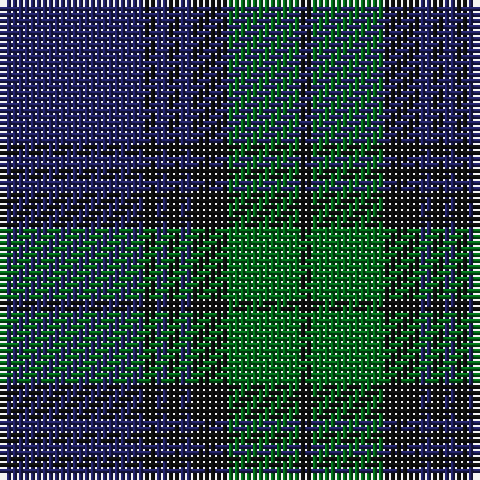

In pattern [BKBKBKGK](/patterns/bkbkbkgk/).

This was sourced from house-of-tartan.  It is a [8 stripes tartan](/stripes/stripes8/).

Original link http://www.house-of-tartan.scotland.net/house/TartanViewjs.asp?colr=Def&tnam=2200

## Thread count
DB/24 K2 DB2 K2 DB2 K6 G12 K/2

## Palette
Each colour and its ΔE from the base-6 reference it is a variant of.

| Colour | Shade | Base | ΔE (OKLab) |
|---|---|---|---|
| DB | <code style="background-color:#202060;">#202060</code> `#202060` | B <code style="background-color:#2C4084;">#2C4084</code> | 0.11 |
| G | <code style="background-color:#006818;">#006818</code> `#006818` | G <code style="background-color:#006400;">#006400</code> | 0.02 |
| K | <code style="background-color:#101010;">#101010</code> `#101010` | K <code style="background-color:#000000;">#000000</code> | 0.17 |

# Sample pattern

## Nearest tartans

The nearest existing variants by ΔTartan distance.

1. [Gammell (Brown) (Personal)](/setts/s8/b40g4b4g4b4g12ga30g4-b2c2c80-g604000-ga006818/) — ΔT 1.14
1. [Pinehurst Resort](/setts/s7/k16r4k16r4b56ba4b4-b0c5454-ba505050-k000034-r8c0000/) — ΔT 1.18
1. [Perthshire, New /Tourist Board](/setts/s6/b74r20g44b22g6r6-b000050-g003000-r800000/) — ΔT 1.23
1. [Scottish Monuments (Corporate)](/setts/s9/b6r4b4r6b40ba16k4ba12k6-b14283c-ba5c5c5c-k101010-r888888/) — ΔT 1.25
1. [Jones (Welsh Name)](/setts/s10/b6ba3b3ba15g7b7g5b17g46ga4-b202060-ba5c8ca8-g003820-ga285800/) — ΔT 1.27
1. [Barnaby Brown Pibroch](/setts/s9/g8r4g32b8g4b8g4b40r8-b000050-g004010-rc00020/) — ΔT 1.29
1. [Angus](/setts/s9/k12r4k56b56r4b4r4b4r8-b2c2c80-k101010-r880000/) — ΔT 1.29
1. [Gammell Family Tartan Tartan Number: 597. Earliest known date: 1965 Designed (probably by David Thomas and Arthur Mackie of Strathmore Woollen Co) for the Hill family of Angus as a personal tartan. Tommy Gemmell (6.3.05) said "The tartan was designed using the largest Government sett by Mrs Hill's mother - a Mrs Gammell - who was a handweaver." See products available Copyright © Blair Urquhart, Comrie, 2015](/setts/s8/b64ba6b6ba6b6ba20g48r6-b202060-ba441800-g006818-r901c38/) — ΔT 1.30
1. [Trotter (Personal)](/setts/s9/b46k4b4k4b4k56r4k8ba4-b344454-ba305060-k00002c-r880000/) — ΔT 1.32
1. [Auckland (Fashion)](/setts/s8/g6k6b4k32b4k4b48w4-b2c2c80-g003820-k101010-wc0c0c0/) — ΔT 1.32

## Neighbour map

Every grey dot is one of 15726 variants placed by the first two principal components of the ΔTartan feature space (44% of its variance). Red is this tartan; blue dots are its nearest — click one to open its page.

<svg viewBox="0 0 640 380" role="img" style="max-width:100%;height:auto;border:1px solid #e0e0e0;border-radius:4px;display:block" xmlns="http://www.w3.org/2000/svg"><image href="/nn/cloud.v1.png" width="640" height="380"/><a href="/setts/s8/b40g4b4g4b4g12ga30g4-b2c2c80-g604000-ga006818/"><circle cx="337.0" cy="231.4" r="4" fill="#3465a4"><title>Gammell (Brown) (Personal)</title></circle></a><a href="/setts/s7/k16r4k16r4b56ba4b4-b0c5454-ba505050-k000034-r8c0000/"><circle cx="389.4" cy="200.5" r="4" fill="#3465a4"><title>Pinehurst Resort</title></circle></a><a href="/setts/s6/b74r20g44b22g6r6-b000050-g003000-r800000/"><circle cx="385.0" cy="258.3" r="4" fill="#3465a4"><title>Perthshire, New /Tourist Board</title></circle></a><a href="/setts/s9/b6r4b4r6b40ba16k4ba12k6-b14283c-ba5c5c5c-k101010-r888888/"><circle cx="324.9" cy="212.0" r="4" fill="#3465a4"><title>Scottish Monuments (Corporate)</title></circle></a><a href="/setts/s10/b6ba3b3ba15g7b7g5b17g46ga4-b202060-ba5c8ca8-g003820-ga285800/"><circle cx="344.6" cy="190.0" r="4" fill="#3465a4"><title>Jones (Welsh Name)</title></circle></a><a href="/setts/s9/g8r4g32b8g4b8g4b40r8-b000050-g004010-rc00020/"><circle cx="324.4" cy="224.0" r="4" fill="#3465a4"><title>Barnaby Brown Pibroch</title></circle></a><a href="/setts/s9/k12r4k56b56r4b4r4b4r8-b2c2c80-k101010-r880000/"><circle cx="370.1" cy="203.6" r="4" fill="#3465a4"><title>Angus</title></circle></a><a href="/setts/s8/b64ba6b6ba6b6ba20g48r6-b202060-ba441800-g006818-r901c38/"><circle cx="311.4" cy="209.7" r="4" fill="#3465a4"><title>Gammell Family Tartan Tartan Number: 597. Earliest known date: 1965 Designed (probably by David Thomas and Arthur Mackie of Strathmore Woollen Co) for the Hill family of Angus as a personal tartan. Tommy Gemmell (6.3.05) said &quot;The tartan was designed using the largest Government sett by Mrs Hill's mother - a Mrs Gammell - who was a handweaver.&quot; See products available Copyright © Blair Urquhart, Comrie, 2015</title></circle></a><a href="/setts/s9/b46k4b4k4b4k56r4k8ba4-b344454-ba305060-k00002c-r880000/"><circle cx="399.8" cy="190.9" r="4" fill="#3465a4"><title>Trotter (Personal)</title></circle></a><a href="/setts/s8/g6k6b4k32b4k4b48w4-b2c2c80-g003820-k101010-wc0c0c0/"><circle cx="357.8" cy="198.5" r="4" fill="#3465a4"><title>Auckland (Fashion)</title></circle></a><circle cx="382.0" cy="223.4" r="5" fill="#c00000"/></svg>

ID: /setts/s8/b24k2b2k2b2k6g12k2-b202060-g006818-k101010/
