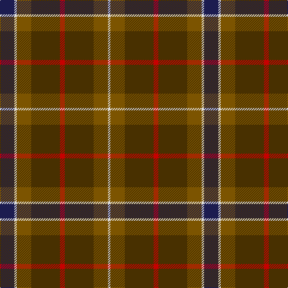

In pattern [BWGGRGGW](/patterns/bwggrggw/).

This was sourced from tartans-authority.  It is a [8 stripes tartan](/stripes/stripes8/).

Original link http://www.tartansauthority.com/tartan-ferret/display/7150/

## Thread count
DB/24 LN4 T24 Ta48 R8 Ta48 T24 LN/4

## Palette
Each colour and its ΔE from the base-6 reference it is a variant of.

| Colour | Shade | Base | ΔE (OKLab) |
|---|---|---|---|
| DB | <code style="background-color:#1C1C50;">#1C1C50</code> `#1C1C50` | B <code style="background-color:#2C4084;">#2C4084</code> | 0.14 |
| LN | <code style="background-color:#E0E0E0;">#E0E0E0</code> `#E0E0E0` | W <code style="background-color:#F4F4F0;">#F4F4F0</code> | 0.06 |
| R | <code style="background-color:#C80000;">#C80000</code> `#C80000` | R <code style="background-color:#C80000;">#C80000</code> | 0.00 |
| T | <code style="background-color:#7C5400;">#7C5400</code> `#7C5400` | G <code style="background-color:#006400;">#006400</code> | 0.15 |
| Ta | <code style="background-color:#483000;">#483000</code> `#483000` | G <code style="background-color:#006400;">#006400</code> | 0.17 |

# Sample pattern

## Nearest tartans

The nearest existing variants by ΔTartan distance.

1. [Indiana "Cardinal" (District)](/setts/s8/b32y4g48r40ga8r24ga8r16-b1c1c50-g006818-ga8c7038-r880000-yd09800/) — ΔT 0.98
1. [Ballantrae (Macnaughtons)](/setts/s7/g12r6g68k32y6b44r8-b1c1c1c-g604000-k101010-rc80000-ye8c000/) — ΔT 1.07
1. [Tartan for London, A (Fashion)](/setts/s7/r60g36y6g36r40w6ga6-g003820-ga006818-r880000-w98c8e8-ya0a0a0/) — ΔT 1.07
1. [Duchess of York Family Tartan Tartan Number: 607. Earliest known date: 1941 Found in sample books. See products available Copyright © Blair Urquhart, Comrie, 2015](/setts/s9/b2ba18g10ba2k10ba2g10ba18w2-b2c2c80-ba480800-g006818-k101010-we0e0e0/) — ΔT 1.13
1. [Duchess of York (Fashion)](/setts/s9/b4g36ga20g2k20g4ga20g36w4-b202060-g604000-ga003820-k101010-wfcfcfc/) — ΔT 1.17
1. [Mica, Green (Fashion)](/setts/s8/g12r4g24k8b28k2g6y4-b3c3c64-g505028-k000000-r640000-yc89800/) — ΔT 1.19
1. [Fraser Hunting Clan Tartan Tartan Number: 1659. Earliest known date: 1906 (1855) In the Hunting Fraser, brown replaces the red of the Clan sett. The late Charles Ian Fraser of Reeling said, in his publication, "Clan Fraser", that this sett was designed by the Sobieski Stuart brothers at the request of Lord Lovat for use by the Inverness and Nairn militia. A letter to Lord Lovat from the War Office, c.1855, authorised the use of the Fraser tartan for the corps. The tartan is worn by the Boghall & Bathgate pipe bands. (Strathallan 1994) See products available Copyright © Blair Urquhart, Comrie, 2015](/setts/s11/r6g36ga20g4b20g4b20g4ga20g36w6-b2c2c80-g604000-ga006818-rc80000-we0e0e0/) — ΔT 1.23
1. [Fulton](/setts/s9/b6k2g32r10g12r10g28r32y4-b6c0070-g006818-k101010-r880000-yd09800/) — ΔT 1.28
1. [Glasgow Cathedral 2000](/setts/s10/g44r6b20ba4b20r42g44r6y4b4-b003c64-ba1870a4-g005814-r940000-yb89800/) — ΔT 1.32
1. [Loch Rannoch Trade Tartan Tartan Number: 1735. Earliest known date: 1975 Nothing See products available Copyright © Blair Urquhart, Comrie, 2015](/setts/s8/b48g4b10y28g4y10ga34b4-b441800-g006818-ga604000-ya08858/) — ΔT 1.33

## Neighbour map

Every grey dot is one of 15726 variants placed by the first two principal components of the ΔTartan feature space (44% of its variance). Red is this tartan; blue dots are its nearest — click one to open its page.

<svg viewBox="0 0 640 380" role="img" style="max-width:100%;height:auto;border:1px solid #e0e0e0;border-radius:4px;display:block" xmlns="http://www.w3.org/2000/svg"><image href="/nn/cloud.v1.png" width="640" height="380"/><a href="/setts/s8/b32y4g48r40ga8r24ga8r16-b1c1c50-g006818-ga8c7038-r880000-yd09800/"><circle cx="234.7" cy="201.6" r="4" fill="#3465a4"><title>Indiana &quot;Cardinal&quot; (District)</title></circle></a><a href="/setts/s7/g12r6g68k32y6b44r8-b1c1c1c-g604000-k101010-rc80000-ye8c000/"><circle cx="261.5" cy="199.2" r="4" fill="#3465a4"><title>Ballantrae (Macnaughtons)</title></circle></a><a href="/setts/s7/r60g36y6g36r40w6ga6-g003820-ga006818-r880000-w98c8e8-ya0a0a0/"><circle cx="308.4" cy="212.9" r="4" fill="#3465a4"><title>Tartan for London, A (Fashion)</title></circle></a><a href="/setts/s9/b2ba18g10ba2k10ba2g10ba18w2-b2c2c80-ba480800-g006818-k101010-we0e0e0/"><circle cx="281.8" cy="205.6" r="4" fill="#3465a4"><title>Duchess of York Family Tartan Tartan Number: 607. Earliest known date: 1941 Found in sample books. See products available Copyright © Blair Urquhart, Comrie, 2015</title></circle></a><a href="/setts/s9/b4g36ga20g2k20g4ga20g36w4-b202060-g604000-ga003820-k101010-wfcfcfc/"><circle cx="330.9" cy="194.1" r="4" fill="#3465a4"><title>Duchess of York (Fashion)</title></circle></a><a href="/setts/s8/g12r4g24k8b28k2g6y4-b3c3c64-g505028-k000000-r640000-yc89800/"><circle cx="271.2" cy="189.8" r="4" fill="#3465a4"><title>Mica, Green (Fashion)</title></circle></a><a href="/setts/s11/r6g36ga20g4b20g4b20g4ga20g36w6-b2c2c80-g604000-ga006818-rc80000-we0e0e0/"><circle cx="243.1" cy="203.1" r="4" fill="#3465a4"><title>Fraser Hunting Clan Tartan Tartan Number: 1659. Earliest known date: 1906 (1855) In the Hunting Fraser, brown replaces the red of the Clan sett. The late Charles Ian Fraser of Reeling said, in his publication, &quot;Clan Fraser&quot;, that this sett was designed by the Sobieski Stuart brothers at the request of Lord Lovat for use by the Inverness and Nairn militia. A letter to Lord Lovat from the War Office, c.1855, authorised the use of the Fraser tartan for the corps. The tartan is worn by the Boghall &amp; Bathgate pipe bands. (Strathallan 1994) See products available Copyright © Blair Urquhart, Comrie, 2015</title></circle></a><a href="/setts/s9/b6k2g32r10g12r10g28r32y4-b6c0070-g006818-k101010-r880000-yd09800/"><circle cx="323.1" cy="186.9" r="4" fill="#3465a4"><title>Fulton</title></circle></a><a href="/setts/s10/g44r6b20ba4b20r42g44r6y4b4-b003c64-ba1870a4-g005814-r940000-yb89800/"><circle cx="268.2" cy="194.6" r="4" fill="#3465a4"><title>Glasgow Cathedral 2000</title></circle></a><a href="/setts/s8/b48g4b10y28g4y10ga34b4-b441800-g006818-ga604000-ya08858/"><circle cx="275.4" cy="202.0" r="4" fill="#3465a4"><title>Loch Rannoch Trade Tartan Tartan Number: 1735. Earliest known date: 1975 Nothing See products available Copyright © Blair Urquhart, Comrie, 2015</title></circle></a><circle cx="291.3" cy="206.6" r="5" fill="#c00000"/></svg>

ID: /setts/s8/b24w4g24ga48r8ga48g24w4-b1c1c50-g7c5400-ga483000-rc80000-we0e0e0/
