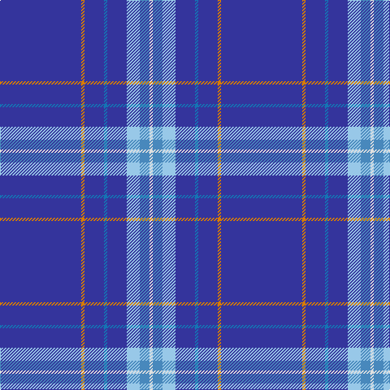

In pattern [BYBBBWBW](/patterns/bybbbwbw/).

This was sourced from register-of-tartans.  It is a [8 stripes tartan](/stripes/stripes8/).

Original link https://www.tartanregister.gov.uk/tartanDetails.aspx?ref=3418

## Thread count
Bb/100 O4 Bb24 B4 Bb24 LB16 Ba12 LN/4

## Palette
Each colour and its ΔE from the base-6 reference it is a variant of.

| Colour | Shade | Base | ΔE (OKLab) |
|---|---|---|---|
| B | <code style="background-color:#1474B4;">#1474B4</code> `#1474B4` | B <code style="background-color:#2A418A;">#2A418A</code> | 0.15 |
| Ba | <code style="background-color:#4888BC;">#4888BC</code> `#4888BC` | B <code style="background-color:#2A418A;">#2A418A</code> | 0.21 |
| Bb | <code style="background-color:#34349C;">#34349C</code> `#34349C` | B <code style="background-color:#2A418A;">#2A418A</code> | 0.04 |
| LB | <code style="background-color:#98C8E8;">#98C8E8</code> `#98C8E8` | W <code style="background-color:#F7F7F7;">#F7F7F7</code> | 0.18 |
| LN | <code style="background-color:#E0E0E0;">#E0E0E0</code> `#E0E0E0` | W <code style="background-color:#F7F7F7;">#F7F7F7</code> | 0.07 |
| O | <code style="background-color:#D87C00;">#D87C00</code> `#D87C00` | Y <code style="background-color:#F2BF00;">#F2BF00</code> | 0.17 |

# Sample pattern

## Nearest tartans

The nearest existing variants by ΔTartan distance.

1. [St. Petersburg City (District)](/setts/s8/b60g10b3w6y2b9r2wa2x2~b34349c-g289c18-rc80000-w98c8e8-wae0e0e0-ye8c000/) — ΔT 1.23
1. [Boat of Garten (District)](/setts/s8/b61w4b2w7ba2g3y2b16x2~b2c2c80-ba9050d8-g006818-we0e0e0-ye8c000/) — ΔT 1.74
1. [RAAF #4](/setts/s9/b48w2b7w2b7w2b20ba11r2x2~b2c2c80-ba5c8ca8-rc80000-we0e0e0/) — ΔT 1.89
1. [U.S. Law Enforcement](/setts/s10/y4k3b6ba4b57r3b3r3b3ra3x2~b202060-ba2c2c80-k101010-r888888-rac80000-y9cb0a8/) — ΔT 1.98
1. [Laidlaw's Highland Drovers (Corp)](/setts/s7/b35k10b4w2b3r2y2x2~b2c2c80-k101010-rc80000-we0e0e0-ye8c000/) — ΔT 2.00
1. [Kendle (2013)](/setts/s6/r5b58y4ba6ya4k4x2~b2c2c80-ba5f749c-k1c1714-rc82828-yb0b0b0-yaf8e38c/) — ΔT 2.00
1. [Kendle (2013)](/setts/s6/r5b58w4ba6y4k4x2~b2c2c80-ba5c8ca8-k101010-rc80000-wa8ace8-ye8c000/) — ΔT 2.01
1. [Visit Scotland](/setts/s10/b51ba4b7r2b2g2b2ga10b13w2x2~b2c2c80-ba1474b4-g408060-ga005448-rb468ac-we0e0e0/) — ΔT 2.09
1. [Centrica Energy](/setts/s9/w12b79y6b53ya4b22wa10b24yb8~b00008b-wffffff-waf6a4d5-yee9a00-ya6ca6cd-yb7ccd7c/) — ΔT 2.10
1. [London Caledonian Rugby Club](/setts/s6/r5b40w1b13g8k4x2~b00008c-g003800-k000000-r8c0000-wc8c8c8/) — ΔT 2.12

## Neighbour map

Every grey dot is one of 15726 variants placed by the first two principal components of the ΔTartan feature space (44% of its variance). Red is this tartan; blue dots are its nearest — click one to open its page.

<svg viewBox="0 0 640 380" role="img" style="max-width:100%;height:auto;border:1px solid #e0e0e0;border-radius:4px;display:block" xmlns="http://www.w3.org/2000/svg"><image href="/nn/cloud.v1.png" width="640" height="380"/><a href="/setts/s8/b60g10b3w6y2b9r2wa2x2~b34349c-g289c18-rc80000-w98c8e8-wae0e0e0-ye8c000/"><circle cx="476.7" cy="99.0" r="4" fill="#3465a4"><title>St. Petersburg City (District)</title></circle></a><a href="/setts/s8/b61w4b2w7ba2g3y2b16x2~b2c2c80-ba9050d8-g006818-we0e0e0-ye8c000/"><circle cx="532.4" cy="115.7" r="4" fill="#3465a4"><title>Boat of Garten (District)</title></circle></a><a href="/setts/s9/b48w2b7w2b7w2b20ba11r2x2~b2c2c80-ba5c8ca8-rc80000-we0e0e0/"><circle cx="547.6" cy="159.9" r="4" fill="#3465a4"><title>RAAF #4</title></circle></a><a href="/setts/s10/y4k3b6ba4b57r3b3r3b3ra3x2~b202060-ba2c2c80-k101010-r888888-rac80000-y9cb0a8/"><circle cx="515.8" cy="116.9" r="4" fill="#3465a4"><title>U.S. Law Enforcement</title></circle></a><a href="/setts/s7/b35k10b4w2b3r2y2x2~b2c2c80-k101010-rc80000-we0e0e0-ye8c000/"><circle cx="450.6" cy="154.3" r="4" fill="#3465a4"><title>Laidlaw's Highland Drovers (Corp)</title></circle></a><a href="/setts/s6/r5b58y4ba6ya4k4x2~b2c2c80-ba5f749c-k1c1714-rc82828-yb0b0b0-yaf8e38c/"><circle cx="418.4" cy="140.0" r="4" fill="#3465a4"><title>Kendle (2013)</title></circle></a><a href="/setts/s6/r5b58w4ba6y4k4x2~b2c2c80-ba5c8ca8-k101010-rc80000-wa8ace8-ye8c000/"><circle cx="417.9" cy="139.9" r="4" fill="#3465a4"><title>Kendle (2013)</title></circle></a><a href="/setts/s10/b51ba4b7r2b2g2b2ga10b13w2x2~b2c2c80-ba1474b4-g408060-ga005448-rb468ac-we0e0e0/"><circle cx="560.9" cy="133.8" r="4" fill="#3465a4"><title>Visit Scotland</title></circle></a><a href="/setts/s9/w12b79y6b53ya4b22wa10b24yb8~b00008b-wffffff-waf6a4d5-yee9a00-ya6ca6cd-yb7ccd7c/"><circle cx="445.3" cy="142.2" r="4" fill="#3465a4"><title>Centrica Energy</title></circle></a><a href="/setts/s6/r5b40w1b13g8k4x2~b00008c-g003800-k000000-r8c0000-wc8c8c8/"><circle cx="499.5" cy="162.1" r="4" fill="#3465a4"><title>London Caledonian Rugby Club</title></circle></a><circle cx="497.3" cy="130.1" r="5" fill="#c00000"/></svg>

ID: /setts/s8/b25y1b6ba1b6w4bb3wa1x4~b34349c-ba1474b4-bb4888bc-w98c8e8-wae0e0e0-yd87c00/
