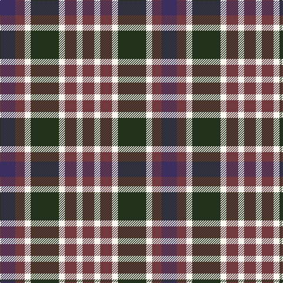

In pattern [BBWGWBWB](/patterns/bbwgwbwb/).

This was sourced from register-of-tartans.  It is a [8 stripes tartan](/stripes/stripes8/).

Original link https://www.tartanregister.gov.uk/tartanDetails.aspx?ref=10803

## Thread count
DB/26 DR16 W10 K48 W10 DR20 W10 DR/20

## Palette
Each colour and its ΔE from the base-6 reference it is a variant of.

| Colour | Shade | Base | ΔE (OKLab) |
|---|---|---|---|
| DB | <code style="background-color:#3D2E60;">#3D2E60</code> `#3D2E60` | B <code style="background-color:#2C4084;">#2C4084</code> | 0.08 |
| DR | <code style="background-color:#72393F;">#72393F</code> `#72393F` | B <code style="background-color:#2C4084;">#2C4084</code> | 0.16 |
| K | <code style="background-color:#23321B;">#23321B</code> `#23321B` | G <code style="background-color:#006400;">#006400</code> | 0.17 |
| W | <code style="background-color:#F9F5EF;">#F9F5EF</code> `#F9F5EF` | W <code style="background-color:#F4F4F0;">#F4F4F0</code> | 0.01 |

# Sample pattern

ID: /setts/s8/b26ba16w10g48w10ba20w10ba20-b3d2e60-ba72393f-g23321b-wf9f5ef/
