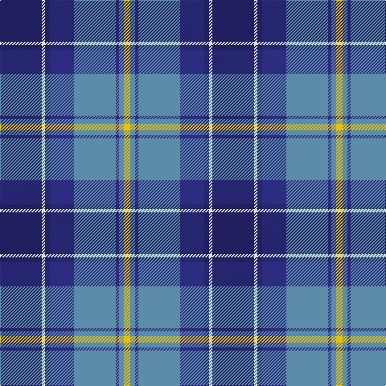

In pattern [BWBBBBBY](/patterns/bwbbbbby/).

This was sourced from house-of-tartan.  It is a [8 stripes tartan](/stripes/stripes8/).

Original link http://www.house-of-tartan.scotland.net/house/TartanViewjs.asp?colr=Def&tnam=2150

## Thread count
DBa/52 LN4 DBa6 DB30 B52 DB4 B6 Y/8

## Palette
Each colour and its ΔE from the base-6 reference it is a variant of.

| Colour | Shade | Base | ΔE (OKLab) |
|---|---|---|---|
| B | <code style="background-color:#5C8CA8;">#5C8CA8</code> `#5C8CA8` | B <code style="background-color:#2A418A;">#2A418A</code> | 0.23 |
| DB | <code style="background-color:#2C2C80;">#2C2C80</code> `#2C2C80` | B <code style="background-color:#2A418A;">#2A418A</code> | 0.06 |
| DBa | <code style="background-color:#202060;">#202060</code> `#202060` | B <code style="background-color:#2A418A;">#2A418A</code> | 0.11 |
| LN | <code style="background-color:#E0E0E0;">#E0E0E0</code> `#E0E0E0` | W <code style="background-color:#F7F7F7;">#F7F7F7</code> | 0.07 |
| Y | <code style="background-color:#E8C000;">#E8C000</code> `#E8C000` | Y <code style="background-color:#F2BF00;">#F2BF00</code> | 0.02 |

# Sample pattern

## Nearest tartans

The nearest existing variants by ΔTartan distance.

1. [Banff, and Buchan](/setts/s8/b26w2b3ba15bb26ba2bb3y4~b000050-ba304080-bb5480b0-we0e0e0-yf0c000~x2/) — ΔT 0.69
1. [Icelandair](/setts/s7/b3ba24k11b20w2b5y3~b2c4084-ba2888c4-k101010-wffffff-yd87c00~x2/) — ΔT 0.75
1. [Mina Perhonen Japanese Corporate Tartan Tartan Number: 5797. Earliest known date: pre 2003 Designed by Fiona Hall of Lochcarron as a corporate tartan for the Mina Company of Tokyo whose logo is a butterfly. The blues are from the company's colours and represent the sky, the yellow represents the butterfly and the white is for the clouds.'Perhonen' is Finnish for butterfly and chosen because the Japanese design world has a great affinity with some Scandinavian countries. See products available Copyright © Blair Urquhart, Comrie, 2015](/setts/s7/w4b24y2ba24bb5b4y4~b202060-ba2c2c80-bb5c8ca8-we0e0e0-ye8c000~x2/) — ΔT 0.83
1. [Highlands Country Club Corporate Tartan Tartan Number: 687. Earliest known date: 1984 Weft uses a dark green. See products available Copyright © Blair Urquhart, Comrie, 2015](/setts/s7/g5b15ba11w2ba1w1ga4~b2c2c80-ba5c8ca8-g006818-ga003820-we0e0e0~x4/) — ΔT 0.88
1. [Blue Peter](/setts/s9/y3b20b4ba4b4ba20g4bb4y2~b38409c-ba003c64-bb780078-g289c18-yfccc00~x2/) — ΔT 1.08
1. [de Franck, Matt (Personal)](/setts/s9/b12k2b2k2b2k12ba12bb3w1~b45626a-ba140e96-bb1c56de-k101010-wffffff~x2/) — ΔT 1.09
1. [Sabema](/setts/s8/b25k3b7k15ba25k2ba2w4~b2c2c80-ba1474b4-k101010-wf8f8f8~x2/) — ΔT 1.09
1. [Highlands Country Club](/setts/s7/g5b15ba11w2ba1w1ga4~b304080-ba5480b0-g008000-ga003000-we0e0e0~x4/) — ΔT 1.11
1. [Royal Air Force Regimental Tartan Tartan Number: 2123. Earliest known date: 1988 The Royal Air Force initially declined to approve this tartan for members of the Air Services. However the tartan was worn by Scottish ex-servicemen and those who have served in Scotland and became quite popular. In 2002 it was officially adopted by the RAF. See products available Copyright © Blair Urquhart, Comrie, 2015](/setts/s11/w4b8r3b25k13ba4bb29b3bb8b2r3~b2c2c80-ba1c0070-bb5c8ca8-k101010-r901c38-we0e0e0~x2/) — ΔT 1.12
1. [GYL family (Personal)](/setts/s10/b28r3w3r3w3r3b28k12ba38wa8~b2c4084-ba0064ac-k101010-rdc0000-we0e0e0-wafafa96/) — ΔT 1.19

## Neighbour map

Every grey dot is one of 15726 variants placed by the first two principal components of the ΔTartan feature space (44% of its variance). Red is this tartan; blue dots are its nearest — click one to open its page.

<svg viewBox="0 0 640 380" role="img" style="max-width:100%;height:auto;border:1px solid #e0e0e0;border-radius:4px;display:block" xmlns="http://www.w3.org/2000/svg"><image href="/nn/cloud.v1.png" width="640" height="380"/><a href="/setts/s8/b26w2b3ba15bb26ba2bb3y4~b000050-ba304080-bb5480b0-we0e0e0-yf0c000~x2/"><circle cx="178.1" cy="161.4" r="4" fill="#3465a4"><title>Banff, and Buchan</title></circle></a><a href="/setts/s7/b3ba24k11b20w2b5y3~b2c4084-ba2888c4-k101010-wffffff-yd87c00~x2/"><circle cx="203.3" cy="184.1" r="4" fill="#3465a4"><title>Icelandair</title></circle></a><a href="/setts/s7/w4b24y2ba24bb5b4y4~b202060-ba2c2c80-bb5c8ca8-we0e0e0-ye8c000~x2/"><circle cx="209.5" cy="173.7" r="4" fill="#3465a4"><title>Mina Perhonen Japanese Corporate Tartan Tartan Number: 5797. Earliest known date: pre 2003 Designed by Fiona Hall of Lochcarron as a corporate tartan for the Mina Company of Tokyo whose logo is a butterfly. The blues are from the company's colours and represent the sky, the yellow represents the butterfly and the white is for the clouds.'Perhonen' is Finnish for butterfly and chosen because the Japanese design world has a great affinity with some Scandinavian countries. See products available Copyright © Blair Urquhart, Comrie, 2015</title></circle></a><a href="/setts/s7/g5b15ba11w2ba1w1ga4~b2c2c80-ba5c8ca8-g006818-ga003820-we0e0e0~x4/"><circle cx="188.2" cy="169.9" r="4" fill="#3465a4"><title>Highlands Country Club Corporate Tartan Tartan Number: 687. Earliest known date: 1984 Weft uses a dark green. See products available Copyright © Blair Urquhart, Comrie, 2015</title></circle></a><a href="/setts/s9/y3b20b4ba4b4ba20g4bb4y2~b38409c-ba003c64-bb780078-g289c18-yfccc00~x2/"><circle cx="230.8" cy="182.0" r="4" fill="#3465a4"><title>Blue Peter</title></circle></a><a href="/setts/s9/b12k2b2k2b2k12ba12bb3w1~b45626a-ba140e96-bb1c56de-k101010-wffffff~x2/"><circle cx="175.6" cy="177.3" r="4" fill="#3465a4"><title>de Franck, Matt (Personal)</title></circle></a><a href="/setts/s8/b25k3b7k15ba25k2ba2w4~b2c2c80-ba1474b4-k101010-wf8f8f8~x2/"><circle cx="211.7" cy="191.1" r="4" fill="#3465a4"><title>Sabema</title></circle></a><a href="/setts/s7/g5b15ba11w2ba1w1ga4~b304080-ba5480b0-g008000-ga003000-we0e0e0~x4/"><circle cx="195.4" cy="173.1" r="4" fill="#3465a4"><title>Highlands Country Club</title></circle></a><a href="/setts/s11/w4b8r3b25k13ba4bb29b3bb8b2r3~b2c2c80-ba1c0070-bb5c8ca8-k101010-r901c38-we0e0e0~x2/"><circle cx="171.4" cy="130.4" r="4" fill="#3465a4"><title>Royal Air Force Regimental Tartan Tartan Number: 2123. Earliest known date: 1988 The Royal Air Force initially declined to approve this tartan for members of the Air Services. However the tartan was worn by Scottish ex-servicemen and those who have served in Scotland and became quite popular. In 2002 it was officially adopted by the RAF. See products available Copyright © Blair Urquhart, Comrie, 2015</title></circle></a><a href="/setts/s10/b28r3w3r3w3r3b28k12ba38wa8~b2c4084-ba0064ac-k101010-rdc0000-we0e0e0-wafafa96/"><circle cx="180.3" cy="134.8" r="4" fill="#3465a4"><title>GYL family (Personal)</title></circle></a><circle cx="192.6" cy="164.1" r="5" fill="#c00000"/></svg>

ID: /setts/s8/b26w2b3ba15bb26ba2bb3y4~b202060-ba2c2c80-bb5c8ca8-we0e0e0-ye8c000~x2/
