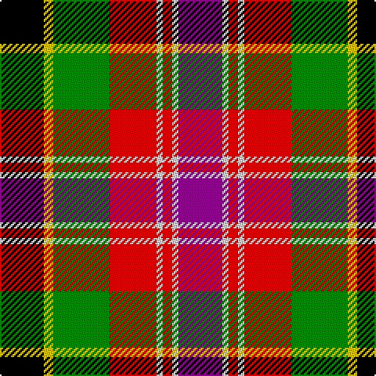

In pattern [BWRWRGYK](/patterns/bwrwrgyk/).

This was sourced from weddslist.  It is a [8 stripes tartan](/stripes/stripes8/).

Original link http://www.weddslist.com/cgi-bin/tartans/pg.pl?source=sts

## Thread count
K/28 Y6 G36 R30 LN4 R6 LN4 P/28

## Palette
Each colour and its ΔE from the base-6 reference it is a variant of.

| Colour | Shade | Base | ΔE (OKLab) |
|---|---|---|---|
| G | <code style="background-color:#008000;">#008000</code> `#008000` | G <code style="background-color:#006400;">#006400</code> | 0.09 |
| K | <code style="background-color:#000000;">#000000</code> `#000000` | K <code style="background-color:#000000;">#000000</code> | 0.00 |
| LN | <code style="background-color:#E0E0E0;">#E0E0E0</code> `#E0E0E0` | W <code style="background-color:#F4F4F0;">#F4F4F0</code> | 0.06 |
| P | <code style="background-color:#800080;">#800080</code> `#800080` | B <code style="background-color:#2C4084;">#2C4084</code> | 0.17 |
| R | <code style="background-color:#C00000;">#C00000</code> `#C00000` | R <code style="background-color:#C80000;">#C80000</code> | 0.02 |
| Y | <code style="background-color:#F0C000;">#F0C000</code> `#F0C000` | Y <code style="background-color:#E8C000;">#E8C000</code> | 0.01 |

# Sample pattern

## Nearest tartans

The nearest existing variants by ΔTartan distance.

1. [Black Hills](/setts/s9/b6w4g28r28k4b14k18y4k4-b2c2c80-g408060-k101010-rc80000-wffffff-ye8c000/) — ΔT 0.96
1. [Black Hills (Corporate)](/setts/s9/b6w4g28r28k4b14k18y4k4-b2c2c80-g408060-k101010-rc80000-we0e0e0-ye8c000/) — ΔT 1.02
1. [Culloden, Gold](/setts/s8/r10b4ba28w4k26g26k4y6-b5480b0-ba800070-g908000-k000000-rc00000-we0e0e0-yf0c000/) — ΔT 1.06
1. [Craigmoor](/setts/s9/k4r16b4k4r4k12ra4g12y2-b304080-g008000-k000000-rc00000-ra806050-yf0c000/) — ΔT 1.07
1. [Nicolson of Taransay (Personal)](/setts/s7/w12g20r44b32ga4k8k10-b2c2c80-g006818-ga289c18-k101010-rc80000-we0e0e0/) — ΔT 1.08
1. [Leitrim Irish County Tartan Tartan Number: 2271. Earliest known date: 1996 One of a series of Irish District tartans designed by Polly Wittering of the House of Edgar, with colours reminiscent of the Country with soft warm colours dominating. See products available Copyright © Blair Urquhart, Comrie, 2015](/setts/s10/y6k36y8b6y8r26y6ya36k4yb6-b28200c-k000000-rc05830-y749cb0-yaa4a8a8-ybd88c74/) — ΔT 1.13
1. [Culloden](/setts/s8/r10b4ba28w4k26y26k4ya6-b5c8ca8-ba780078-k101010-rc80000-wfcfcfc-ybc8c00-yae8c000/) — ΔT 1.14
1. [Comyn/Cumming](/setts/s9/b16k8b16k40y4g40r16w4r16-b3c82af-g005020-k101010-rdc0000-we0e0e0-ye8c000/) — ΔT 1.17
1. [Scotch House 2000 Dress](/setts/s7/g44w6k4y6k38r36b8-b1c0070-g006818-k101010-rc80000-we0e0e0-ye8c000/) — ΔT 1.17
1. [Comyn, Cumming](/setts/s9/b16k8b16k40y4g40r16w4r16-b5480b0-g008000-k000000-rc00000-we0e0e0-yf0c000/) — ΔT 1.19

## Neighbour map

Every grey dot is one of 15726 variants placed by the first two principal components of the ΔTartan feature space (44% of its variance). Red is this tartan; blue dots are its nearest — click one to open its page.

<svg viewBox="0 0 640 380" role="img" style="max-width:100%;height:auto;border:1px solid #e0e0e0;border-radius:4px;display:block" xmlns="http://www.w3.org/2000/svg"><image href="/nn/cloud.v1.png" width="640" height="380"/><a href="/setts/s9/b6w4g28r28k4b14k18y4k4-b2c2c80-g408060-k101010-rc80000-wffffff-ye8c000/"><circle cx="55.4" cy="162.2" r="4" fill="#3465a4"><title>Black Hills</title></circle></a><a href="/setts/s9/b6w4g28r28k4b14k18y4k4-b2c2c80-g408060-k101010-rc80000-we0e0e0-ye8c000/"><circle cx="58.5" cy="163.7" r="4" fill="#3465a4"><title>Black Hills (Corporate)</title></circle></a><a href="/setts/s8/r10b4ba28w4k26g26k4y6-b5480b0-ba800070-g908000-k000000-rc00000-we0e0e0-yf0c000/"><circle cx="31.6" cy="145.6" r="4" fill="#3465a4"><title>Culloden, Gold</title></circle></a><a href="/setts/s9/k4r16b4k4r4k12ra4g12y2-b304080-g008000-k000000-rc00000-ra806050-yf0c000/"><circle cx="76.4" cy="166.3" r="4" fill="#3465a4"><title>Craigmoor</title></circle></a><a href="/setts/s7/w12g20r44b32ga4k8k10-b2c2c80-g006818-ga289c18-k101010-rc80000-we0e0e0/"><circle cx="101.6" cy="160.3" r="4" fill="#3465a4"><title>Nicolson of Taransay (Personal)</title></circle></a><a href="/setts/s10/y6k36y8b6y8r26y6ya36k4yb6-b28200c-k000000-rc05830-y749cb0-yaa4a8a8-ybd88c74/"><circle cx="53.9" cy="133.9" r="4" fill="#3465a4"><title>Leitrim Irish County Tartan Tartan Number: 2271. Earliest known date: 1996 One of a series of Irish District tartans designed by Polly Wittering of the House of Edgar, with colours reminiscent of the Country with soft warm colours dominating. See products available Copyright © Blair Urquhart, Comrie, 2015</title></circle></a><a href="/setts/s8/r10b4ba28w4k26y26k4ya6-b5c8ca8-ba780078-k101010-rc80000-wfcfcfc-ybc8c00-yae8c000/"><circle cx="39.9" cy="145.4" r="4" fill="#3465a4"><title>Culloden</title></circle></a><a href="/setts/s9/b16k8b16k40y4g40r16w4r16-b3c82af-g005020-k101010-rdc0000-we0e0e0-ye8c000/"><circle cx="81.9" cy="161.5" r="4" fill="#3465a4"><title>Comyn/Cumming</title></circle></a><a href="/setts/s7/g44w6k4y6k38r36b8-b1c0070-g006818-k101010-rc80000-we0e0e0-ye8c000/"><circle cx="109.0" cy="157.8" r="4" fill="#3465a4"><title>Scotch House 2000 Dress</title></circle></a><a href="/setts/s9/b16k8b16k40y4g40r16w4r16-b5480b0-g008000-k000000-rc00000-we0e0e0-yf0c000/"><circle cx="60.6" cy="154.8" r="4" fill="#3465a4"><title>Comyn, Cumming</title></circle></a><circle cx="45.0" cy="155.3" r="5" fill="#c00000"/></svg>

ID: /setts/s8/b28w4r6w4r30g36y6k28-b800080-g008000-k000000-rc00000-we0e0e0-yf0c000/
