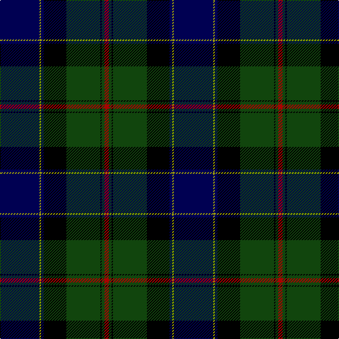

In pattern [BYBKGKGR](/patterns/bybkgkgr/).

This was sourced from weddslist.  It is a [8 stripes tartan](/stripes/stripes8/).

Original link http://www.weddslist.com/cgi-bin/tartans/pg.pl?source=tinsel

## Attestations

This cloth appears in 2 source records; the oldest owns this page.

- undated — Ogilvy VS (weddslist, [record](http://www.weddslist.com/cgi-bin/tartans/pg.pl?source=tinsel))
- undated — Ogilvy VS (weddslist, [record](http://www.weddslist.com/cgi-bin/tartans/pg.pl?source=x))

## Thread count
DB/56 LG2 DB4 K32 DG48 K2 DG4 DR/6

## Palette
Each colour and its ΔE from the base-6 reference it is a variant of.

| Colour | Shade | Base | ΔE (OKLab) |
|---|---|---|---|
| DB | <code style="background-color:#000052;">#000052</code> `#000052` | B <code style="background-color:#2A418A;">#2A418A</code> | 0.20 |
| DG | <code style="background-color:#11450D;">#11450D</code> `#11450D` | G <code style="background-color:#006100;">#006100</code> | 0.09 |
| DR | <code style="background-color:#AA0000;">#AA0000</code> `#AA0000` | R <code style="background-color:#CC0000;">#CC0000</code> | 0.07 |
| K | <code style="background-color:#000000;">#000000</code> `#000000` | K <code style="background-color:#000000;">#000000</code> | 0.00 |
| LG | <code style="background-color:#AAAA00;">#AAAA00</code> `#AAAA00` | Y <code style="background-color:#F2BF00;">#F2BF00</code> | 0.13 |

# Sample pattern

## Nearest tartans

The nearest existing variants by ΔTartan distance.

1. [Ogilvy VS](/setts/s8/b28y1b2k16g24k1g2r3x2~b00004c-g004c00-k000000-rc80000-yffc800/) — ΔT 0.45
1. [Ogilvy Hunting](/setts/s9/b24y2k8g16k1g3k1g3r4x2~b000052-g11450d-k000000-raa0000-yaaaa00/) — ΔT 0.53
1. [Colqhoun VS](/setts/s7/b4k2b16y1k8g24r4x2~b000052-g11450d-k000000-raa0000-yaaaaaa/) — ΔT 0.70
1. [Colqhoun VS](/setts/s7/b4k2b16y1k8g24r4~b000052-g11450d-k000000-raa0000-yaaaaaa/) — ΔT 0.70
1. [MacLaren](/setts/s7/b24k8g8r2g8k1y2x2~b000052-g11450d-k000000-raa0000-yaaaa00/) — ΔT 0.78
1. [MacLaren](/setts/s7/b24k8g8r2g8k1y2~b000052-g11450d-k000000-raa0000-yaaaa00/) — ΔT 0.78
1. [Fergusson](/setts/s7/b24k8g8r2g8k1y2x2~b000052-g11450d-k000000-raa0000-yaaaaaa/) — ΔT 0.81
1. [Fergusson](/setts/s7/b24k8g8r2g8k1y2~b000052-g11450d-k000000-raa0000-yaaaaaa/) — ΔT 0.81
1. [Weisfeld](/setts/s7/k6b3g28w1ba28b2w3x2~b304080-ba000050-g004010-k000000-we0e0e0/) — ΔT 0.84
1. [Singh, Gopal (Personal)](/setts/s6/k10r4g34b34k1y3x2~b000048-g002814-k000000-rfa4b00-yd87c00/) — ΔT 0.85

## Neighbour map

Every grey dot is one of 15726 variants placed by the first two principal components of the ΔTartan feature space (44% of its variance). Red is this tartan; blue dots are its nearest — click one to open its page.

<svg viewBox="0 0 640 380" role="img" style="max-width:100%;height:auto;border:1px solid #e0e0e0;border-radius:4px;display:block" xmlns="http://www.w3.org/2000/svg"><image href="/nn/cloud.v1.png" width="640" height="380"/><a href="/setts/s8/b28y1b2k16g24k1g2r3x2~b00004c-g004c00-k000000-rc80000-yffc800/"><circle cx="246.2" cy="142.8" r="4" fill="#3465a4"><title>Ogilvy VS</title></circle></a><a href="/setts/s9/b24y2k8g16k1g3k1g3r4x2~b000052-g11450d-k000000-raa0000-yaaaa00/"><circle cx="236.8" cy="142.5" r="4" fill="#3465a4"><title>Ogilvy Hunting</title></circle></a><a href="/setts/s7/b4k2b16y1k8g24r4x2~b000052-g11450d-k000000-raa0000-yaaaaaa/"><circle cx="245.1" cy="166.4" r="4" fill="#3465a4"><title>Colqhoun VS</title></circle></a><a href="/setts/s7/b4k2b16y1k8g24r4~b000052-g11450d-k000000-raa0000-yaaaaaa/"><circle cx="245.1" cy="166.4" r="4" fill="#3465a4"><title>Colqhoun VS</title></circle></a><a href="/setts/s7/b24k8g8r2g8k1y2x2~b000052-g11450d-k000000-raa0000-yaaaa00/"><circle cx="263.8" cy="165.0" r="4" fill="#3465a4"><title>MacLaren</title></circle></a><a href="/setts/s7/b24k8g8r2g8k1y2~b000052-g11450d-k000000-raa0000-yaaaa00/"><circle cx="263.8" cy="165.0" r="4" fill="#3465a4"><title>MacLaren</title></circle></a><a href="/setts/s7/b24k8g8r2g8k1y2x2~b000052-g11450d-k000000-raa0000-yaaaaaa/"><circle cx="264.4" cy="165.1" r="4" fill="#3465a4"><title>Fergusson</title></circle></a><a href="/setts/s7/b24k8g8r2g8k1y2~b000052-g11450d-k000000-raa0000-yaaaaaa/"><circle cx="264.4" cy="165.1" r="4" fill="#3465a4"><title>Fergusson</title></circle></a><a href="/setts/s7/k6b3g28w1ba28b2w3x2~b304080-ba000050-g004010-k000000-we0e0e0/"><circle cx="249.8" cy="145.1" r="4" fill="#3465a4"><title>Weisfeld</title></circle></a><a href="/setts/s6/k10r4g34b34k1y3x2~b000048-g002814-k000000-rfa4b00-yd87c00/"><circle cx="278.5" cy="163.0" r="4" fill="#3465a4"><title>Singh, Gopal (Personal)</title></circle></a><circle cx="258.6" cy="147.7" r="5" fill="#c00000"/></svg>

ID: /setts/s8/b28y1b2k16g24k1g2r3x2~b000052-g11450d-k000000-raa0000-yaaaa00/
