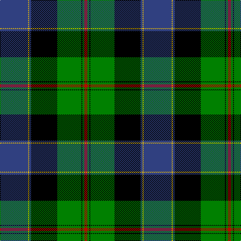

In pattern [BYBKGKGR](/patterns/bybkgkgr/).

This was sourced from weddslist.  It is a [8 stripes tartan](/stripes/stripes8/).

Original link http://www.weddslist.com/cgi-bin/tartans/pg.pl?source=sts

## Thread count
B/56 Y2 B4 K52 G48 K2 G4 R/6

## Palette
Each colour and its ΔE from the base-6 reference it is a variant of.

| Colour | Shade | Base | ΔE (OKLab) |
|---|---|---|---|
| B | <code style="background-color:#304080;">#304080</code> `#304080` | B <code style="background-color:#2A418A;">#2A418A</code> | 0.02 |
| G | <code style="background-color:#008000;">#008000</code> `#008000` | G <code style="background-color:#006100;">#006100</code> | 0.10 |
| K | <code style="background-color:#000000;">#000000</code> `#000000` | K <code style="background-color:#000000;">#000000</code> | 0.00 |
| R | <code style="background-color:#C00000;">#C00000</code> `#C00000` | R <code style="background-color:#CC0000;">#CC0000</code> | 0.03 |
| Y | <code style="background-color:#F0C000;">#F0C000</code> `#F0C000` | Y <code style="background-color:#F2BF00;">#F2BF00</code> | 0.00 |

# Sample pattern

## Nearest tartans

The nearest existing variants by ΔTartan distance.

1. [Black Gold](/setts/s9/g3k3g3k18b28w1ga22k2g2~b3c5070-g604000-ga008b45-k000000-wffffff~x2/) — ΔT 0.50
1. [Lochaber](/setts/s8/g3r1g18k20r1b18ba1g2~b304080-ba5480b0-g008000-k000000-rc00000~x4/) — ΔT 0.61
1. [Lochaber](/setts/s10/g4b2ba33r2k35g33k1r2k1g4~b5480b0-ba304080-g008000-k000000-rc00000~x2/) — ΔT 0.72
1. [Ogilvie 1](/setts/s9/b24y2k8g16k1g3k1g3r4~b304080-g008000-k000000-rc00000-yf0c000~x2/) — ΔT 0.86
1. [Common Kilt](/setts/s8/r3k2b25k28g25k2r1b2~b304080-g008000-k000000-rc00000~x2/) — ΔT 0.89
1. [Ogilvy Hunting](/setts/s9/b24y2k8g16k1g3k1g3r4~b00004c-g004c00-k000000-rc80000-yffc800~x2/) — ΔT 0.90
1. [Whitson](/setts/s8/w4k1g18k17b13r1b3r1~b304080-g008000-k000000-rc00000-we0e0e0~x2/) — ΔT 0.95
1. [Robertson, hunting](/setts/s11/b28k12g16k1r2k1g16k12b12k1w3~b304080-g008000-k000000-rc00000-we0e0e0~x2/) — ΔT 0.98
1. [Lochaber, Cameron](/setts/s11/b8ba3b40r3k44ba3r3g40r2k4r7~b304080-ba5480b0-g008000-k000000-rc00000~x2/) — ΔT 0.99
1. [Colquhoun](/setts/s7/b4k2b16w1k8g24r4~b304080-g008000-k000000-rc00000-we0e0e0~x2/) — ΔT 1.06

## Neighbour map

Every grey dot is one of 15726 variants placed by the first two principal components of the ΔTartan feature space (44% of its variance). Red is this tartan; blue dots are its nearest — click one to open its page.

<svg viewBox="0 0 640 380" role="img" style="max-width:100%;height:auto;border:1px solid #e0e0e0;border-radius:4px;display:block" xmlns="http://www.w3.org/2000/svg"><image href="/nn/cloud.v1.png" width="640" height="380"/><a href="/setts/s9/g3k3g3k18b28w1ga22k2g2~b3c5070-g604000-ga008b45-k000000-wffffff~x2/"><circle cx="186.3" cy="120.8" r="4" fill="#3465a4"><title>Black Gold</title></circle></a><a href="/setts/s8/g3r1g18k20r1b18ba1g2~b304080-ba5480b0-g008000-k000000-rc00000~x4/"><circle cx="185.5" cy="142.4" r="4" fill="#3465a4"><title>Lochaber</title></circle></a><a href="/setts/s10/g4b2ba33r2k35g33k1r2k1g4~b5480b0-ba304080-g008000-k000000-rc00000~x2/"><circle cx="209.4" cy="100.9" r="4" fill="#3465a4"><title>Lochaber</title></circle></a><a href="/setts/s9/b24y2k8g16k1g3k1g3r4~b304080-g008000-k000000-rc00000-yf0c000~x2/"><circle cx="206.8" cy="125.2" r="4" fill="#3465a4"><title>Ogilvie 1</title></circle></a><a href="/setts/s8/r3k2b25k28g25k2r1b2~b304080-g008000-k000000-rc00000~x2/"><circle cx="220.9" cy="145.6" r="4" fill="#3465a4"><title>Common Kilt</title></circle></a><a href="/setts/s9/b24y2k8g16k1g3k1g3r4~b00004c-g004c00-k000000-rc80000-yffc800~x2/"><circle cx="221.9" cy="136.2" r="4" fill="#3465a4"><title>Ogilvy Hunting</title></circle></a><a href="/setts/s8/w4k1g18k17b13r1b3r1~b304080-g008000-k000000-rc00000-we0e0e0~x2/"><circle cx="139.2" cy="143.8" r="4" fill="#3465a4"><title>Whitson</title></circle></a><a href="/setts/s11/b28k12g16k1r2k1g16k12b12k1w3~b304080-g008000-k000000-rc00000-we0e0e0~x2/"><circle cx="188.9" cy="127.3" r="4" fill="#3465a4"><title>Robertson, hunting</title></circle></a><a href="/setts/s11/b8ba3b40r3k44ba3r3g40r2k4r7~b304080-ba5480b0-g008000-k000000-rc00000~x2/"><circle cx="160.0" cy="112.3" r="4" fill="#3465a4"><title>Lochaber, Cameron</title></circle></a><a href="/setts/s7/b4k2b16w1k8g24r4~b304080-g008000-k000000-rc00000-we0e0e0~x2/"><circle cx="209.3" cy="147.7" r="4" fill="#3465a4"><title>Colquhoun</title></circle></a><circle cx="197.2" cy="127.2" r="5" fill="#c00000"/></svg>

ID: /setts/s8/b28y1b2k26g24k1g2r3~b304080-g008000-k000000-rc00000-yf0c000~x2/
