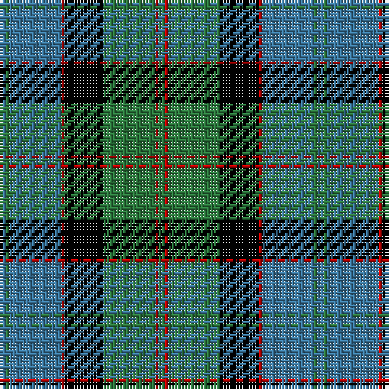

In pattern [BGBRKGRG](/patterns/bgbrkgrg/).

This was sourced from weddslist.  It is a [8 stripes tartan](/stripes/stripes8/).

Original link http://www.weddslist.com/cgi-bin/tartans/pg.pl?source=rb

## Thread count
B/2 G1 B16 R1 K12 G16 R1 G/2

## Palette
Each colour and its ΔE from the base-6 reference it is a variant of.

| Colour | Shade | Base | ΔE (OKLab) |
|---|---|---|---|
| B | <code style="background-color:#3C779D;">#3C779D</code> `#3C779D` | B <code style="background-color:#2A418A;">#2A418A</code> | 0.16 |
| G | <code style="background-color:#2D783E;">#2D783E</code> `#2D783E` | G <code style="background-color:#006100;">#006100</code> | 0.09 |
| K | <code style="background-color:#000000;">#000000</code> `#000000` | K <code style="background-color:#000000;">#000000</code> | 0.00 |
| R | <code style="background-color:#C80000;">#C80000</code> `#C80000` | R <code style="background-color:#CC0000;">#CC0000</code> | 0.01 |

# Sample pattern

## Nearest tartans

The nearest existing variants by ΔTartan distance.

1. [Ayrton](/setts/s9/r6b4k2b40k18g40k2g4r6-b5480b0-g008000-k000000-rc00000/) — ΔT 0.74
1. [Gordon 3](/setts/s10/b56k6b6k6b6k44g44y4g5y8-b304080-g008000-k000000-yf0c000/) — ΔT 0.89
1. [Hebridean Old](/setts/s9/b4k4b36ba2k26ba2g32b6k4-b304080-ba8080d0-g008000-k000000/) — ΔT 0.89
1. [Baird](/setts/s8/r7g3r2g33k31b31k3b3-b304080-g008000-k000000-r900030/) — ΔT 0.97
1. [Dress Watch](/setts/s8/b8k6b36k36g36b2g4w8-b2c2c80-g006818-k101010-wfcfcfc/) — ΔT 0.98
1. [Rangers F.C.](/setts/s11/r6g32k24b68k24g4k4g4k4g14r6-b304080-g30a010-k000000-rc00000/) — ΔT 1.00
1. [Johnstone / Johnston](/setts/s8/k6b6k6b44g52k4b2y6-b304080-g008000-k000000-yf0c000/) — ΔT 1.04
1. [Lamont](/setts/s8/b20k2b2k2b4k16g20w2-b304080-g008000-k000000-we0e0e0/) — ΔT 1.04
1. [Hebridean Old](/setts/s8/b4k4b36k26b2g32b2k4-b5480b0-g008000-k000000/) — ΔT 1.04
1. [MacThomas](/setts/s7/b6r4b44k22g48w4g6-b304080-g008000-k000000-r900030-wc0a0e0/) — ΔT 1.07

## Neighbour map

Every grey dot is one of 15726 variants placed by the first two principal components of the ΔTartan feature space (44% of its variance). Red is this tartan; blue dots are its nearest — click one to open its page.

<svg viewBox="0 0 640 380" role="img" style="max-width:100%;height:auto;border:1px solid #e0e0e0;border-radius:4px;display:block" xmlns="http://www.w3.org/2000/svg"><image href="/nn/cloud.v1.png" width="640" height="380"/><a href="/setts/s9/r6b4k2b40k18g40k2g4r6-b5480b0-g008000-k000000-rc00000/"><circle cx="199.0" cy="141.3" r="4" fill="#3465a4"><title>Ayrton</title></circle></a><a href="/setts/s10/b56k6b6k6b6k44g44y4g5y8-b304080-g008000-k000000-yf0c000/"><circle cx="180.5" cy="154.9" r="4" fill="#3465a4"><title>Gordon 3</title></circle></a><a href="/setts/s9/b4k4b36ba2k26ba2g32b6k4-b304080-ba8080d0-g008000-k000000/"><circle cx="215.3" cy="158.1" r="4" fill="#3465a4"><title>Hebridean Old</title></circle></a><a href="/setts/s8/r7g3r2g33k31b31k3b3-b304080-g008000-k000000-r900030/"><circle cx="174.1" cy="168.1" r="4" fill="#3465a4"><title>Baird</title></circle></a><a href="/setts/s8/b8k6b36k36g36b2g4w8-b2c2c80-g006818-k101010-wfcfcfc/"><circle cx="192.4" cy="177.1" r="4" fill="#3465a4"><title>Dress Watch</title></circle></a><a href="/setts/s11/r6g32k24b68k24g4k4g4k4g14r6-b304080-g30a010-k000000-rc00000/"><circle cx="182.4" cy="140.3" r="4" fill="#3465a4"><title>Rangers F.C.</title></circle></a><a href="/setts/s8/k6b6k6b44g52k4b2y6-b304080-g008000-k000000-yf0c000/"><circle cx="262.0" cy="140.4" r="4" fill="#3465a4"><title>Johnstone / Johnston</title></circle></a><a href="/setts/s8/b20k2b2k2b4k16g20w2-b304080-g008000-k000000-we0e0e0/"><circle cx="180.2" cy="188.0" r="4" fill="#3465a4"><title>Lamont</title></circle></a><a href="/setts/s8/b4k4b36k26b2g32b2k4-b5480b0-g008000-k000000/"><circle cx="227.5" cy="173.6" r="4" fill="#3465a4"><title>Hebridean Old</title></circle></a><a href="/setts/s7/b6r4b44k22g48w4g6-b304080-g008000-k000000-r900030-wc0a0e0/"><circle cx="190.7" cy="174.2" r="4" fill="#3465a4"><title>MacThomas</title></circle></a><circle cx="204.4" cy="164.7" r="5" fill="#c00000"/></svg>

ID: /setts/s8/b2g1b16r1k12g16r1g2-b3c779d-g2d783e-k000000-rc80000/
