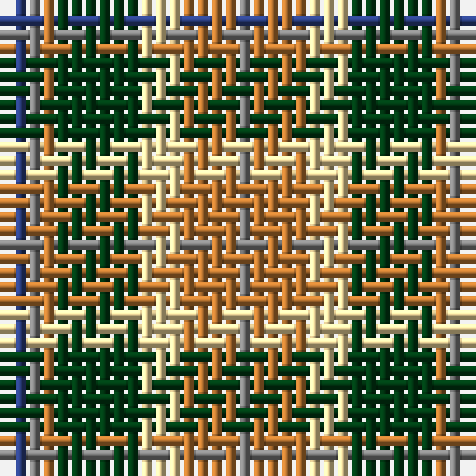

In pattern [BGRGWRRG](/patterns/bgrgwrrg/).

This was sourced from register-of-tartans.  It is a [8 stripes tartan](/stripes/stripes8/).

Original link https://www.tartanregister.gov.uk/tartanDetails.aspx?ref=1118

## Thread count
B/2 N1 DO1 DG6 LY3 DO3 DO1 N/1

## Palette
Each colour and its ΔE from the base-6 reference it is a variant of.

| Colour | Shade | Base | ΔE (OKLab) |
|---|---|---|---|
| B | <code style="background-color:#2C4084;">#2C4084</code> `#2C4084` | B <code style="background-color:#2C4084;">#2C4084</code> | 0.00 |
| DG | <code style="background-color:#003C14;">#003C14</code> `#003C14` | G <code style="background-color:#006400;">#006400</code> | 0.14 |
| DO | <code style="background-color:#BE7832;">#BE7832</code> `#BE7832` | R <code style="background-color:#C80000;">#C80000</code> | 0.17 |
| LY | <code style="background-color:#F5DCA0;">#F5DCA0</code> `#F5DCA0` | W <code style="background-color:#F4F4F0;">#F4F4F0</code> | 0.10 |
| N | <code style="background-color:#808080;">#808080</code> `#808080` | G <code style="background-color:#006400;">#006400</code> | 0.22 |

# Sample pattern

ID: /setts/s8/b2g1r1ga6w3r3r1g1-b2c4084-g808080-ga003c14-rbe7832-wf5dca0/
