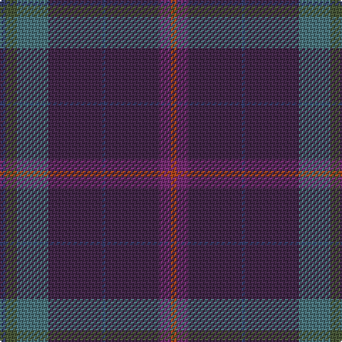

In pattern [BGBBBBBR](/patterns/bgbbbbbr/).

This was sourced from register-of-tartans.  It is a [8 stripes tartan](/stripes/stripes8/).

Original link https://www.tartanregister.gov.uk/tartanDetails.aspx?ref=10401

## Register references

External register numbers recorded for this tartan.

- Scottish Register of Tartans: [10401](https://www.tartanregister.gov.uk/tartanDetails.aspx?ref=10401)

## Thread count
B/4 N8 G22 DP38 B2 DP38 P8 T/4

## Palette
Each colour and its ΔE from the base-6 reference it is a variant of.

| Colour | Shade | Base | ΔE (OKLab) |
|---|---|---|---|
| B | <code style="background-color:#363F6D;">#363F6D</code> `#363F6D` | B <code style="background-color:#2A418A;">#2A418A</code> | 0.05 |
| DP | <code style="background-color:#432849;">#432849</code> `#432849` | B <code style="background-color:#2A418A;">#2A418A</code> | 0.12 |
| G | <code style="background-color:#4B747C;">#4B747C</code> `#4B747C` | B <code style="background-color:#2A418A;">#2A418A</code> | 0.17 |
| N | <code style="background-color:#485738;">#485738</code> `#485738` | G <code style="background-color:#006100;">#006100</code> | 0.10 |
| P | <code style="background-color:#762E73;">#762E73</code> `#762E73` | B <code style="background-color:#2A418A;">#2A418A</code> | 0.14 |
| T | <code style="background-color:#B0471C;">#B0471C</code> `#B0471C` | R <code style="background-color:#CC0000;">#CC0000</code> | 0.08 |

# Sample pattern

## Nearest tartans

The nearest existing variants by ΔTartan distance.

1. [Strathisla District Tartan Tartan Number: 4101. Earliest known date: 2002 Designed by David Cowley and Arther MacKie of the Strathmore Woollen Company to reflect the colours of the Angus glen. See products available Copyright © Blair Urquhart, Comrie, 2015](/setts/s10/b3g8ba12bb3bc20g3ba20b3ba20w2~b2c2c80-ba183044-bb540000-bc28003c-g003014-wc8c8c8~x2/) — ΔT 1.94
1. [Haddrell (2013)](/setts/s7/r2b4g18ba2g2ba41w2~b1870a4-ba505050-g808080-rc80000-we0e0e0~x2/) — ΔT 2.08
1. [McGovern (2016)](/setts/s5/b62r4g10ga3gb21~b061d37-g452700-ga2a230c-gb004f15-r9e411f~x2/) — ΔT 2.13
1. [Spirit of Scotland](/setts/s11/b19k4b4ba1b1ba1b1g5bb3k1bb4~b102040-ba304080-bb300030-g004010-k000000~x6/) — ΔT 2.14
1. [Isaia](/setts/s7/r80b8r4k4g4k45ba8~b430506-ba42333a-g6c6964-k2f0200-r76333a/) — ΔT 2.16
1. [Scottish Heritage](/setts/s8/k2b6k1ba7g13k11ba42r2~b2c4084-ba141e46-g005020-k101010-rdc0000~x2/) — ΔT 2.17
1. [Bouncing Blackie (Personal)](/setts/s7/b5ba8bb13g21ba34bb55r3~b700070-ba24246c-bb1c1c1c-g007040-r742800/) — ΔT 2.17
1. [Riley's Theme](/setts/s6/b20ba4g5bb14y1b2~b667aa3-ba292929-bb683c66-g6f8070-yccc7ad~x2/) — ΔT 2.19
1. [Michie (Name)](/setts/s20/b9ba10g4ba3g2ba7g4ba20k2ba20g4ba7g2ba3g4ba10b9r1b2y1~b384c58-ba440044-g003820-k101010-rc80000-yd87c00~x2/) — ΔT 2.19
1. [MacInnes Homecoming](/setts/s12/r3k19b2k2b2k2b18k3ba3k3b23ra3~b383838-ba1c1c50-k101010-ra47c00-rab02414~x2/) — ΔT 2.20

## Neighbour map

Every grey dot is one of 15726 variants placed by the first two principal components of the ΔTartan feature space (44% of its variance). Red is this tartan; blue dots are its nearest — click one to open its page.

<svg viewBox="0 0 640 380" role="img" style="max-width:100%;height:auto;border:1px solid #e0e0e0;border-radius:4px;display:block" xmlns="http://www.w3.org/2000/svg"><image href="/nn/cloud.v1.png" width="640" height="380"/><a href="/setts/s10/b3g8ba12bb3bc20g3ba20b3ba20w2~b2c2c80-ba183044-bb540000-bc28003c-g003014-wc8c8c8~x2/"><circle cx="353.6" cy="222.7" r="4" fill="#3465a4"><title>Strathisla District Tartan Tartan Number: 4101. Earliest known date: 2002 Designed by David Cowley and Arther MacKie of the Strathmore Woollen Company to reflect the colours of the Angus glen. See products available Copyright © Blair Urquhart, Comrie, 2015</title></circle></a><a href="/setts/s7/r2b4g18ba2g2ba41w2~b1870a4-ba505050-g808080-rc80000-we0e0e0~x2/"><circle cx="459.3" cy="170.9" r="4" fill="#3465a4"><title>Haddrell (2013)</title></circle></a><a href="/setts/s5/b62r4g10ga3gb21~b061d37-g452700-ga2a230c-gb004f15-r9e411f~x2/"><circle cx="470.5" cy="220.2" r="4" fill="#3465a4"><title>McGovern (2016)</title></circle></a><a href="/setts/s11/b19k4b4ba1b1ba1b1g5bb3k1bb4~b102040-ba304080-bb300030-g004010-k000000~x6/"><circle cx="416.8" cy="177.1" r="4" fill="#3465a4"><title>Spirit of Scotland</title></circle></a><a href="/setts/s7/r80b8r4k4g4k45ba8~b430506-ba42333a-g6c6964-k2f0200-r76333a/"><circle cx="445.0" cy="179.1" r="4" fill="#3465a4"><title>Isaia</title></circle></a><a href="/setts/s8/k2b6k1ba7g13k11ba42r2~b2c4084-ba141e46-g005020-k101010-rdc0000~x2/"><circle cx="459.8" cy="164.8" r="4" fill="#3465a4"><title>Scottish Heritage</title></circle></a><a href="/setts/s7/b5ba8bb13g21ba34bb55r3~b700070-ba24246c-bb1c1c1c-g007040-r742800/"><circle cx="342.5" cy="206.9" r="4" fill="#3465a4"><title>Bouncing Blackie (Personal)</title></circle></a><a href="/setts/s6/b20ba4g5bb14y1b2~b667aa3-ba292929-bb683c66-g6f8070-yccc7ad~x2/"><circle cx="344.0" cy="197.0" r="4" fill="#3465a4"><title>Riley's Theme</title></circle></a><a href="/setts/s20/b9ba10g4ba3g2ba7g4ba20k2ba20g4ba7g2ba3g4ba10b9r1b2y1~b384c58-ba440044-g003820-k101010-rc80000-yd87c00~x2/"><circle cx="434.0" cy="152.7" r="4" fill="#3465a4"><title>Michie (Name)</title></circle></a><a href="/setts/s12/r3k19b2k2b2k2b18k3ba3k3b23ra3~b383838-ba1c1c50-k101010-ra47c00-rab02414~x2/"><circle cx="384.6" cy="189.5" r="4" fill="#3465a4"><title>MacInnes Homecoming</title></circle></a><circle cx="426.7" cy="189.9" r="5" fill="#c00000"/></svg>

ID: /setts/s8/b2g4ba11bb19b1bb19bc4r2~b363f6d-ba4b747c-bb432849-bc762e73-g485738-rb0471c~x2/
