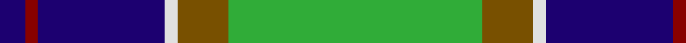

In pattern [BRBWGGGG](/patterns/brbwgggg/).

This was sourced from register-of-tartans.  It is a [8 stripes tartan](/stripes/stripes8/).

Original link https://www.tartanregister.gov.uk/tartanDetails.aspx?ref=151

## Thread count
DB/8 DR4 DB40 LN4 T16 G32 G4 G/8

## Palette
Each colour and its ΔE from the base-6 reference it is a variant of.

| Colour | Shade | Base | ΔE (OKLab) |
|---|---|---|---|
| DB | <code style="background-color:#1C0070;">#1C0070</code> `#1C0070` | B <code style="background-color:#2A418A;">#2A418A</code> | 0.14 |
| DR | <code style="background-color:#880000;">#880000</code> `#880000` | R <code style="background-color:#CC0000;">#CC0000</code> | 0.15 |
| DY | <code style="background-color:#BC8C00;">#BC8C00</code> `#BC8C00` | Y <code style="background-color:#F2BF00;">#F2BF00</code> | 0.16 |
| G | <code style="background-color:#30AC38;">#30AC38</code> `#30AC38` | G <code style="background-color:#006100;">#006100</code> | 0.23 |
| LN | <code style="background-color:#E0E0E0;">#E0E0E0</code> `#E0E0E0` | W <code style="background-color:#F7F7F7;">#F7F7F7</code> | 0.07 |
| T | <code style="background-color:#785000;">#785000</code> `#785000` | G <code style="background-color:#006100;">#006100</code> | 0.14 |

# Sample pattern

## Nearest tartans

The nearest existing variants by ΔTartan distance.

1. [Bahamas](/setts/s8/b3g11w11r2g7b22y2b2~b304080-g008000-rc00000-we0e0e0-yf0c000~x2/) — ΔT 0.79
1. [Snodgrass](/setts/s8/k3r1y1b11g13b5r1y1~b304080-g008000-k000000-rc00000-yf0c000~x2/) — ΔT 0.83
1. [Antrim Irish County Tartan Tartan Number: 2282. Earliest known date: 1993 One of a series of Irish District tartans designed by Polly Wittering of the House of Edgar, with colours reminiscent of the Country with soft warm colours dominating. See products available Copyright © Blair Urquhart, Comrie, 2015](/setts/s10/g5b2g17y2ba5y2r5ba17g2y4~b043c48-ba101448-g4c9864-rb03000-yf4bc3c~x2/) — ΔT 0.85
1. [MacThomas](/setts/s7/b3r2b22k11g24w2g3~b304080-g008000-k000000-r900030-wc0a0e0~x2/) — ΔT 0.86
1. [Seaford House](/setts/s9/w3b3w12b26g26r3g26b28wa3~b202060-g006818-rc80000-w98c8e8-wafcfcfc/) — ΔT 0.87
1. [Ayrshire (District)](/setts/s8/b2r1b10w1g4ga8y1ga2~b1c0070-g785000-ga30ac38-r880000-we0e0e0-ybc8c00~x4/) — ΔT 0.88
1. [Loyalhanna](/setts/s8/b15w2g2y15r3b21r3g15~b00008c-g007800-r8c0000-wc8c8c8-ydcbc00~x2/) — ΔT 0.90
1. [Corstorphine Trial A](/setts/s10/k6y2g18w3g13k3y4k3b18w3~b2c2c80-g006818-k101010-wfcfcfc-ye8c000~x2/) — ΔT 0.90
1. [MacMillan, hunting](/setts/s9/b10y3b30y5k8g16r4g16r2~b304080-g008000-k000000-rd03030-yf0c000~x2/) — ΔT 0.91
1. [Dick (Personal)](/setts/s7/k5g30y3b15k15b7w3~b1474b4-g28802c-k101010-we0e0e0-ye8c000~x2/) — ΔT 0.95

## Neighbour map

Every grey dot is one of 15726 variants placed by the first two principal components of the ΔTartan feature space (44% of its variance). Red is this tartan; blue dots are its nearest — click one to open its page.

<svg viewBox="0 0 640 380" role="img" style="max-width:100%;height:auto;border:1px solid #e0e0e0;border-radius:4px;display:block" xmlns="http://www.w3.org/2000/svg"><image href="/nn/cloud.v1.png" width="640" height="380"/><a href="/setts/s8/b3g11w11r2g7b22y2b2~b304080-g008000-rc00000-we0e0e0-yf0c000~x2/"><circle cx="189.1" cy="166.2" r="4" fill="#3465a4"><title>Bahamas</title></circle></a><a href="/setts/s8/k3r1y1b11g13b5r1y1~b304080-g008000-k000000-rc00000-yf0c000~x2/"><circle cx="218.7" cy="159.9" r="4" fill="#3465a4"><title>Snodgrass</title></circle></a><a href="/setts/s10/g5b2g17y2ba5y2r5ba17g2y4~b043c48-ba101448-g4c9864-rb03000-yf4bc3c~x2/"><circle cx="153.0" cy="161.4" r="4" fill="#3465a4"><title>Antrim Irish County Tartan Tartan Number: 2282. Earliest known date: 1993 One of a series of Irish District tartans designed by Polly Wittering of the House of Edgar, with colours reminiscent of the Country with soft warm colours dominating. See products available Copyright © Blair Urquhart, Comrie, 2015</title></circle></a><a href="/setts/s7/b3r2b22k11g24w2g3~b304080-g008000-k000000-r900030-wc0a0e0~x2/"><circle cx="191.5" cy="174.9" r="4" fill="#3465a4"><title>MacThomas</title></circle></a><a href="/setts/s9/w3b3w12b26g26r3g26b28wa3~b202060-g006818-rc80000-w98c8e8-wafcfcfc/"><circle cx="193.2" cy="187.8" r="4" fill="#3465a4"><title>Seaford House</title></circle></a><a href="/setts/s8/b2r1b10w1g4ga8y1ga2~b1c0070-g785000-ga30ac38-r880000-we0e0e0-ybc8c00~x4/"><circle cx="149.3" cy="152.6" r="4" fill="#3465a4"><title>Ayrshire (District)</title></circle></a><a href="/setts/s8/b15w2g2y15r3b21r3g15~b00008c-g007800-r8c0000-wc8c8c8-ydcbc00~x2/"><circle cx="172.4" cy="177.6" r="4" fill="#3465a4"><title>Loyalhanna</title></circle></a><a href="/setts/s10/k6y2g18w3g13k3y4k3b18w3~b2c2c80-g006818-k101010-wfcfcfc-ye8c000~x2/"><circle cx="144.4" cy="167.7" r="4" fill="#3465a4"><title>Corstorphine Trial A</title></circle></a><a href="/setts/s9/b10y3b30y5k8g16r4g16r2~b304080-g008000-k000000-rd03030-yf0c000~x2/"><circle cx="185.7" cy="160.6" r="4" fill="#3465a4"><title>MacMillan, hunting</title></circle></a><a href="/setts/s7/k5g30y3b15k15b7w3~b1474b4-g28802c-k101010-we0e0e0-ye8c000~x2/"><circle cx="156.5" cy="188.5" r="4" fill="#3465a4"><title>Dick (Personal)</title></circle></a><circle cx="174.0" cy="169.9" r="5" fill="#c00000"/></svg>

ID: /setts/s8/b2r1b10w1g4ga8ga1ga2~b1c0070-g785000-ga30ac38-r880000-we0e0e0~x4/
