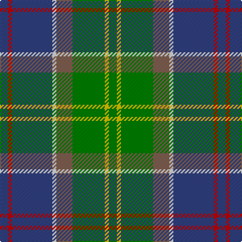

In pattern [BRBWRGYG](/patterns/brbwrgyg/).

This was sourced from weddslist.  It is a [8 stripes tartan](/stripes/stripes8/).

Original link http://www.weddslist.com/cgi-bin/tartans/pg.pl?source=sts

## Thread count
B/8 R4 B40 LN4 LT16 G32 Y4 G/8

## Palette
Each colour and its ΔE from the base-6 reference it is a variant of.

| Colour | Shade | Base | ΔE (OKLab) |
|---|---|---|---|
| B | <code style="background-color:#304080;">#304080</code> `#304080` | B <code style="background-color:#2A418A;">#2A418A</code> | 0.02 |
| G | <code style="background-color:#008000;">#008000</code> `#008000` | G <code style="background-color:#006100;">#006100</code> | 0.10 |
| LN | <code style="background-color:#E0E0E0;">#E0E0E0</code> `#E0E0E0` | W <code style="background-color:#F7F7F7;">#F7F7F7</code> | 0.07 |
| LT | <code style="background-color:#806050;">#806050</code> `#806050` | R <code style="background-color:#CC0000;">#CC0000</code> | 0.17 |
| R | <code style="background-color:#C00000;">#C00000</code> `#C00000` | R <code style="background-color:#CC0000;">#CC0000</code> | 0.03 |
| Y | <code style="background-color:#F0C000;">#F0C000</code> `#F0C000` | Y <code style="background-color:#F2BF00;">#F2BF00</code> | 0.00 |

# Sample pattern

## Nearest tartans

The nearest existing variants by ΔTartan distance.

1. [Ayrshire District Tartan Tartan Number: 436. Earliest known date: 1988 Dr Phil Smith, a Fellow of the Scottish Tartans Society, designed the Ayrshire district tartan at the suggestion of the Clan Boyd and Clan Cunningham Societies. In his book, 'District Tartans' (1992) co-authored with Dr G Teall, he says, the colours "..reflect the gold of the rising sun, the green of the land and brown of the coast, the blue of the sea and the red of the setting sun. The Ayrshire tartan is intended for those with connections in the districts of Kyle, Cunninghame and Inverclyde." See products available Copyright © Blair Urquhart, Comrie, 2015](/setts/s8/b2r1b10w1g4ga8y1ga2~b2c2c80-g604000-ga006818-rc80000-we0e0e0-ye8c000~x4/) — ΔT 0.66
1. [Connor (Personal)](/setts/s9/b1g4ga8y1ga8b12w1b2r1~b2c2c80-g604000-ga006818-rc80000-we0e0e0-ye8c000~x4/) — ΔT 0.75
1. [Patel (2013)](/setts/s9/g3y2r10g10ga20g12ra3ga10w2~g003820-ga048888-r880000-rac80000-wfcfcfc-ye8c000~x2/) — ΔT 0.87
1. [McComb (Personal)](/setts/s7/b3r2b18k6g18y2ga3~b2c2c80-g006818-ga408060-k101010-rc80000-ye8c000~x2/) — ΔT 0.96
1. [Gallagher Ancient](/setts/s9/b4g41y4ga4y4ga9r18y4w4~b202060-g005448-ga008c54-re87878-we0e0e0-ya08858~x2/) — ΔT 1.01
1. [Glen Lyon (Fashion)](/setts/s7/r3b1r11w1k5ba14y3~b1c1c50-ba206084-k101010-r888888-wfcfcfc-ybc8c00~x4/) — ΔT 1.02
1. [Royal Pharmaceutical Society (Corp)](/setts/s9/g2r2ga19r6ga2r6y14ra4w2~g604000-ga003820-r888888-ra901c38-we0e0e0-ya08858~x2/) — ΔT 1.02
1. [Lundy (Personal)](/setts/s7/w2k2g8ga8r1ga1wa1~g006818-ga048888-k101010-rc80000-w98c8e8-waf8f8f8~x4/) — ΔT 1.03
1. [Big Rory (Corporate)](/setts/s10/b10w5b48k35g5k5g35r5g5ba5~b2c607c-ba780078-g006818-k101010-rc80000-we0e0e0/) — ΔT 1.05
1. [Gallagher Irish Fashion Tartan Tartan Number: 4053. Earliest known date: 2001 February See products available Copyright © Blair Urquhart, Comrie, 2015](/setts/s9/b4g41y4ga4y4ga9r18y4w4~b202060-g005448-ga008c54-rdc6854-we0e0e0-ya08858~x2/) — ΔT 1.05

## Neighbour map

Every grey dot is one of 15726 variants placed by the first two principal components of the ΔTartan feature space (44% of its variance). Red is this tartan; blue dots are its nearest — click one to open its page.

<svg viewBox="0 0 640 380" role="img" style="max-width:100%;height:auto;border:1px solid #e0e0e0;border-radius:4px;display:block" xmlns="http://www.w3.org/2000/svg"><image href="/nn/cloud.v1.png" width="640" height="380"/><a href="/setts/s8/b2r1b10w1g4ga8y1ga2~b2c2c80-g604000-ga006818-rc80000-we0e0e0-ye8c000~x4/"><circle cx="188.2" cy="168.1" r="4" fill="#3465a4"><title>Ayrshire District Tartan Tartan Number: 436. Earliest known date: 1988 Dr Phil Smith, a Fellow of the Scottish Tartans Society, designed the Ayrshire district tartan at the suggestion of the Clan Boyd and Clan Cunningham Societies. In his book, 'District Tartans' (1992) co-authored with Dr G Teall, he says, the colours &quot;..reflect the gold of the rising sun, the green of the land and brown of the coast, the blue of the sea and the red of the setting sun. The Ayrshire tartan is intended for those with connections in the districts of Kyle, Cunninghame and Inverclyde.&quot; See products available Copyright © Blair Urquhart, Comrie, 2015</title></circle></a><a href="/setts/s9/b1g4ga8y1ga8b12w1b2r1~b2c2c80-g604000-ga006818-rc80000-we0e0e0-ye8c000~x4/"><circle cx="214.0" cy="160.9" r="4" fill="#3465a4"><title>Connor (Personal)</title></circle></a><a href="/setts/s9/g3y2r10g10ga20g12ra3ga10w2~g003820-ga048888-r880000-rac80000-wfcfcfc-ye8c000~x2/"><circle cx="164.6" cy="175.2" r="4" fill="#3465a4"><title>Patel (2013)</title></circle></a><a href="/setts/s7/b3r2b18k6g18y2ga3~b2c2c80-g006818-ga408060-k101010-rc80000-ye8c000~x2/"><circle cx="181.7" cy="179.1" r="4" fill="#3465a4"><title>McComb (Personal)</title></circle></a><a href="/setts/s9/b4g41y4ga4y4ga9r18y4w4~b202060-g005448-ga008c54-re87878-we0e0e0-ya08858~x2/"><circle cx="201.0" cy="138.6" r="4" fill="#3465a4"><title>Gallagher Ancient</title></circle></a><a href="/setts/s7/r3b1r11w1k5ba14y3~b1c1c50-ba206084-k101010-r888888-wfcfcfc-ybc8c00~x4/"><circle cx="178.7" cy="159.2" r="4" fill="#3465a4"><title>Glen Lyon (Fashion)</title></circle></a><a href="/setts/s9/g2r2ga19r6ga2r6y14ra4w2~g604000-ga003820-r888888-ra901c38-we0e0e0-ya08858~x2/"><circle cx="155.2" cy="157.0" r="4" fill="#3465a4"><title>Royal Pharmaceutical Society (Corp)</title></circle></a><a href="/setts/s7/w2k2g8ga8r1ga1wa1~g006818-ga048888-k101010-rc80000-w98c8e8-waf8f8f8~x4/"><circle cx="154.5" cy="176.4" r="4" fill="#3465a4"><title>Lundy (Personal)</title></circle></a><a href="/setts/s10/b10w5b48k35g5k5g35r5g5ba5~b2c607c-ba780078-g006818-k101010-rc80000-we0e0e0/"><circle cx="166.1" cy="155.5" r="4" fill="#3465a4"><title>Big Rory (Corporate)</title></circle></a><a href="/setts/s9/b4g41y4ga4y4ga9r18y4w4~b202060-g005448-ga008c54-rdc6854-we0e0e0-ya08858~x2/"><circle cx="207.4" cy="141.5" r="4" fill="#3465a4"><title>Gallagher Irish Fashion Tartan Tartan Number: 4053. Earliest known date: 2001 February See products available Copyright © Blair Urquhart, Comrie, 2015</title></circle></a><circle cx="189.2" cy="167.4" r="5" fill="#c00000"/></svg>

ID: /setts/s8/b2r1b10w1ra4g8y1g2~b304080-g008000-rc00000-ra806050-we0e0e0-yf0c000~x4/
