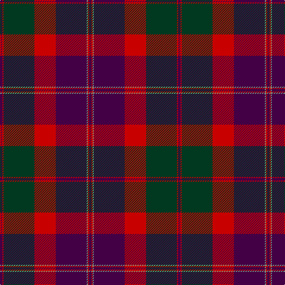

In pattern [BRGBRGRB](/patterns/brgbrgrb/).

This was sourced from tartans-authority.  It is a [8 stripes tartan](/stripes/stripes8/).

Original link http://www.tartansauthority.com/tartan-ferret/display/3158/

## Attestations

This cloth appears in 3 source records; the oldest owns this page.

- 1994 — Robb Dress (Personal) (tartans-authority, [record](http://www.tartansauthority.com/tartan-ferret/display/3158/))
- undated — Robb Red (Personal) (register-of-tartans, [record](https://www.tartanregister.gov.uk/tartanDetails.aspx?ref=4850))
- undated — Robb Red (Personal) Personal Tartan Tartan Number: 3158. Earliest known date: 1994 Designed by Peter MacDonald for Martin Robb of Carroglen, Comrie, Perthshire, Scotland. Can be worn by anyone of the name but Martin Robb would appreciate being advised. See products available Copyright © Blair Urquhart, Comrie, 2015 (house-of-tartan, [record](http://www.house-of-tartan.scotland.net/house/TartanViewjs.asp?colr=Def&tnam=3158))

## Register references

External register numbers recorded for this tartan.

- Scottish Register of Tartans: [4850](https://www.tartanregister.gov.uk/tartanDetails.aspx?ref=4850)
- Scottish Tartans Authority (ITI): 3158

## Thread count
DP/4 R2 DG52 R36 DP52 LG2 R2 DP/4

## Palette
Each colour and its ΔE from the base-6 reference it is a variant of.

| Colour | Shade | Base | ΔE (OKLab) |
|---|---|---|---|
| DG | <code style="background-color:#003820;">#003820</code> `#003820` | G <code style="background-color:#006100;">#006100</code> | 0.15 |
| DP | <code style="background-color:#440044;">#440044</code> `#440044` | B <code style="background-color:#2A418A;">#2A418A</code> | 0.18 |
| LG | <code style="background-color:#789484;">#789484</code> `#789484` | G <code style="background-color:#006100;">#006100</code> | 0.24 |
| R | <code style="background-color:#C80000;">#C80000</code> `#C80000` | R <code style="background-color:#CC0000;">#CC0000</code> | 0.01 |

# Sample pattern

## Nearest tartans

The nearest existing variants by ΔTartan distance.

1. [Gwyn Welsh Name Tartan Tartan Number: 5734. Earliest known date: 2002 The tartan for this Welsh surname and its spelling variation, Wynn, is actually woven in Wales at the Cambrian Woollen Mill, weaving on the same site since 1830. This tartan differs from many traditional patterns in that the warp and weft differ, giving the finished worsted wool cloth more of a predominant stripe, vertically noticeable in the finished Kilt, or Cilt in Wales. See products available Copyright © Blair Urquhart, Comrie, 2015](/setts/s11/w2k35b30k3r30k2r4k2r30k3w2~b202060-k101010-r901c38-we0e0e0/) — ΔT 1.11
1. [Queen of Scots (Commemorative))](/setts/s9/g22k3g1k3g2b8r1b8r16~b780078-g006818-k101010-r901c38~x2/) — ΔT 1.11
1. [Marshall](/setts/s10/r4b4ba2b24w1ba14b2r18b4ba3~b5c5c5c-ba1c1c1c-rc80000-wc0c0c0~x4/) — ΔT 1.13
1. [Brown Family Tartan Tartan Number: 432. Earliest known date: 1850 The Scott Adie collection, a book of manufacturers samples, was recently sold at auction. The book is dated 1850 and the samples are thought to represent the tartans available for purchase between 1840-50. See products available Copyright © Blair Urquhart, Comrie, 2015](/setts/s8/b6r1b2r1b2k18r8g2~b2c2c80-g006818-k101010-rc80000~x4/) — ΔT 1.22
1. [Rannoch Moor (Fashion)](/setts/s8/r3g12r12r5g2b30r2g2~b1c1c50-g005410-ra80000~x2/) — ΔT 1.26
1. [Carson Red (Personal)](/setts/s8/b19r2b3r2b3k43r22g3~b446c84-g006818-k101010-rc80000~x2/) — ΔT 1.32
1. [Pride of Wales (Fashion)](/setts/s10/r9k2r2ra13k2ra2w1r13k26w2~k101010-r880000-rac8002c-we0e0e0~x2/) — ΔT 1.33
1. [Queen of Scots](/setts/s9/r34b4r1b4g2k3g1k3g22~b780078-g006818-k101010-r901c38~x2/) — ΔT 1.33
1. [Pride of Scotland Autumn](/setts/s11/g9b2ba2g2ba18g2b2g1b19r33g2~b202060-ba780078-g006818-r880000~x2/) — ΔT 1.35
1. [Black and Red](/setts/s8/r25k2b4k2r8k31ba32k8~b5c5c5c-ba2c2c80-k101010-rc80000/) — ΔT 1.35

## Neighbour map

Every grey dot is one of 15726 variants placed by the first two principal components of the ΔTartan feature space (44% of its variance). Red is this tartan; blue dots are its nearest — click one to open its page.

<svg viewBox="0 0 640 380" role="img" style="max-width:100%;height:auto;border:1px solid #e0e0e0;border-radius:4px;display:block" xmlns="http://www.w3.org/2000/svg"><image href="/nn/cloud.v1.png" width="640" height="380"/><a href="/setts/s11/w2k35b30k3r30k2r4k2r30k3w2~b202060-k101010-r901c38-we0e0e0/"><circle cx="296.2" cy="156.2" r="4" fill="#3465a4"><title>Gwyn Welsh Name Tartan Tartan Number: 5734. Earliest known date: 2002 The tartan for this Welsh surname and its spelling variation, Wynn, is actually woven in Wales at the Cambrian Woollen Mill, weaving on the same site since 1830. This tartan differs from many traditional patterns in that the warp and weft differ, giving the finished worsted wool cloth more of a predominant stripe, vertically noticeable in the finished Kilt, or Cilt in Wales. See products available Copyright © Blair Urquhart, Comrie, 2015</title></circle></a><a href="/setts/s9/g22k3g1k3g2b8r1b8r16~b780078-g006818-k101010-r901c38~x2/"><circle cx="265.9" cy="161.7" r="4" fill="#3465a4"><title>Queen of Scots (Commemorative))</title></circle></a><a href="/setts/s10/r4b4ba2b24w1ba14b2r18b4ba3~b5c5c5c-ba1c1c1c-rc80000-wc0c0c0~x4/"><circle cx="313.3" cy="152.4" r="4" fill="#3465a4"><title>Marshall</title></circle></a><a href="/setts/s8/b6r1b2r1b2k18r8g2~b2c2c80-g006818-k101010-rc80000~x4/"><circle cx="282.7" cy="163.3" r="4" fill="#3465a4"><title>Brown Family Tartan Tartan Number: 432. Earliest known date: 1850 The Scott Adie collection, a book of manufacturers samples, was recently sold at auction. The book is dated 1850 and the samples are thought to represent the tartans available for purchase between 1840-50. See products available Copyright © Blair Urquhart, Comrie, 2015</title></circle></a><a href="/setts/s8/r3g12r12r5g2b30r2g2~b1c1c50-g005410-ra80000~x2/"><circle cx="287.5" cy="180.7" r="4" fill="#3465a4"><title>Rannoch Moor (Fashion)</title></circle></a><a href="/setts/s8/b19r2b3r2b3k43r22g3~b446c84-g006818-k101010-rc80000~x2/"><circle cx="282.8" cy="147.8" r="4" fill="#3465a4"><title>Carson Red (Personal)</title></circle></a><a href="/setts/s10/r9k2r2ra13k2ra2w1r13k26w2~k101010-r880000-rac8002c-we0e0e0~x2/"><circle cx="280.8" cy="132.3" r="4" fill="#3465a4"><title>Pride of Wales (Fashion)</title></circle></a><a href="/setts/s9/r34b4r1b4g2k3g1k3g22~b780078-g006818-k101010-r901c38~x2/"><circle cx="365.2" cy="129.5" r="4" fill="#3465a4"><title>Queen of Scots</title></circle></a><a href="/setts/s11/g9b2ba2g2ba18g2b2g1b19r33g2~b202060-ba780078-g006818-r880000~x2/"><circle cx="294.8" cy="129.8" r="4" fill="#3465a4"><title>Pride of Scotland Autumn</title></circle></a><a href="/setts/s8/r25k2b4k2r8k31ba32k8~b5c5c5c-ba2c2c80-k101010-rc80000/"><circle cx="238.4" cy="179.8" r="4" fill="#3465a4"><title>Black and Red</title></circle></a><circle cx="304.3" cy="151.8" r="5" fill="#c00000"/></svg>

ID: /setts/s8/b2r1g26r18b26ga1r1b2~b440044-g003820-ga789484-rc80000~x2/
