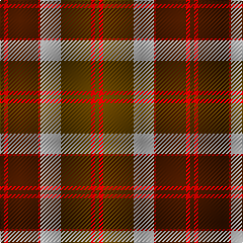

In pattern [BRBRWGRG](/patterns/brbrwgrg/).

This was sourced from register-of-tartans.  It is a [8 stripes tartan](/stripes/stripes8/).

Original link https://www.tartanregister.gov.uk/tartanDetails.aspx?ref=196

## Thread count
DR/4 R4 DR30 R2 LN20 T30 R4 T/4

## Palette
Each colour and its ΔE from the base-6 reference it is a variant of.

| Colour | Shade | Base | ΔE (OKLab) |
|---|---|---|---|
| DR | <code style="background-color:#441800;">#441800</code> `#441800` | B <code style="background-color:#2A418A;">#2A418A</code> | 0.23 |
| LN | <code style="background-color:#E0E0E0;">#E0E0E0</code> `#E0E0E0` | W <code style="background-color:#F7F7F7;">#F7F7F7</code> | 0.07 |
| R | <code style="background-color:#C80000;">#C80000</code> `#C80000` | R <code style="background-color:#CC0000;">#CC0000</code> | 0.01 |
| T | <code style="background-color:#604000;">#604000</code> `#604000` | G <code style="background-color:#006100;">#006100</code> | 0.14 |

# Sample pattern

## Nearest tartans

The nearest existing variants by ΔTartan distance.

1. [Bannockbane](/setts/s8/b2r2b15r1w10ra15r2ra2x2~b401000-rc00000-ra806050-we0e0e0/) — ΔT 0.50
1. [Bannockbane](/setts/s8/b2y2b15y1w10r15y2r2x2~b401000-r906030-we0e0e0-yff8500/) — ΔT 0.57
1. [Prince Edward Island #2](/setts/s7/w2k1g16k12r12k1w2x2~g005020-k101010-rdc0000-we0e0e0/) — ΔT 0.83
1. [Cranston Dress](/setts/s8/r15b2r1b2r3b7g13ga3x2~b2c2c80-g289c18-ga006818-rc80000/) — ΔT 0.89
1. [Bannockbane Orange Stripes](/setts/s8/b2y2b15y1w10ya15y2ya2x2~b441800-we0e0e0-yd87c00-yaa08858/) — ΔT 0.91
1. [Logan #3](/setts/s7/b9y4b1y4g15r4b1x4~b440044-g00801c-rc8002c-ye08070/) — ΔT 0.92
1. [Cranston Dress Family Tartan Tartan Number: 753. Earliest known date: pre 2003 Restricted See products available Copyright © Blair Urquhart, Comrie, 2015](/setts/s8/r30b3r2b3r6b14g26ga6~b2c2c80-g289c18-ga006818-rc80000/) — ΔT 0.93
1. [Prince Edward Island District Tartan Tartan Number: 1815. Earliest known date: 1960-70 The warmth and glow of the fertile soil, The green field and tree, The yellow and the brown of Autumn, The white of surf or a summer snow, Rust, green, yellow and white, Yes! That's our Island Tartan. See products available Copyright © Blair Urquhart, Comrie, 2015](/setts/s7/w2k1g16k12r12k1w2x2~g006818-k101010-rc80000-we0e0e0/) — ΔT 0.94
1. [Logan Light](/setts/s7/b9r4b1r4g15ra4b1x2~b5a008c-g309c18-rc82828-radc0000/) — ΔT 0.95
1. [Blackstock Dress Family Tartan Tartan Number: 1881. Earliest known date: 1982 Commissioned by Herbert Earl Blackstock in 1983, President of the Clan Blackstock Society in the USA. Blackstocks were a 'Scotch-Irish' family who emigrated to the US from Ulster. Designed by kiltmaker and historian Bob Martin of Greenville, South Carolina. www.clanblackstocksociety.com See products available Copyright © Blair Urquhart, Comrie, 2015](/setts/s7/y2g7k6r12k1r1y2x4~g006818-k101010-rc80000-ye8c000/) — ΔT 0.96

## Neighbour map

Every grey dot is one of 15726 variants placed by the first two principal components of the ΔTartan feature space (44% of its variance). Red is this tartan; blue dots are its nearest — click one to open its page.

<svg viewBox="0 0 640 380" role="img" style="max-width:100%;height:auto;border:1px solid #e0e0e0;border-radius:4px;display:block" xmlns="http://www.w3.org/2000/svg"><image href="/nn/cloud.v1.png" width="640" height="380"/><a href="/setts/s8/b2r2b15r1w10ra15r2ra2x2~b401000-rc00000-ra806050-we0e0e0/"><circle cx="189.7" cy="155.5" r="4" fill="#3465a4"><title>Bannockbane</title></circle></a><a href="/setts/s8/b2y2b15y1w10r15y2r2x2~b401000-r906030-we0e0e0-yff8500/"><circle cx="184.6" cy="152.2" r="4" fill="#3465a4"><title>Bannockbane</title></circle></a><a href="/setts/s7/w2k1g16k12r12k1w2x2~g005020-k101010-rdc0000-we0e0e0/"><circle cx="189.1" cy="168.7" r="4" fill="#3465a4"><title>Prince Edward Island #2</title></circle></a><a href="/setts/s8/r15b2r1b2r3b7g13ga3x2~b2c2c80-g289c18-ga006818-rc80000/"><circle cx="227.8" cy="169.8" r="4" fill="#3465a4"><title>Cranston Dress</title></circle></a><a href="/setts/s8/b2y2b15y1w10ya15y2ya2x2~b441800-we0e0e0-yd87c00-yaa08858/"><circle cx="183.9" cy="153.2" r="4" fill="#3465a4"><title>Bannockbane Orange Stripes</title></circle></a><a href="/setts/s7/b9y4b1y4g15r4b1x4~b440044-g00801c-rc8002c-ye08070/"><circle cx="209.1" cy="177.1" r="4" fill="#3465a4"><title>Logan #3</title></circle></a><a href="/setts/s8/r30b3r2b3r6b14g26ga6~b2c2c80-g289c18-ga006818-rc80000/"><circle cx="235.5" cy="167.0" r="4" fill="#3465a4"><title>Cranston Dress Family Tartan Tartan Number: 753. Earliest known date: pre 2003 Restricted See products available Copyright © Blair Urquhart, Comrie, 2015</title></circle></a><a href="/setts/s7/w2k1g16k12r12k1w2x2~g006818-k101010-rc80000-we0e0e0/"><circle cx="187.9" cy="169.2" r="4" fill="#3465a4"><title>Prince Edward Island District Tartan Tartan Number: 1815. Earliest known date: 1960-70 The warmth and glow of the fertile soil, The green field and tree, The yellow and the brown of Autumn, The white of surf or a summer snow, Rust, green, yellow and white, Yes! That's our Island Tartan. See products available Copyright © Blair Urquhart, Comrie, 2015</title></circle></a><a href="/setts/s7/b9r4b1r4g15ra4b1x2~b5a008c-g309c18-rc82828-radc0000/"><circle cx="208.9" cy="173.9" r="4" fill="#3465a4"><title>Logan Light</title></circle></a><a href="/setts/s7/y2g7k6r12k1r1y2x4~g006818-k101010-rc80000-ye8c000/"><circle cx="206.3" cy="177.3" r="4" fill="#3465a4"><title>Blackstock Dress Family Tartan Tartan Number: 1881. Earliest known date: 1982 Commissioned by Herbert Earl Blackstock in 1983, President of the Clan Blackstock Society in the USA. Blackstocks were a 'Scotch-Irish' family who emigrated to the US from Ulster. Designed by kiltmaker and historian Bob Martin of Greenville, South Carolina. www.clanblackstocksociety.com See products available Copyright © Blair Urquhart, Comrie, 2015</title></circle></a><circle cx="192.3" cy="158.7" r="5" fill="#c00000"/></svg>

ID: /setts/s8/b2r2b15r1w10g15r2g2x2~b441800-g604000-rc80000-we0e0e0/
