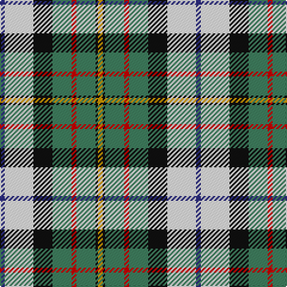

In pattern [BWKGRGKY](/patterns/bwkgrgky/).

This was sourced from register-of-tartans.  It is a [8 stripes tartan](/stripes/stripes8/).

Original link https://www.tartanregister.gov.uk/tartanDetails.aspx?ref=2599

## Attestations

This cloth appears in 2 source records; the oldest owns this page.

- 01/01/1981 — MacLaren Dress (register-of-tartans, [record](https://www.tartanregister.gov.uk/tartanDetails.aspx?ref=2599))
- 1981 — MacLaren Dress (Clan) (tartans-authority, [record](http://www.tartansauthority.com/tartan-ferret/display/649/))

## Thread count
DB/4 W24 K16 G16 R4 G16 K2 DY/4

## Palette
Each colour and its ΔE from the base-6 reference it is a variant of.

| Colour | Shade | Base | ΔE (OKLab) |
|---|---|---|---|
| DB | <code style="background-color:#2C2C80;">#2C2C80</code> `#2C2C80` | B <code style="background-color:#2A418A;">#2A418A</code> | 0.06 |
| DY | <code style="background-color:#D09800;">#D09800</code> `#D09800` | Y <code style="background-color:#F2BF00;">#F2BF00</code> | 0.12 |
| G | <code style="background-color:#408060;">#408060</code> `#408060` | G <code style="background-color:#006100;">#006100</code> | 0.14 |
| K | <code style="background-color:#101010;">#101010</code> `#101010` | K <code style="background-color:#000000;">#000000</code> | 0.17 |
| R | <code style="background-color:#C80000;">#C80000</code> `#C80000` | R <code style="background-color:#CC0000;">#CC0000</code> | 0.01 |
| W | <code style="background-color:#F8F8F8;">#F8F8F8</code> `#F8F8F8` | W <code style="background-color:#F7F7F7;">#F7F7F7</code> | 0.00 |

# Sample pattern

## Nearest tartans

The nearest existing variants by ΔTartan distance.

1. [MacLaren Dress Clan Tartan Tartan Number: 649. Earliest known date: 1981 This sett was approved by the Chief and accepted by the A.G.M. of the Clan MacLaren Society as Dress MacLaren in 1981. The sett has been designed by changing the blue ground of the usual MacLaren sett to white and then centering a blue stripe on the white ground. This illustration is based on a kilt belonging to the designer, Mr I.G.Campbell MacLaren. See products available Copyright © Blair Urquhart, Comrie, 2015](/setts/s8/b7w30k13g9r6g16k2y7x2~b2c2c80-g006818-k101010-rc80000-we0e0e0-ye8c000/) — ΔT 0.65
1. [MacLaren dress](/setts/s8/b7w30k13g9r6g16k2y7x2~b304080-g008000-k000000-rc00000-we0e0e0-yf0c000/) — ΔT 0.82
1. [Crofters (Corporate?)](/setts/s7/b20r2g9w6y4k2g8x2~b2c2c80-g009420-k101010-rc80000-wf8f8f8-ye8c000/) — ΔT 0.91
1. [Coulter Dress (Personal)](/setts/s8/r6w20g12ra3g8b20k2b3x2~b788cb4-g007800-k000000-r8c0000-raa0783c-wf0f0f0/) — ΔT 0.98
1. [Crofters (Personal)](/setts/s7/b20r2g9w6y4k2g8x2~b2c4084-g309c18-k101010-rdc0000-we0e0e0-ye8c000/) — ΔT 0.99
1. [Gillies, Blue dress](/setts/s10/r7k2b16y5b10k13w28g2w4g2x2~b5480b0-g008000-k000000-rc00000-we0e0e0-yf0c000/) — ΔT 1.00
1. [MacRobart Dress (Personal)](/setts/s7/b8w33k15g17ba3g17ba3x2~b2c2c80-ba5c8ca8-g285800-k101010-we0e0e0/) — ΔT 1.00
1. [Gillies, dress Green](/setts/s10/y6k2g15r6g8k12w25b2w3b2x2~b5480b0-g008000-k000000-rc00000-we0e0e0-yf0c000/) — ΔT 1.04
1. [Gillies Blue Dress Clan Tartan Tartan Number: 934. Earliest known date: pre 2003 A name associated with Badenoch and the Hebrides. It means 'servant of Jesus'. See products available Copyright © Blair Urquhart, Comrie, 2015](/setts/s10/r7k2b16y5b10k13w28g2w4g2x2~b5c8ca8-g006818-k101010-rc80000-we0e0e0-ye8c000/) — ΔT 1.04
1. [Gillies Dress Blue #1 (Dance)](/setts/s10/r7k2b16y5b10k13w28g2w4g4x2~b5c8ca8-g003820-k101010-rc80000-wfcfcfc-yd8b000/) — ΔT 1.05

## Neighbour map

Every grey dot is one of 15726 variants placed by the first two principal components of the ΔTartan feature space (44% of its variance). Red is this tartan; blue dots are its nearest — click one to open its page.

<svg viewBox="0 0 640 380" role="img" style="max-width:100%;height:auto;border:1px solid #e0e0e0;border-radius:4px;display:block" xmlns="http://www.w3.org/2000/svg"><image href="/nn/cloud.v1.png" width="640" height="380"/><a href="/setts/s8/b7w30k13g9r6g16k2y7x2~b2c2c80-g006818-k101010-rc80000-we0e0e0-ye8c000/"><circle cx="80.3" cy="135.5" r="4" fill="#3465a4"><title>MacLaren Dress Clan Tartan Tartan Number: 649. Earliest known date: 1981 This sett was approved by the Chief and accepted by the A.G.M. of the Clan MacLaren Society as Dress MacLaren in 1981. The sett has been designed by changing the blue ground of the usual MacLaren sett to white and then centering a blue stripe on the white ground. This illustration is based on a kilt belonging to the designer, Mr I.G.Campbell MacLaren. See products available Copyright © Blair Urquhart, Comrie, 2015</title></circle></a><a href="/setts/s8/b7w30k13g9r6g16k2y7x2~b304080-g008000-k000000-rc00000-we0e0e0-yf0c000/"><circle cx="72.8" cy="133.8" r="4" fill="#3465a4"><title>MacLaren dress</title></circle></a><a href="/setts/s7/b20r2g9w6y4k2g8x2~b2c2c80-g009420-k101010-rc80000-wf8f8f8-ye8c000/"><circle cx="119.0" cy="160.1" r="4" fill="#3465a4"><title>Crofters (Corporate?)</title></circle></a><a href="/setts/s8/r6w20g12ra3g8b20k2b3x2~b788cb4-g007800-k000000-r8c0000-raa0783c-wf0f0f0/"><circle cx="79.5" cy="151.9" r="4" fill="#3465a4"><title>Coulter Dress (Personal)</title></circle></a><a href="/setts/s7/b20r2g9w6y4k2g8x2~b2c4084-g309c18-k101010-rdc0000-we0e0e0-ye8c000/"><circle cx="127.3" cy="162.9" r="4" fill="#3465a4"><title>Crofters (Personal)</title></circle></a><a href="/setts/s10/r7k2b16y5b10k13w28g2w4g2x2~b5480b0-g008000-k000000-rc00000-we0e0e0-yf0c000/"><circle cx="98.5" cy="111.1" r="4" fill="#3465a4"><title>Gillies, Blue dress</title></circle></a><a href="/setts/s7/b8w33k15g17ba3g17ba3x2~b2c2c80-ba5c8ca8-g285800-k101010-we0e0e0/"><circle cx="111.6" cy="176.1" r="4" fill="#3465a4"><title>MacRobart Dress (Personal)</title></circle></a><a href="/setts/s10/y6k2g15r6g8k12w25b2w3b2x2~b5480b0-g008000-k000000-rc00000-we0e0e0-yf0c000/"><circle cx="81.5" cy="117.7" r="4" fill="#3465a4"><title>Gillies, dress Green</title></circle></a><a href="/setts/s10/r7k2b16y5b10k13w28g2w4g2x2~b5c8ca8-g006818-k101010-rc80000-we0e0e0-ye8c000/"><circle cx="108.4" cy="113.4" r="4" fill="#3465a4"><title>Gillies Blue Dress Clan Tartan Tartan Number: 934. Earliest known date: pre 2003 A name associated with Badenoch and the Hebrides. It means 'servant of Jesus'. See products available Copyright © Blair Urquhart, Comrie, 2015</title></circle></a><a href="/setts/s10/r7k2b16y5b10k13w28g2w4g4x2~b5c8ca8-g003820-k101010-rc80000-wfcfcfc-yd8b000/"><circle cx="90.8" cy="111.7" r="4" fill="#3465a4"><title>Gillies Dress Blue #1 (Dance)</title></circle></a><circle cx="95.1" cy="145.9" r="5" fill="#c00000"/></svg>

ID: /setts/s8/b2w12k8g8r2g8k1y2x2~b2c2c80-g408060-k101010-rc80000-wf8f8f8-yd09800/
