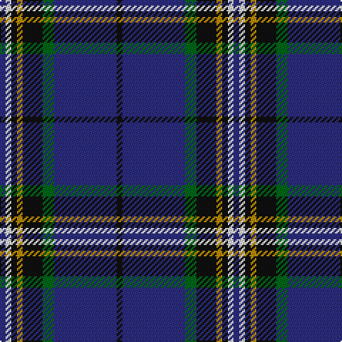

In pattern [BWKYKGBK](/patterns/bwkykgbk/).

This was sourced from register-of-tartans.  It is a [8 stripes tartan](/stripes/stripes8/).

Original link https://www.tartanregister.gov.uk/tartanDetails.aspx?ref=1360

## Attestations

This cloth appears in 2 source records; the oldest owns this page.

- 01/01/1998 — Glasgow, University of (register-of-tartans, [record](https://www.tartanregister.gov.uk/tartanDetails.aspx?ref=1360))
- Nov. 1999 — Glasgow, University of (Corporate) (tartans-authority, [record](http://www.tartansauthority.com/tartan-ferret/display/2680/))

## Thread count
DB/4 LN4 K4 DY4 K14 G8 DB44 K/4

## Palette
Each colour and its ΔE from the base-6 reference it is a variant of.

| Colour | Shade | Base | ΔE (OKLab) |
|---|---|---|---|
| DB | <code style="background-color:#2C2C80;">#2C2C80</code> `#2C2C80` | B <code style="background-color:#2A418A;">#2A418A</code> | 0.06 |
| DY | <code style="background-color:#BC8C00;">#BC8C00</code> `#BC8C00` | Y <code style="background-color:#F2BF00;">#F2BF00</code> | 0.16 |
| G | <code style="background-color:#006818;">#006818</code> `#006818` | G <code style="background-color:#006100;">#006100</code> | 0.02 |
| K | <code style="background-color:#101010;">#101010</code> `#101010` | K <code style="background-color:#000000;">#000000</code> | 0.17 |
| LN | <code style="background-color:#E0E0E0;">#E0E0E0</code> `#E0E0E0` | W <code style="background-color:#F7F7F7;">#F7F7F7</code> | 0.07 |

# Sample pattern

## Nearest tartans

The nearest existing variants by ΔTartan distance.

1. [Burt #2 (Name)](/setts/s9/b8w2k8g12r2b3r2b24r2~b2c2c80-g006818-k101010-rc80000-we0e0e0~x2/) — ΔT 0.77
1. [St. Andrews University (Corporate)](/setts/s10/b6y3k2y5ba30g2k4g2ba6b4~b202060-ba2c2c80-g006818-k101010-ye8c000~x2/) — ΔT 0.81
1. [Isle of Harris](/setts/s10/b10k1g2k2ba3k2g2k1b10w1~b2c2c80-ba2888c4-g289c18-k101010-wfcfcfc~x8/) — ΔT 0.95
1. [Reese (Personal)](/setts/s6/r4g2r2k5b22w2~b003c64-g006818-k101010-rc80000-we0e0e0~x4/) — ΔT 1.04
1. [Glasgow, University of](/setts/s8/b2w2k2g2k7ga4b22k2~b304080-g908000-ga008000-k000000-we0e0e0~x2/) — ΔT 1.04
1. [Chestico](/setts/s7/b20g1b1g1ga8k1w3~b202060-g603800-ga003820-k101010-wfcfcfc~x2/) — ΔT 1.12
1. [Glasgow, University of Corporate Tartan Tartan Number: 2680. Earliest known date: 2002 The official livery and promotional university tartan (STS). See products available Copyright © Blair Urquhart, Comrie, 2015](/setts/s14/b2w2k2y2k7g4b22k2b22g4k7y2k2w2~b2c2c80-g006818-k101010-we0e0e0-ybc8c00~x2/) — ΔT 1.14
1. [MacBeth (Fashion)](/setts/s8/b42k6y2k3y2g10r7k2~b1c0070-g006818-k101010-r880000-yd09800~x2/) — ΔT 1.17
1. [City of Rome Pipe Band (Corporate)](/setts/s7/r12y6k88b45k6b6ya6~b2c2c80-k101010-r901c38-yd87c00-yae8c000/) — ΔT 1.17
1. [Royal Scottish Corporation](/setts/s9/w2r3b12ba3b3ba28r3ba3y2~b1c1c50-ba2c2c80-rc80000-we0e0e0-ye8c000~x2/) — ΔT 1.20

## Neighbour map

Every grey dot is one of 15726 variants placed by the first two principal components of the ΔTartan feature space (44% of its variance). Red is this tartan; blue dots are its nearest — click one to open its page.

<svg viewBox="0 0 640 380" role="img" style="max-width:100%;height:auto;border:1px solid #e0e0e0;border-radius:4px;display:block" xmlns="http://www.w3.org/2000/svg"><image href="/nn/cloud.v1.png" width="640" height="380"/><a href="/setts/s9/b8w2k8g12r2b3r2b24r2~b2c2c80-g006818-k101010-rc80000-we0e0e0~x2/"><circle cx="285.2" cy="169.2" r="4" fill="#3465a4"><title>Burt #2 (Name)</title></circle></a><a href="/setts/s10/b6y3k2y5ba30g2k4g2ba6b4~b202060-ba2c2c80-g006818-k101010-ye8c000~x2/"><circle cx="298.0" cy="137.7" r="4" fill="#3465a4"><title>St. Andrews University (Corporate)</title></circle></a><a href="/setts/s10/b10k1g2k2ba3k2g2k1b10w1~b2c2c80-ba2888c4-g289c18-k101010-wfcfcfc~x8/"><circle cx="282.5" cy="170.4" r="4" fill="#3465a4"><title>Isle of Harris</title></circle></a><a href="/setts/s6/r4g2r2k5b22w2~b003c64-g006818-k101010-rc80000-we0e0e0~x4/"><circle cx="319.9" cy="176.6" r="4" fill="#3465a4"><title>Reese (Personal)</title></circle></a><a href="/setts/s8/b2w2k2g2k7ga4b22k2~b304080-g908000-ga008000-k000000-we0e0e0~x2/"><circle cx="272.8" cy="155.5" r="4" fill="#3465a4"><title>Glasgow, University of</title></circle></a><a href="/setts/s7/b20g1b1g1ga8k1w3~b202060-g603800-ga003820-k101010-wfcfcfc~x2/"><circle cx="350.2" cy="143.8" r="4" fill="#3465a4"><title>Chestico</title></circle></a><a href="/setts/s14/b2w2k2y2k7g4b22k2b22g4k7y2k2w2~b2c2c80-g006818-k101010-we0e0e0-ybc8c00~x2/"><circle cx="284.8" cy="142.3" r="4" fill="#3465a4"><title>Glasgow, University of Corporate Tartan Tartan Number: 2680. Earliest known date: 2002 The official livery and promotional university tartan (STS). See products available Copyright © Blair Urquhart, Comrie, 2015</title></circle></a><a href="/setts/s8/b42k6y2k3y2g10r7k2~b1c0070-g006818-k101010-r880000-yd09800~x2/"><circle cx="340.3" cy="136.8" r="4" fill="#3465a4"><title>MacBeth (Fashion)</title></circle></a><a href="/setts/s7/r12y6k88b45k6b6ya6~b2c2c80-k101010-r901c38-yd87c00-yae8c000/"><circle cx="334.2" cy="165.3" r="4" fill="#3465a4"><title>City of Rome Pipe Band (Corporate)</title></circle></a><a href="/setts/s9/w2r3b12ba3b3ba28r3ba3y2~b1c1c50-ba2c2c80-rc80000-we0e0e0-ye8c000~x2/"><circle cx="339.2" cy="152.9" r="4" fill="#3465a4"><title>Royal Scottish Corporation</title></circle></a><circle cx="300.1" cy="164.4" r="5" fill="#c00000"/></svg>

ID: /setts/s8/b2w2k2y2k7g4b22k2~b2c2c80-g006818-k101010-we0e0e0-ybc8c00~x2/
