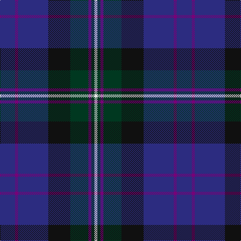

In pattern [BBBKGBGW](/patterns/bbbkgbgw/).

This was sourced from tartans-authority.  It is a [8 stripes tartan](/stripes/stripes8/).

Original link http://www.tartansauthority.com/tartan-ferret/display/7693/

## Thread count
DB/30 P6 DB60 K44 DG36 P6 DG6 LN/6

## Palette
Each colour and its ΔE from the base-6 reference it is a variant of.

| Colour | Shade | Base | ΔE (OKLab) |
|---|---|---|---|
| DB | <code style="background-color:#2C2C80;">#2C2C80</code> `#2C2C80` | B <code style="background-color:#2A418A;">#2A418A</code> | 0.06 |
| DG | <code style="background-color:#003820;">#003820</code> `#003820` | G <code style="background-color:#006100;">#006100</code> | 0.15 |
| K | <code style="background-color:#101010;">#101010</code> `#101010` | K <code style="background-color:#000000;">#000000</code> | 0.17 |
| LN | <code style="background-color:#E0E0E0;">#E0E0E0</code> `#E0E0E0` | W <code style="background-color:#F7F7F7;">#F7F7F7</code> | 0.07 |
| P | <code style="background-color:#780078;">#780078</code> `#780078` | B <code style="background-color:#2A418A;">#2A418A</code> | 0.17 |

# Sample pattern

## Nearest tartans

The nearest existing variants by ΔTartan distance.

1. [Haus of RvR](/setts/s11/b26w4b26k6ba26k42y6k36b18k4b4-b2c4084-ba141e46-k101010-we0e0e0-yc88c00/) — ΔT 0.95
1. [Brethwe Powys](/setts/s11/g24b7g7b7k22b7k4ga4k4b40r14-b2c4084-g003c14-ga503c14-k000028-r781c38/) — ΔT 0.95
1. [Scozia (Fashion)](/setts/s9/b6ba8b48ba12r6ba8g6ba16w6-b14283c-ba2c2c80-g006818-rc80000-we0e0e0/) — ΔT 0.98
1. [Hutchesons' Grammar (Corporate)](/setts/s6/b16r8ba60bb60ra6bb8-b5c8ca8-ba2c2c80-bb14283c-r888888-rac80000/) — ΔT 0.99
1. [Leslie Hebridean Artifact Tartan Tartan Number: 1111. Earliest known date: 1740 From the Telfer Dunbar collection and said to date to C.1740s. See products available Copyright © Blair Urquhart, Comrie, 2015](/setts/s6/k12g22w4b44r4k8-b403870-g344c2c-k101010-rd05054-we0e0e0/) — ΔT 1.14
1. [Hutchesons' Grammar School](/setts/s10/b8r6b60ba60ra8bb16ra8ba60b60r6-b14283c-ba2c2c80-bb5c8ca8-rc80000-ra888888/) — ΔT 1.19
1. [Romantic Scotland (Madonna)](/setts/s9/b20ba4b16bb16b28bb32w4bb8y4-b14283c-ba780078-bb2c2c80-wf8f8f8-ye8c000/) — ΔT 1.23
1. [Christian Dewar (Personal)](/setts/s9/b32k4b4k4b4k12g26y4g6-b00248c-g142814-k3c0000-ya08c28/) — ΔT 1.23
1. [St. Andrew's Soc. of Philadelphia (C](/setts/s12/b12r4ba48g8ba8b16ba8g8ba8g36b4y8-b202060-ba2c2c80-g285800-rc80000-ybc8c00/) — ΔT 1.25
1. [Belfrage](/setts/s6/b44ba10bb18g28b20y4-b000048-ba646464-bb3c0014-g004028-yc8a050/) — ΔT 1.25

## Neighbour map

Every grey dot is one of 15726 variants placed by the first two principal components of the ΔTartan feature space (44% of its variance). Red is this tartan; blue dots are its nearest — click one to open its page.

<svg viewBox="0 0 640 380" role="img" style="max-width:100%;height:auto;border:1px solid #e0e0e0;border-radius:4px;display:block" xmlns="http://www.w3.org/2000/svg"><image href="/nn/cloud.v1.png" width="640" height="380"/><a href="/setts/s11/b26w4b26k6ba26k42y6k36b18k4b4-b2c4084-ba141e46-k101010-we0e0e0-yc88c00/"><circle cx="239.5" cy="200.8" r="4" fill="#3465a4"><title>Haus of RvR</title></circle></a><a href="/setts/s11/g24b7g7b7k22b7k4ga4k4b40r14-b2c4084-g003c14-ga503c14-k000028-r781c38/"><circle cx="243.8" cy="200.1" r="4" fill="#3465a4"><title>Brethwe Powys</title></circle></a><a href="/setts/s9/b6ba8b48ba12r6ba8g6ba16w6-b14283c-ba2c2c80-g006818-rc80000-we0e0e0/"><circle cx="259.4" cy="194.3" r="4" fill="#3465a4"><title>Scozia (Fashion)</title></circle></a><a href="/setts/s6/b16r8ba60bb60ra6bb8-b5c8ca8-ba2c2c80-bb14283c-r888888-rac80000/"><circle cx="275.3" cy="220.3" r="4" fill="#3465a4"><title>Hutchesons' Grammar (Corporate)</title></circle></a><a href="/setts/s6/k12g22w4b44r4k8-b403870-g344c2c-k101010-rd05054-we0e0e0/"><circle cx="257.8" cy="203.0" r="4" fill="#3465a4"><title>Leslie Hebridean Artifact Tartan Tartan Number: 1111. Earliest known date: 1740 From the Telfer Dunbar collection and said to date to C.1740s. See products available Copyright © Blair Urquhart, Comrie, 2015</title></circle></a><a href="/setts/s10/b8r6b60ba60ra8bb16ra8ba60b60r6-b14283c-ba2c2c80-bb5c8ca8-rc80000-ra888888/"><circle cx="285.1" cy="209.1" r="4" fill="#3465a4"><title>Hutchesons' Grammar School</title></circle></a><a href="/setts/s9/b20ba4b16bb16b28bb32w4bb8y4-b14283c-ba780078-bb2c2c80-wf8f8f8-ye8c000/"><circle cx="268.0" cy="228.5" r="4" fill="#3465a4"><title>Romantic Scotland (Madonna)</title></circle></a><a href="/setts/s9/b32k4b4k4b4k12g26y4g6-b00248c-g142814-k3c0000-ya08c28/"><circle cx="268.3" cy="224.5" r="4" fill="#3465a4"><title>Christian Dewar (Personal)</title></circle></a><a href="/setts/s12/b12r4ba48g8ba8b16ba8g8ba8g36b4y8-b202060-ba2c2c80-g285800-rc80000-ybc8c00/"><circle cx="250.5" cy="178.9" r="4" fill="#3465a4"><title>St. Andrew's Soc. of Philadelphia (C</title></circle></a><a href="/setts/s6/b44ba10bb18g28b20y4-b000048-ba646464-bb3c0014-g004028-yc8a050/"><circle cx="267.1" cy="241.0" r="4" fill="#3465a4"><title>Belfrage</title></circle></a><circle cx="250.5" cy="210.3" r="5" fill="#c00000"/></svg>

ID: /setts/s8/b30ba6b60k44g36ba6g6w6-b2c2c80-ba780078-g003820-k101010-we0e0e0/
