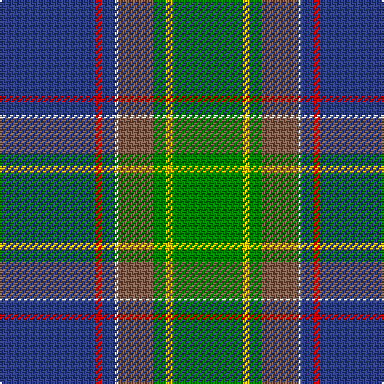

In pattern [BRBWRGYG](/patterns/brbwrgyg/).

This was sourced from weddslist.  It is a [8 stripes tartan](/stripes/stripes8/).

Original link http://www.weddslist.com/cgi-bin/tartans/pg.pl?source=sts

## Thread count
B/60 R4 B8 LN2 LT22 G8 Y4 G/44

## Palette
Each colour and its ΔE from the base-6 reference it is a variant of.

| Colour | Shade | Base | ΔE (OKLab) |
|---|---|---|---|
| B | <code style="background-color:#304080;">#304080</code> `#304080` | B <code style="background-color:#2A418A;">#2A418A</code> | 0.02 |
| G | <code style="background-color:#008000;">#008000</code> `#008000` | G <code style="background-color:#006100;">#006100</code> | 0.10 |
| LN | <code style="background-color:#E0E0E0;">#E0E0E0</code> `#E0E0E0` | W <code style="background-color:#F7F7F7;">#F7F7F7</code> | 0.07 |
| LT | <code style="background-color:#806050;">#806050</code> `#806050` | R <code style="background-color:#CC0000;">#CC0000</code> | 0.17 |
| R | <code style="background-color:#C00000;">#C00000</code> `#C00000` | R <code style="background-color:#CC0000;">#CC0000</code> | 0.03 |
| Y | <code style="background-color:#F0C000;">#F0C000</code> `#F0C000` | Y <code style="background-color:#F2BF00;">#F2BF00</code> | 0.00 |

# Sample pattern

## Nearest tartans

The nearest existing variants by ΔTartan distance.

1. [The Climb (Fashion)](/setts/s8/g2ga9r16ra2b30g3ga6w1x2~b1474b4-g5c6428-ga285800-r880000-rac80000-we8ccb8/) — ΔT 0.85
1. [Wagland](/setts/s7/r3b6y2b15g12ga39w3x2~b304080-g004010-ga407040-rc00000-we0e0e0-yf0c000/) — ΔT 0.91
1. [Young](/setts/s8/b3ba3g30b25bb4r3y2bb1x2~b1c1c50-ba2888c4-bb6c0070-g006818-rc8002c-ye8c000/) — ΔT 1.05
1. [McAvoy (Personal)](/setts/s10/y3g5k2g5w1g17b4r1b22w2x2~b003c64-g285800-k101010-rc80000-we0e0e0-ye8c000/) — ΔT 1.05
1. [Wagland (Name)](/setts/s7/r3b6y2b15g12ga39w3x2~b2c2c80-g006818-ga285800-rc80000-we0e0e0-ye8c000/) — ΔT 1.06
1. [Inkster (Name)](/setts/s8/b31y4g68w4b31r2k6r2x2~b2c2c80-g006818-k101010-rc80000-we0e0e0-ye8c000/) — ΔT 1.07
1. [Heriot Watt University (Corporate)](/setts/s10/g5y1b4ba18g2r2g16bb1b32ba3x2~b1474b4-ba14283c-bb202060-g285800-ra00000-yd09800/) — ΔT 1.11
1. [Rikaco Heirloom (Fashion)](/setts/s10/b3ba3b1g26b10bb1b3bc5ba4y2x2~b1c1c50-ba2c2c80-bb586c8c-bc780078-g006818-ya08858/) — ΔT 1.11
1. [State Seal of Pennsylvania (Fashion)](/setts/s9/y4k1g28k6ga18w4b41k1w3x2~b1474b4-g006818-ga604000-k101010-we8ccb8-ybc8c00/) — ΔT 1.14
1. [Tooth (Personal)](/setts/s8/g5y1r2g25k14b19w2g4x2~b2c2c80-g5c6428-k101010-r880000-wf8f8f8-ybc8c00/) — ΔT 1.16

## Neighbour map

Every grey dot is one of 15726 variants placed by the first two principal components of the ΔTartan feature space (44% of its variance). Red is this tartan; blue dots are its nearest — click one to open its page.

<svg viewBox="0 0 640 380" role="img" style="max-width:100%;height:auto;border:1px solid #e0e0e0;border-radius:4px;display:block" xmlns="http://www.w3.org/2000/svg"><image href="/nn/cloud.v1.png" width="640" height="380"/><a href="/setts/s8/g2ga9r16ra2b30g3ga6w1x2~b1474b4-g5c6428-ga285800-r880000-rac80000-we8ccb8/"><circle cx="264.7" cy="120.9" r="4" fill="#3465a4"><title>The Climb (Fashion)</title></circle></a><a href="/setts/s7/r3b6y2b15g12ga39w3x2~b304080-g004010-ga407040-rc00000-we0e0e0-yf0c000/"><circle cx="279.2" cy="149.6" r="4" fill="#3465a4"><title>Wagland</title></circle></a><a href="/setts/s8/b3ba3g30b25bb4r3y2bb1x2~b1c1c50-ba2888c4-bb6c0070-g006818-rc8002c-ye8c000/"><circle cx="265.7" cy="112.5" r="4" fill="#3465a4"><title>Young</title></circle></a><a href="/setts/s10/y3g5k2g5w1g17b4r1b22w2x2~b003c64-g285800-k101010-rc80000-we0e0e0-ye8c000/"><circle cx="256.1" cy="123.3" r="4" fill="#3465a4"><title>McAvoy (Personal)</title></circle></a><a href="/setts/s7/r3b6y2b15g12ga39w3x2~b2c2c80-g006818-ga285800-rc80000-we0e0e0-ye8c000/"><circle cx="269.3" cy="148.1" r="4" fill="#3465a4"><title>Wagland (Name)</title></circle></a><a href="/setts/s8/b31y4g68w4b31r2k6r2x2~b2c2c80-g006818-k101010-rc80000-we0e0e0-ye8c000/"><circle cx="292.0" cy="110.9" r="4" fill="#3465a4"><title>Inkster (Name)</title></circle></a><a href="/setts/s10/g5y1b4ba18g2r2g16bb1b32ba3x2~b1474b4-ba14283c-bb202060-g285800-ra00000-yd09800/"><circle cx="277.0" cy="115.0" r="4" fill="#3465a4"><title>Heriot Watt University (Corporate)</title></circle></a><a href="/setts/s10/b3ba3b1g26b10bb1b3bc5ba4y2x2~b1c1c50-ba2c2c80-bb586c8c-bc780078-g006818-ya08858/"><circle cx="273.2" cy="115.9" r="4" fill="#3465a4"><title>Rikaco Heirloom (Fashion)</title></circle></a><a href="/setts/s9/y4k1g28k6ga18w4b41k1w3x2~b1474b4-g006818-ga604000-k101010-we8ccb8-ybc8c00/"><circle cx="223.6" cy="95.2" r="4" fill="#3465a4"><title>State Seal of Pennsylvania (Fashion)</title></circle></a><a href="/setts/s8/g5y1r2g25k14b19w2g4x2~b2c2c80-g5c6428-k101010-r880000-wf8f8f8-ybc8c00/"><circle cx="255.3" cy="133.6" r="4" fill="#3465a4"><title>Tooth (Personal)</title></circle></a><circle cx="273.8" cy="124.3" r="5" fill="#c00000"/></svg>

ID: /setts/s8/b30r2b4w1ra11g4y2g22x2~b304080-g008000-rc00000-ra806050-we0e0e0-yf0c000/
