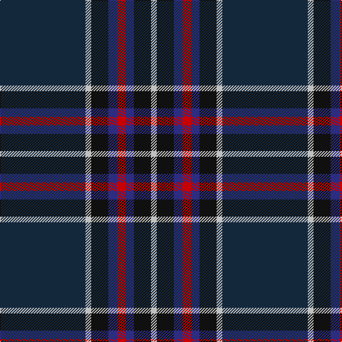

In pattern [BWKBRBKW](/patterns/bwkbrbkw/).

This was sourced from house-of-tartan.  It is a [8 stripes tartan](/stripes/stripes8/).

Original link http://www.house-of-tartan.scotland.net/house/TartanViewjs.asp?colr=Def&tnam=2307

## Thread count
DN/120 N8 K24 DB12 R12 DB12 K24 N/8

## Palette
Each colour and its ΔE from the base-6 reference it is a variant of.

| Colour | Shade | Base | ΔE (OKLab) |
|---|---|---|---|
| DB | <code style="background-color:#2C2C80;">#2C2C80</code> `#2C2C80` | B <code style="background-color:#2A418A;">#2A418A</code> | 0.06 |
| DBa | <code style="background-color:#003C64;">#003C64</code> `#003C64` | B <code style="background-color:#2A418A;">#2A418A</code> | 0.08 |
| DN | <code style="background-color:#14283C;">#14283C</code> `#14283C` | B <code style="background-color:#2A418A;">#2A418A</code> | 0.15 |
| DR | <code style="background-color:#880000;">#880000</code> `#880000` | R <code style="background-color:#CC0000;">#CC0000</code> | 0.15 |
| K | <code style="background-color:#101010;">#101010</code> `#101010` | K <code style="background-color:#000000;">#000000</code> | 0.17 |
| N | <code style="background-color:#C0C0C0;">#C0C0C0</code> `#C0C0C0` | W <code style="background-color:#F7F7F7;">#F7F7F7</code> | 0.17 |
| R | <code style="background-color:#C80000;">#C80000</code> `#C80000` | R <code style="background-color:#CC0000;">#CC0000</code> | 0.01 |

# Sample pattern

## Nearest tartans

The nearest existing variants by ΔTartan distance.

1. [Peter of Lee (Chief) (Personal)](/setts/s8/r4g4k2g29b21k3b3y3x2~b2c2c80-g003820-k101010-rc80000-ye8c000/) — ΔT 0.89
1. [City of Rome Pipe Band (Corporate)](/setts/s7/r12y6k88b45k6b6ya6~b2c2c80-k101010-r901c38-yd87c00-yae8c000/) — ΔT 1.02
1. [Moray Council](/setts/s8/b8r2b33ba15g12y2g2r2x2~b1c0070-ba14283c-g006818-r880000-yd09800/) — ΔT 1.10
1. [American National](/setts/s8/k3r3g4b7k3ba39b15w3x2~b2c2c80-ba14283c-g285800-k101010-rc80000-wf8f8f8/) — ΔT 1.11
1. [Strachan (Name)](/setts/s9/r2k3b42k3y2k3g22k3r2x2~b2c2c80-g006818-k101010-rc80000-ye8c000/) — ΔT 1.15
1. [Six Frigates (US)](/setts/s10/b3k1y2k1ba10k17ba2b1g1r1x2~b5f749c-ba141e46-g603800-k1c1714-rc82828-ye0a126/) — ΔT 1.18
1. [MacBeth (Fashion)](/setts/s8/b42k6y2k3y2g10r7k2x2~b1c0070-g006818-k101010-r880000-yd09800/) — ΔT 1.20
1. [Dugan (Personal)](/setts/s10/k10b4k34ba3g3ba3g3ba26bb2w3x2~b506878-ba1c1c50-bb84407c-g006818-k101010-wccd8e4/) — ΔT 1.24
1. [Edinburgh and Lothian Tourist Board](/setts/s7/k40b8r3b6ka3b6ra4x2~b141e46-k000028-ka101010-rc87814-radc0000/) — ΔT 1.24
1. [Black Raven (Fashion)](/setts/s7/k62b15ba15g20y5b5k15x2~b2c2c80-ba1870a4-g604000-k101010-yc4bc68/) — ΔT 1.26

## Neighbour map

Every grey dot is one of 15726 variants placed by the first two principal components of the ΔTartan feature space (44% of its variance). Red is this tartan; blue dots are its nearest — click one to open its page.

<svg viewBox="0 0 640 380" role="img" style="max-width:100%;height:auto;border:1px solid #e0e0e0;border-radius:4px;display:block" xmlns="http://www.w3.org/2000/svg"><image href="/nn/cloud.v1.png" width="640" height="380"/><a href="/setts/s8/r4g4k2g29b21k3b3y3x2~b2c2c80-g003820-k101010-rc80000-ye8c000/"><circle cx="294.9" cy="170.5" r="4" fill="#3465a4"><title>Peter of Lee (Chief) (Personal)</title></circle></a><a href="/setts/s7/r12y6k88b45k6b6ya6~b2c2c80-k101010-r901c38-yd87c00-yae8c000/"><circle cx="334.2" cy="165.3" r="4" fill="#3465a4"><title>City of Rome Pipe Band (Corporate)</title></circle></a><a href="/setts/s8/b8r2b33ba15g12y2g2r2x2~b1c0070-ba14283c-g006818-r880000-yd09800/"><circle cx="324.0" cy="174.3" r="4" fill="#3465a4"><title>Moray Council</title></circle></a><a href="/setts/s8/k3r3g4b7k3ba39b15w3x2~b2c2c80-ba14283c-g285800-k101010-rc80000-wf8f8f8/"><circle cx="290.2" cy="155.2" r="4" fill="#3465a4"><title>American National</title></circle></a><a href="/setts/s9/r2k3b42k3y2k3g22k3r2x2~b2c2c80-g006818-k101010-rc80000-ye8c000/"><circle cx="319.2" cy="128.3" r="4" fill="#3465a4"><title>Strachan (Name)</title></circle></a><a href="/setts/s10/b3k1y2k1ba10k17ba2b1g1r1x2~b5f749c-ba141e46-g603800-k1c1714-rc82828-ye0a126/"><circle cx="294.7" cy="130.0" r="4" fill="#3465a4"><title>Six Frigates (US)</title></circle></a><a href="/setts/s8/b42k6y2k3y2g10r7k2x2~b1c0070-g006818-k101010-r880000-yd09800/"><circle cx="340.3" cy="136.8" r="4" fill="#3465a4"><title>MacBeth (Fashion)</title></circle></a><a href="/setts/s10/k10b4k34ba3g3ba3g3ba26bb2w3x2~b506878-ba1c1c50-bb84407c-g006818-k101010-wccd8e4/"><circle cx="298.2" cy="142.7" r="4" fill="#3465a4"><title>Dugan (Personal)</title></circle></a><a href="/setts/s7/k40b8r3b6ka3b6ra4x2~b141e46-k000028-ka101010-rc87814-radc0000/"><circle cx="365.9" cy="185.3" r="4" fill="#3465a4"><title>Edinburgh and Lothian Tourist Board</title></circle></a><a href="/setts/s7/k62b15ba15g20y5b5k15x2~b2c2c80-ba1870a4-g604000-k101010-yc4bc68/"><circle cx="302.2" cy="192.6" r="4" fill="#3465a4"><title>Black Raven (Fashion)</title></circle></a><circle cx="328.4" cy="159.6" r="5" fill="#c00000"/></svg>

ID: /setts/s8/b30w2k6ba3r3ba3k6w2x4~b14283c-ba2c2c80-k101010-rc80000-wc0c0c0/
