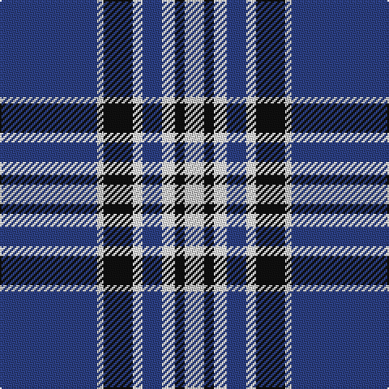

In pattern [BWKWBWKW](/patterns/bwkwbwkw/).

This was sourced from register-of-tartans.  It is a [8 stripes tartan](/stripes/stripes8/).

Original link https://www.tartanregister.gov.uk/tartanDetails.aspx?ref=11131

## Thread count
B/60 N4 K18 W6 B12 W8 K6 N/12

## Palette
Each colour and its ΔE from the base-6 reference it is a variant of.

| Colour | Shade | Base | ΔE (OKLab) |
|---|---|---|---|
| B | <code style="background-color:#2C4084;">#2C4084</code> `#2C4084` | B <code style="background-color:#2A418A;">#2A418A</code> | 0.01 |
| K | <code style="background-color:#101010;">#101010</code> `#101010` | K <code style="background-color:#000000;">#000000</code> | 0.17 |
| N | <code style="background-color:#C8C8C8;">#C8C8C8</code> `#C8C8C8` | W <code style="background-color:#F7F7F7;">#F7F7F7</code> | 0.14 |
| W | <code style="background-color:#FFFFFF;">#FFFFFF</code> `#FFFFFF` | W <code style="background-color:#F7F7F7;">#F7F7F7</code> | 0.02 |

# Sample pattern

## Nearest tartans

The nearest existing variants by ΔTartan distance.

1. [Highlands School (N. Carolina) Corporate Tartan Tartan Number: 2109. Earliest known date: 1990 Highlands in North Carolina is the home of the Scottish Tartans Society's Museum Extension. The school tartan was designed by Bob Martin who is a 'Fellow of the Society'. Blue and Gold are the school colours. See products available Copyright © Blair Urquhart, Comrie, 2015](/setts/s8/y12b2y2b30ba3b2ba13w4x2~b2c2c80-ba202060-we0e0e0-ye8c000/) — ΔT 0.78
1. [Longniddry Eildon Blue Dress Fancy Tartan Tartan Number: 5486. Earliest known date: pre 1992 Dancers tartan See products available Copyright © Blair Urquhart, Comrie, 2015](/setts/s8/b42w2wa2w2b5ba12wa32b4x2~b202060-ba003c64-wa8ace8-wac0c0c0/) — ΔT 0.79
1. [Wolverines (Corporate)](/setts/s6/y8w3b40k12w3y3x2~b2c2c80-k101010-we0e0e0-yfcb464/) — ΔT 0.81
1. [Wolverine (Corporate)](/setts/s6/y8w3b40k12w3y3x2~b0c4ba8-k101010-wffffff-yaba712/) — ΔT 0.82
1. [Eildon (1980)](/setts/s8/b42w2wa2w2b5ba12wa32b4x2~b000050-ba003478-w94acfc-wac8c8c8/) — ΔT 0.95
1. [Stewart Navy Clan Tartan Tartan Number: 1117. Earliest known date: 1971 Stewart Navy See products available Copyright © Blair Urquhart, Comrie, 2015](/setts/s10/b29ba3w10b2w2y10b5w2b4y2x2~b003c64-ba680028-we0e0e0-ya08858/) — ΔT 0.98
1. [Eildon/Longniddry Blue Dress Fashion Tartan Tartan Number: 4799. Earliest known date: 01/01/1980 A Dancers' Fancy from Dalgliesh. This appears under three different names - Longniddry #5486, Eildon #4799 and Harmony Eildon #87 (original Scottish Tartans Authority references). Needs resolving. Sample in Scottish Tartans Authority's Dalgety Collection. /Threadcount and colours aren't 100% original. Generated manually./ See products available Copyright © Blair Urquhart, Comrie, 2015](/setts/s8/b30ba2w2ba2b4bb10w25b4x2~b202060-ba2888c4-bb5c8ca8-we0e0e0/) — ΔT 1.03
1. [Longniddry Blue (Dance)](/setts/s8/b42w2wa2w2b5ba12wa32b4x2~b14283c-ba003c64-wa8ace8-wac0c0c0/) — ΔT 1.03
1. [Highlands School (North Carolina)](/setts/s8/y12b2y2b30ba2b2ba13w4x2~b1c0070-ba14283c-wc0c0c0-yd09800/) — ΔT 1.04
1. [Int. Police Association (Official)](/setts/s7/b7r3b26ba2b2ba26y4x2~b1c0070-ba5c8ca8-rc80000-ye8c000/) — ΔT 1.06

## Neighbour map

Every grey dot is one of 15726 variants placed by the first two principal components of the ΔTartan feature space (44% of its variance). Red is this tartan; blue dots are its nearest — click one to open its page.

<svg viewBox="0 0 640 380" role="img" style="max-width:100%;height:auto;border:1px solid #e0e0e0;border-radius:4px;display:block" xmlns="http://www.w3.org/2000/svg"><image href="/nn/cloud.v1.png" width="640" height="380"/><a href="/setts/s8/y12b2y2b30ba3b2ba13w4x2~b2c2c80-ba202060-we0e0e0-ye8c000/"><circle cx="257.4" cy="157.3" r="4" fill="#3465a4"><title>Highlands School (N. Carolina) Corporate Tartan Tartan Number: 2109. Earliest known date: 1990 Highlands in North Carolina is the home of the Scottish Tartans Society's Museum Extension. The school tartan was designed by Bob Martin who is a 'Fellow of the Society'. Blue and Gold are the school colours. See products available Copyright © Blair Urquhart, Comrie, 2015</title></circle></a><a href="/setts/s8/b42w2wa2w2b5ba12wa32b4x2~b202060-ba003c64-wa8ace8-wac0c0c0/"><circle cx="286.3" cy="141.0" r="4" fill="#3465a4"><title>Longniddry Eildon Blue Dress Fancy Tartan Tartan Number: 5486. Earliest known date: pre 1992 Dancers tartan See products available Copyright © Blair Urquhart, Comrie, 2015</title></circle></a><a href="/setts/s6/y8w3b40k12w3y3x2~b2c2c80-k101010-we0e0e0-yfcb464/"><circle cx="304.2" cy="170.4" r="4" fill="#3465a4"><title>Wolverines (Corporate)</title></circle></a><a href="/setts/s6/y8w3b40k12w3y3x2~b0c4ba8-k101010-wffffff-yaba712/"><circle cx="299.3" cy="173.6" r="4" fill="#3465a4"><title>Wolverine (Corporate)</title></circle></a><a href="/setts/s8/b42w2wa2w2b5ba12wa32b4x2~b000050-ba003478-w94acfc-wac8c8c8/"><circle cx="271.5" cy="139.9" r="4" fill="#3465a4"><title>Eildon (1980)</title></circle></a><a href="/setts/s10/b29ba3w10b2w2y10b5w2b4y2x2~b003c64-ba680028-we0e0e0-ya08858/"><circle cx="302.2" cy="146.9" r="4" fill="#3465a4"><title>Stewart Navy Clan Tartan Tartan Number: 1117. Earliest known date: 1971 Stewart Navy See products available Copyright © Blair Urquhart, Comrie, 2015</title></circle></a><a href="/setts/s8/b30ba2w2ba2b4bb10w25b4x2~b202060-ba2888c4-bb5c8ca8-we0e0e0/"><circle cx="241.0" cy="150.0" r="4" fill="#3465a4"><title>Eildon/Longniddry Blue Dress Fashion Tartan Tartan Number: 4799. Earliest known date: 01/01/1980 A Dancers' Fancy from Dalgliesh. This appears under three different names - Longniddry #5486, Eildon #4799 and Harmony Eildon #87 (original Scottish Tartans Authority references). Needs resolving. Sample in Scottish Tartans Authority's Dalgety Collection. /Threadcount and colours aren't 100% original. Generated manually./ See products available Copyright © Blair Urquhart, Comrie, 2015</title></circle></a><a href="/setts/s8/b42w2wa2w2b5ba12wa32b4x2~b14283c-ba003c64-wa8ace8-wac0c0c0/"><circle cx="284.3" cy="141.6" r="4" fill="#3465a4"><title>Longniddry Blue (Dance)</title></circle></a><a href="/setts/s8/y12b2y2b30ba2b2ba13w4x2~b1c0070-ba14283c-wc0c0c0-yd09800/"><circle cx="270.0" cy="161.4" r="4" fill="#3465a4"><title>Highlands School (North Carolina)</title></circle></a><a href="/setts/s7/b7r3b26ba2b2ba26y4x2~b1c0070-ba5c8ca8-rc80000-ye8c000/"><circle cx="285.3" cy="180.8" r="4" fill="#3465a4"><title>Int. Police Association (Official)</title></circle></a><circle cx="288.4" cy="156.4" r="5" fill="#c00000"/></svg>

ID: /setts/s8/b30w2k9wa3b6wa4k3w6x2~b2c4084-k101010-wc8c8c8-waffffff/
