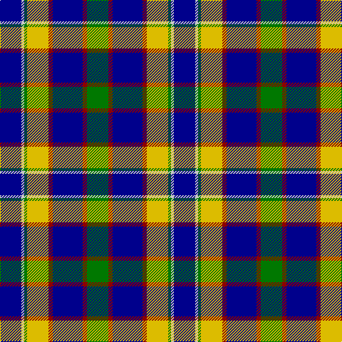

In pattern [BWGYRBRG](/patterns/bwgyrbrg/).

This was sourced from register-of-tartans.  It is a [8 stripes tartan](/stripes/stripes8/).

Original link https://www.tartanregister.gov.uk/tartanDetails.aspx?ref=2239

## Thread count
DB/30 N4 G4 Y30 DR6 DB42 DR6 G/30

## Palette
Each colour and its ΔE from the base-6 reference it is a variant of.

| Colour | Shade | Base | ΔE (OKLab) |
|---|---|---|---|
| DB | <code style="background-color:#00008C;">#00008C</code> `#00008C` | B <code style="background-color:#2C4084;">#2C4084</code> | 0.13 |
| DR | <code style="background-color:#8C0000;">#8C0000</code> `#8C0000` | R <code style="background-color:#C80000;">#C80000</code> | 0.13 |
| G | <code style="background-color:#007800;">#007800</code> `#007800` | G <code style="background-color:#006400;">#006400</code> | 0.06 |
| N | <code style="background-color:#C8C8C8;">#C8C8C8</code> `#C8C8C8` | W <code style="background-color:#F4F4F0;">#F4F4F0</code> | 0.13 |
| Y | <code style="background-color:#DCBC00;">#DCBC00</code> `#DCBC00` | Y <code style="background-color:#E8C000;">#E8C000</code> | 0.02 |

# Sample pattern

## Nearest tartans

The nearest existing variants by ΔTartan distance.

1. [Bahamas District Tartan Tartan Number: 2089. Earliest known date: 1966 Designed by Gordon Rees of the Scottish Shop in Nassau, now owned by Colin and Beverley Honnes. It was intended to perpetuate the memory of early Scottish settlers in the Bahamas including Thompson, Sands, Forsythe, Munroe, Johnston, Russell, Christie, Roberts, Kelly, MacKinney, Saunders, Malcolm, Crawford, MacPherson, Clark and Rae. The tartan was formally approved by the Bahamas Government in 1966. See products available Copyright © Blair Urquhart, Comrie, 2015](/setts/s8/b12y4b44g14r4w22g22b6-b2c2c80-g006818-rc80000-we0e0e0-ye8c000/) — ΔT 0.56
1. [Scotsburn Croft](/setts/s9/w16k3w16k26b4k26ba20wa3ba8-b780078-ba646464-k101010-w82cffd-waffffff/) — ΔT 0.81
1. [Thomson Dress (Blue)](/setts/s6/r6b60k12w24k24y6-b1870a4-k101010-rc80000-we0e0e0-ye8c000/) — ΔT 0.86
1. [Ayrshire](/setts/s8/b8r4b40w4g16ga32ga4ga8-b1c0070-g785000-ga30ac38-r880000-we0e0e0/) — ΔT 0.89
1. [Seaford House](/setts/s9/w3b3w12b26g26r3g26b28wa3-b202060-g006818-rc80000-w98c8e8-wafcfcfc/) — ΔT 0.97
1. [Bahamas](/setts/s8/b6g22w22r4g14b44y4b4-b304080-g008000-rc00000-we0e0e0-yf0c000/) — ΔT 1.08
1. [Loch Ness (Fashion)](/setts/s7/r4b4r4b42y22k34w4-b5c8ca8-k00002c-rc80000-w98c8e8-y48a4c0/) — ΔT 1.10
1. [Gillies](/setts/s8/b64k24b24g12r12g36k4y6-b304080-g008000-k000000-rc00000-yf0c000/) — ΔT 1.11
1. [MacIntyre, Inglis](/setts/s6/w8g56b36r8b36y6-b2c2c80-g006818-rc80000-wf8f8f8-ye8c000/) — ΔT 1.12
1. [Patterson (blue)](/setts/s6/b44w4k20g22r6g8-b304080-g008000-k000000-rc00000-we0e0e0/) — ΔT 1.13

## Neighbour map

Every grey dot is one of 15726 variants placed by the first two principal components of the ΔTartan feature space (44% of its variance). Red is this tartan; blue dots are its nearest — click one to open its page.

<svg viewBox="0 0 640 380" role="img" style="max-width:100%;height:auto;border:1px solid #e0e0e0;border-radius:4px;display:block" xmlns="http://www.w3.org/2000/svg"><image href="/nn/cloud.v1.png" width="640" height="380"/><a href="/setts/s8/b12y4b44g14r4w22g22b6-b2c2c80-g006818-rc80000-we0e0e0-ye8c000/"><circle cx="197.5" cy="173.8" r="4" fill="#3465a4"><title>Bahamas District Tartan Tartan Number: 2089. Earliest known date: 1966 Designed by Gordon Rees of the Scottish Shop in Nassau, now owned by Colin and Beverley Honnes. It was intended to perpetuate the memory of early Scottish settlers in the Bahamas including Thompson, Sands, Forsythe, Munroe, Johnston, Russell, Christie, Roberts, Kelly, MacKinney, Saunders, Malcolm, Crawford, MacPherson, Clark and Rae. The tartan was formally approved by the Bahamas Government in 1966. See products available Copyright © Blair Urquhart, Comrie, 2015</title></circle></a><a href="/setts/s9/w16k3w16k26b4k26ba20wa3ba8-b780078-ba646464-k101010-w82cffd-waffffff/"><circle cx="147.6" cy="185.3" r="4" fill="#3465a4"><title>Scotsburn Croft</title></circle></a><a href="/setts/s6/r6b60k12w24k24y6-b1870a4-k101010-rc80000-we0e0e0-ye8c000/"><circle cx="176.6" cy="178.5" r="4" fill="#3465a4"><title>Thomson Dress (Blue)</title></circle></a><a href="/setts/s8/b8r4b40w4g16ga32ga4ga8-b1c0070-g785000-ga30ac38-r880000-we0e0e0/"><circle cx="173.5" cy="169.1" r="4" fill="#3465a4"><title>Ayrshire</title></circle></a><a href="/setts/s9/w3b3w12b26g26r3g26b28wa3-b202060-g006818-rc80000-w98c8e8-wafcfcfc/"><circle cx="192.8" cy="187.2" r="4" fill="#3465a4"><title>Seaford House</title></circle></a><a href="/setts/s8/b6g22w22r4g14b44y4b4-b304080-g008000-rc00000-we0e0e0-yf0c000/"><circle cx="188.5" cy="165.5" r="4" fill="#3465a4"><title>Bahamas</title></circle></a><a href="/setts/s7/r4b4r4b42y22k34w4-b5c8ca8-k00002c-rc80000-w98c8e8-y48a4c0/"><circle cx="165.0" cy="169.1" r="4" fill="#3465a4"><title>Loch Ness (Fashion)</title></circle></a><a href="/setts/s8/b64k24b24g12r12g36k4y6-b304080-g008000-k000000-rc00000-yf0c000/"><circle cx="218.0" cy="166.2" r="4" fill="#3465a4"><title>Gillies</title></circle></a><a href="/setts/s6/w8g56b36r8b36y6-b2c2c80-g006818-rc80000-wf8f8f8-ye8c000/"><circle cx="221.1" cy="204.7" r="4" fill="#3465a4"><title>MacIntyre, Inglis</title></circle></a><a href="/setts/s6/b44w4k20g22r6g8-b304080-g008000-k000000-rc00000-we0e0e0/"><circle cx="171.5" cy="190.3" r="4" fill="#3465a4"><title>Patterson (blue)</title></circle></a><circle cx="172.2" cy="176.3" r="5" fill="#c00000"/></svg>

ID: /setts/s8/b30w4g4y30r6b42r6g30-b00008c-g007800-r8c0000-wc8c8c8-ydcbc00/
