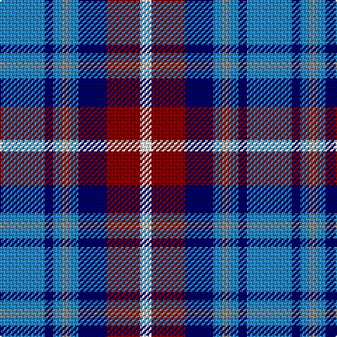

In pattern [BBBRBBRW](/patterns/bbbrbbrw/).

This was sourced from tartans-authority.  It is a [8 stripes tartan](/stripes/stripes8/).

Original link http://www.tartansauthority.com/tartan-ferret/display/5117/

## Thread count
B/32 DB6 B6 N6 B6 DB20 DR24 W/8

## Palette
Each colour and its ΔE from the base-6 reference it is a variant of.

| Colour | Shade | Base | ΔE (OKLab) |
|---|---|---|---|
| B | <code style="background-color:#2888C4;">#2888C4</code> `#2888C4` | B <code style="background-color:#2A418A;">#2A418A</code> | 0.21 |
| DB | <code style="background-color:#000064;">#000064</code> `#000064` | B <code style="background-color:#2A418A;">#2A418A</code> | 0.18 |
| DR | <code style="background-color:#880000;">#880000</code> `#880000` | R <code style="background-color:#CC0000;">#CC0000</code> | 0.15 |
| N | <code style="background-color:#888888;">#888888</code> `#888888` | R <code style="background-color:#CC0000;">#CC0000</code> | 0.24 |
| W | <code style="background-color:#F8F8F8;">#F8F8F8</code> `#F8F8F8` | W <code style="background-color:#F7F7F7;">#F7F7F7</code> | 0.00 |

# Sample pattern

## Nearest tartans

The nearest existing variants by ΔTartan distance.

1. [Unidentified #47](/setts/s10/b40ba20y8ba8w8ba20r16ba8r16w8-b000064-ba788cb4-ra0783c-wc8c8c8-yc48800/) — ΔT 1.02
1. [Caitriot](/setts/s9/w6b4ba28y16b28bb32ba26b4w6-b5f749c-ba505050-bb000048-wffffff-ya0a0a0/) — ΔT 1.03
1. [Sibbald Blue (2014)](/setts/s9/g8b44ba12w20b6w12bb8ba6w8-b202060-ba2c2c80-bb780078-g003820-wfcfcfc/) — ΔT 1.09
1. [Sibbald Blue (2014)](/setts/s9/g8b44ba12w20b6w12bb8ba6w8-b141e46-ba003c64-bb64008c-g003c14-wfcfcfc/) — ΔT 1.13
1. [Lopatinsky (Personal)](/setts/s10/b24r6w6r6w6r6b25k12ba36y6-b2c2c80-ba1480c8-k101010-rc80000-we0e0e0-ye8c000/) — ΔT 1.13
1. [Bryson (1988) (Name)](/setts/s5/y16r8b56ba56w8-b78849c-ba000064-rc80000-wc8d8dc-ya0a0a0/) — ΔT 1.15
1. [Meh Dundee](/setts/s6/b78y12r24g12ba48w12-b2c2c80-ba2888c4-g006818-rc80000-we0e0e0-ye8c000/) — ΔT 1.18
1. [Waterford County Crest (Fashion)](/setts/s8/w16b10ba60y8b26y26g10ya10-b1c1c50-ba2c2c80-g006818-we0e0e0-ya0a0a0-yabc8c00/) — ΔT 1.20
1. [Lopez-Gasparotto](/setts/s7/r8ra40k40b8k8b48y8-b2c2c80-k101010-rc80000-ra888888-ye8c000/) — ΔT 1.24
1. [Naysmith, William A (Personal)](/setts/s10/w8r4b28k8w8k6w6k4r4wa4-b1c0070-k101010-r880000-wc0c0c0-waa8ace8/) — ΔT 1.26

## Neighbour map

Every grey dot is one of 15726 variants placed by the first two principal components of the ΔTartan feature space (44% of its variance). Red is this tartan; blue dots are its nearest — click one to open its page.

<svg viewBox="0 0 640 380" role="img" style="max-width:100%;height:auto;border:1px solid #e0e0e0;border-radius:4px;display:block" xmlns="http://www.w3.org/2000/svg"><image href="/nn/cloud.v1.png" width="640" height="380"/><a href="/setts/s10/b40ba20y8ba8w8ba20r16ba8r16w8-b000064-ba788cb4-ra0783c-wc8c8c8-yc48800/"><circle cx="93.3" cy="204.6" r="4" fill="#3465a4"><title>Unidentified #47</title></circle></a><a href="/setts/s9/w6b4ba28y16b28bb32ba26b4w6-b5f749c-ba505050-bb000048-wffffff-ya0a0a0/"><circle cx="110.0" cy="191.9" r="4" fill="#3465a4"><title>Caitriot</title></circle></a><a href="/setts/s9/g8b44ba12w20b6w12bb8ba6w8-b202060-ba2c2c80-bb780078-g003820-wfcfcfc/"><circle cx="122.1" cy="164.6" r="4" fill="#3465a4"><title>Sibbald Blue (2014)</title></circle></a><a href="/setts/s9/g8b44ba12w20b6w12bb8ba6w8-b141e46-ba003c64-bb64008c-g003c14-wfcfcfc/"><circle cx="119.6" cy="166.0" r="4" fill="#3465a4"><title>Sibbald Blue (2014)</title></circle></a><a href="/setts/s10/b24r6w6r6w6r6b25k12ba36y6-b2c2c80-ba1480c8-k101010-rc80000-we0e0e0-ye8c000/"><circle cx="86.8" cy="166.3" r="4" fill="#3465a4"><title>Lopatinsky (Personal)</title></circle></a><a href="/setts/s5/y16r8b56ba56w8-b78849c-ba000064-rc80000-wc8d8dc-ya0a0a0/"><circle cx="157.8" cy="211.0" r="4" fill="#3465a4"><title>Bryson (1988) (Name)</title></circle></a><a href="/setts/s6/b78y12r24g12ba48w12-b2c2c80-ba2888c4-g006818-rc80000-we0e0e0-ye8c000/"><circle cx="133.2" cy="187.7" r="4" fill="#3465a4"><title>Meh Dundee</title></circle></a><a href="/setts/s8/w16b10ba60y8b26y26g10ya10-b1c1c50-ba2c2c80-g006818-we0e0e0-ya0a0a0-yabc8c00/"><circle cx="94.8" cy="170.2" r="4" fill="#3465a4"><title>Waterford County Crest (Fashion)</title></circle></a><a href="/setts/s7/r8ra40k40b8k8b48y8-b2c2c80-k101010-rc80000-ra888888-ye8c000/"><circle cx="128.5" cy="208.0" r="4" fill="#3465a4"><title>Lopez-Gasparotto</title></circle></a><a href="/setts/s10/w8r4b28k8w8k6w6k4r4wa4-b1c0070-k101010-r880000-wc0c0c0-waa8ace8/"><circle cx="104.6" cy="166.3" r="4" fill="#3465a4"><title>Naysmith, William A (Personal)</title></circle></a><circle cx="121.2" cy="202.8" r="5" fill="#c00000"/></svg>

ID: /setts/s8/b32ba6b6r6b6ba20ra24w8-b2888c4-ba000064-r888888-ra880000-wf8f8f8/
