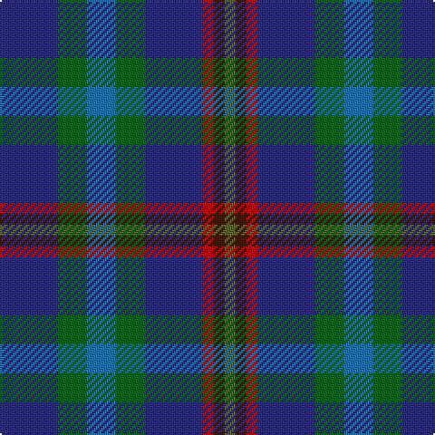

In pattern [BGBGBRBG](/patterns/bgbgbrbg/).

This was sourced from register-of-tartans.  It is a [8 stripes tartan](/stripes/stripes8/).

Original link https://www.tartanregister.gov.uk/tartanDetails.aspx?ref=1375

## Attestations

This cloth appears in 2 source records; the oldest owns this page.

- 01/01/2002 — Glen Erin (register-of-tartans, [record](https://www.tartanregister.gov.uk/tartanDetails.aspx?ref=1375))
- pre 2002 — Glen Erin (Fashion) (tartans-authority, [record](http://www.tartansauthority.com/tartan-ferret/display/1909/))

## Thread count
DB/32 Ga16 B16 Ga16 DB32 R6 DR6 G/6

## Palette
Each colour and its ΔE from the base-6 reference it is a variant of.

| Colour | Shade | Base | ΔE (OKLab) |
|---|---|---|---|
| B | <code style="background-color:#1474B4;">#1474B4</code> `#1474B4` | B <code style="background-color:#2A418A;">#2A418A</code> | 0.15 |
| DB | <code style="background-color:#2C2C80;">#2C2C80</code> `#2C2C80` | B <code style="background-color:#2A418A;">#2A418A</code> | 0.06 |
| DR | <code style="background-color:#441800;">#441800</code> `#441800` | B <code style="background-color:#2A418A;">#2A418A</code> | 0.23 |
| G | <code style="background-color:#5C6428;">#5C6428</code> `#5C6428` | G <code style="background-color:#006100;">#006100</code> | 0.10 |
| Ga | <code style="background-color:#006818;">#006818</code> `#006818` | G <code style="background-color:#006100;">#006100</code> | 0.02 |
| R | <code style="background-color:#C80000;">#C80000</code> `#C80000` | R <code style="background-color:#CC0000;">#CC0000</code> | 0.01 |

# Sample pattern

## Nearest tartans

The nearest existing variants by ΔTartan distance.

1. [Glen Erin Canadian Tartan Tartan Number: 1909. Earliest known date: pre 2003 Many new designs have been given district names to promote their Scottish connections. However, these names should not be confused with the District tartans which have earned their title through 'use and wont' and not a little history. See products available Copyright © Blair Urquhart, Comrie, 2015](/setts/s8/b32g16ba16g16b32r6ga6gb6-b202060-ba2c2c80-g006818-ga604000-gb289c18-rc80000/) — ΔT 0.50
1. [Queen of the South F.C. (Sports)](/setts/s8/w6r16b20ba18bb5ba18bc6ba4-b003c64-ba2c2c80-bb507894-bc105074-r940000-wc4c4c4/) — ΔT 1.32
1. [Blarney Castle](/setts/s9/g64y12b36r12b36g24b12g12k12-b2c2c80-g00643c-k101010-rdc0000-ye0a126/) — ΔT 1.39
1. [Patel Name Tartan Tartan Number: 10924. Earliest known date: 2013 Designed for the Patel family using colours associated with the Gujarat, a state in the North-West coast of India known locally as Jewel of the West. See products available Copyright © Blair Urquhart, Comrie, 2015](/setts/s9/g6y4r20g20b40g24ra6b20w4-b085088-g004830-r884050-raa00028-we8e8e8-yc48800/) — ΔT 1.49
1. [Forbo Nairn Corporate Tartan Tartan Number: 2298. Earliest known date: pre 2002 Designed for Forbo Nairn Ltd - a Swiss based company with two factories in Kirkcaldy, Fife. Tartan is based on the Nairn (#1331) because of an association with Michael Nairn, builder of the first 'floor cloth' (linoleum) factory in Scotland in 1843.STS said Approved by Sir Robert Spencer Nairn. Blue and red used in this graphic in place of dark blue and red so that sett could be seen. See products available Copyright © Blair Urquhart, Comrie, 2015](/setts/s8/g32k28b48r8b48k28g32ba8-b2c2c80-ba5c8ca8-g006818-k101010-rc80000/) — ΔT 1.50
1. [Dalmeny](/setts/s10/b16k2b16k4g12r2g12k4b16w2-b2c4084-g005020-k101010-rdc0000-we0e0e0/) — ΔT 1.51
1. [Royal Navy Submarine Service](/setts/s9/w6b6r4b28k6g24k28b32y4-b141e46-g005448-k101010-r880000-wf0e0c8-yc88c00/) — ΔT 1.51
1. [Patel (2013)](/setts/s9/g6y4r20g20b40g24ra6b20w4-b1870a4-g004028-r781c38-ra960028-wffffff-ye0a126/) — ΔT 1.51
1. [Rose, Danny and Hanna (Personal)](/setts/s5/y22b38ba76r14k14-b2c2c80-ba14283c-k101010-r880000-y48a4c0/) — ΔT 1.55
1. [Quinn (Personal)](/setts/s9/r6b48k24g6ga24g6k24b48y6-b1870a4-g006818-ga003820-k101010-r880000-ye8c000/) — ΔT 1.55

## Neighbour map

Every grey dot is one of 15726 variants placed by the first two principal components of the ΔTartan feature space (44% of its variance). Red is this tartan; blue dots are its nearest — click one to open its page.

<svg viewBox="0 0 640 380" role="img" style="max-width:100%;height:auto;border:1px solid #e0e0e0;border-radius:4px;display:block" xmlns="http://www.w3.org/2000/svg"><image href="/nn/cloud.v1.png" width="640" height="380"/><a href="/setts/s8/b32g16ba16g16b32r6ga6gb6-b202060-ba2c2c80-g006818-ga604000-gb289c18-rc80000/"><circle cx="196.8" cy="233.5" r="4" fill="#3465a4"><title>Glen Erin Canadian Tartan Tartan Number: 1909. Earliest known date: pre 2003 Many new designs have been given district names to promote their Scottish connections. However, these names should not be confused with the District tartans which have earned their title through 'use and wont' and not a little history. See products available Copyright © Blair Urquhart, Comrie, 2015</title></circle></a><a href="/setts/s8/w6r16b20ba18bb5ba18bc6ba4-b003c64-ba2c2c80-bb507894-bc105074-r940000-wc4c4c4/"><circle cx="156.0" cy="239.1" r="4" fill="#3465a4"><title>Queen of the South F.C. (Sports)</title></circle></a><a href="/setts/s9/g64y12b36r12b36g24b12g12k12-b2c2c80-g00643c-k101010-rdc0000-ye0a126/"><circle cx="204.8" cy="227.9" r="4" fill="#3465a4"><title>Blarney Castle</title></circle></a><a href="/setts/s9/g6y4r20g20b40g24ra6b20w4-b085088-g004830-r884050-raa00028-we8e8e8-yc48800/"><circle cx="215.3" cy="202.4" r="4" fill="#3465a4"><title>Patel Name Tartan Tartan Number: 10924. Earliest known date: 2013 Designed for the Patel family using colours associated with the Gujarat, a state in the North-West coast of India known locally as Jewel of the West. See products available Copyright © Blair Urquhart, Comrie, 2015</title></circle></a><a href="/setts/s8/g32k28b48r8b48k28g32ba8-b2c2c80-ba5c8ca8-g006818-k101010-rc80000/"><circle cx="160.3" cy="253.8" r="4" fill="#3465a4"><title>Forbo Nairn Corporate Tartan Tartan Number: 2298. Earliest known date: pre 2002 Designed for Forbo Nairn Ltd - a Swiss based company with two factories in Kirkcaldy, Fife. Tartan is based on the Nairn (#1331) because of an association with Michael Nairn, builder of the first 'floor cloth' (linoleum) factory in Scotland in 1843.STS said Approved by Sir Robert Spencer Nairn. Blue and red used in this graphic in place of dark blue and red so that sett could be seen. See products available Copyright © Blair Urquhart, Comrie, 2015</title></circle></a><a href="/setts/s10/b16k2b16k4g12r2g12k4b16w2-b2c4084-g005020-k101010-rdc0000-we0e0e0/"><circle cx="288.5" cy="222.8" r="4" fill="#3465a4"><title>Dalmeny</title></circle></a><a href="/setts/s9/w6b6r4b28k6g24k28b32y4-b141e46-g005448-k101010-r880000-wf0e0c8-yc88c00/"><circle cx="206.9" cy="198.5" r="4" fill="#3465a4"><title>Royal Navy Submarine Service</title></circle></a><a href="/setts/s9/g6y4r20g20b40g24ra6b20w4-b1870a4-g004028-r781c38-ra960028-wffffff-ye0a126/"><circle cx="181.3" cy="185.0" r="4" fill="#3465a4"><title>Patel (2013)</title></circle></a><a href="/setts/s5/y22b38ba76r14k14-b2c2c80-ba14283c-k101010-r880000-y48a4c0/"><circle cx="215.8" cy="257.2" r="4" fill="#3465a4"><title>Rose, Danny and Hanna (Personal)</title></circle></a><a href="/setts/s9/r6b48k24g6ga24g6k24b48y6-b1870a4-g006818-ga003820-k101010-r880000-ye8c000/"><circle cx="195.6" cy="186.7" r="4" fill="#3465a4"><title>Quinn (Personal)</title></circle></a><circle cx="199.0" cy="232.9" r="5" fill="#c00000"/></svg>

ID: /setts/s8/b32g16ba16g16b32r6bb6ga6-b2c2c80-ba1474b4-bb441800-g006818-ga5c6428-rc80000/
