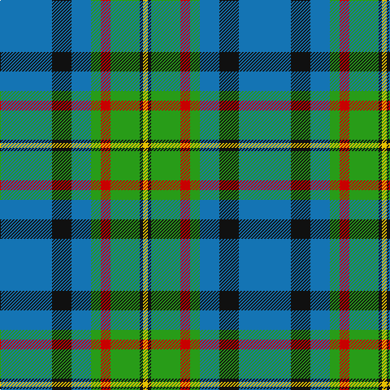

In pattern [BKBGRGKY](/patterns/bkbgrgky/).

This was sourced from register-of-tartans.  It is a [8 stripes tartan](/stripes/stripes8/).

Original link https://www.tartanregister.gov.uk/tartanDetails.aspx?ref=1341

## Attestations

This cloth appears in 2 source records; the oldest owns this page.

- 01/01/2002 — Gillies (House of Edgar) (register-of-tartans, [record](https://www.tartanregister.gov.uk/tartanDetails.aspx?ref=1341))
- pre 2002 — Gillies (House of Edgar) (Clan) (tartans-authority, [record](http://www.tartansauthority.com/tartan-ferret/display/309/))

## Thread count
B/64 K24 B24 G12 R12 G36 K4 Y/6

## Palette
Each colour and its ΔE from the base-6 reference it is a variant of.

| Colour | Shade | Base | ΔE (OKLab) |
|---|---|---|---|
| B | <code style="background-color:#1474B4;">#1474B4</code> `#1474B4` | B <code style="background-color:#2A418A;">#2A418A</code> | 0.15 |
| G | <code style="background-color:#289C18;">#289C18</code> `#289C18` | G <code style="background-color:#006100;">#006100</code> | 0.19 |
| K | <code style="background-color:#101010;">#101010</code> `#101010` | K <code style="background-color:#000000;">#000000</code> | 0.17 |
| R | <code style="background-color:#C80000;">#C80000</code> `#C80000` | R <code style="background-color:#CC0000;">#CC0000</code> | 0.01 |
| Y | <code style="background-color:#E8C000;">#E8C000</code> `#E8C000` | Y <code style="background-color:#F2BF00;">#F2BF00</code> | 0.02 |

# Sample pattern

## Nearest tartans

The nearest existing variants by ΔTartan distance.

1. [Bahamas](/setts/s8/b3g11w11r2g7b22y2b2~b304080-g008000-rc00000-we0e0e0-yf0c000~x2/) — ΔT 0.92
1. [MacMillan, hunting](/setts/s9/b10y3b30y5k8g16r4g16r2~b304080-g008000-k000000-rd03030-yf0c000~x2/) — ΔT 1.02
1. [MacWilliam](/setts/s8/g2ga12k10r1b16r2b16r1~b1474b4-g604000-ga006818-k101010-rc80000~x4/) — ΔT 1.10
1. [Snodgrass](/setts/s8/k3r1y1b11g13b5r1y1~b304080-g008000-k000000-rc00000-yf0c000~x2/) — ΔT 1.10
1. [MacMillan Hunting Clan Tartan Tartan Number: 667. Earliest known date: (1906) The modern Hunting MacMillan incorporates red and yellow stripes from the ancient design with the greens and blues of the Vestiarium version. - J. Cant. If Cant's notes are good, then the Vestiarium reference would place the design much earlier - say 1842. - BU. This version which lacks a black stripe outlining the blue square is not generally used. See products available Copyright © Blair Urquhart, Comrie, 2015](/setts/s9/b10y3b30y5k8g16r4g16r2~b2c2c80-g006818-k101010-rd05054-ye8c000~x2/) — ΔT 1.10
1. [Bahamas](/setts/s8/b8y2b22g6r2w10g12b3~b40647c-g004800-rc80000-wc8c8c8-y9c9c00~x2/) — ΔT 1.12
1. [Ferguson of Atholl Clan](/setts/s7/b24k8g8r2g8k1w2~b1860a8-g006818-k101010-rc80000-wfcfcfc~x2/) — ΔT 1.14
1. [Snodgrass (Clan)](/setts/s8/k3r1y1b11g13b5r1y1~b2888c4-g289c18-k101010-rc80000-ye8c000~x4/) — ΔT 1.15
1. [State Seal of Washington (Fashion)](/setts/s7/b5g28w5k20y5b47y4~b1474b4-g604000-k101010-we8ccb8-ybc8c00~x2/) — ΔT 1.16
1. [MX-5 Owners' Club](/setts/s7/r6b27ba2g2ba2g30w4~b2c2c80-ba2888c4-g006818-rc80000-wfcfcfc~x2/) — ΔT 1.18

## Neighbour map

Every grey dot is one of 15726 variants placed by the first two principal components of the ΔTartan feature space (44% of its variance). Red is this tartan; blue dots are its nearest — click one to open its page.

<svg viewBox="0 0 640 380" role="img" style="max-width:100%;height:auto;border:1px solid #e0e0e0;border-radius:4px;display:block" xmlns="http://www.w3.org/2000/svg"><image href="/nn/cloud.v1.png" width="640" height="380"/><a href="/setts/s8/b3g11w11r2g7b22y2b2~b304080-g008000-rc00000-we0e0e0-yf0c000~x2/"><circle cx="189.1" cy="166.2" r="4" fill="#3465a4"><title>Bahamas</title></circle></a><a href="/setts/s9/b10y3b30y5k8g16r4g16r2~b304080-g008000-k000000-rd03030-yf0c000~x2/"><circle cx="185.7" cy="160.6" r="4" fill="#3465a4"><title>MacMillan, hunting</title></circle></a><a href="/setts/s8/g2ga12k10r1b16r2b16r1~b1474b4-g604000-ga006818-k101010-rc80000~x4/"><circle cx="271.5" cy="177.1" r="4" fill="#3465a4"><title>MacWilliam</title></circle></a><a href="/setts/s8/k3r1y1b11g13b5r1y1~b304080-g008000-k000000-rc00000-yf0c000~x2/"><circle cx="218.7" cy="159.9" r="4" fill="#3465a4"><title>Snodgrass</title></circle></a><a href="/setts/s9/b10y3b30y5k8g16r4g16r2~b2c2c80-g006818-k101010-rd05054-ye8c000~x2/"><circle cx="201.0" cy="166.7" r="4" fill="#3465a4"><title>MacMillan Hunting Clan Tartan Tartan Number: 667. Earliest known date: (1906) The modern Hunting MacMillan incorporates red and yellow stripes from the ancient design with the greens and blues of the Vestiarium version. - J. Cant. If Cant's notes are good, then the Vestiarium reference would place the design much earlier - say 1842. - BU. This version which lacks a black stripe outlining the blue square is not generally used. See products available Copyright © Blair Urquhart, Comrie, 2015</title></circle></a><a href="/setts/s8/b8y2b22g6r2w10g12b3~b40647c-g004800-rc80000-wc8c8c8-y9c9c00~x2/"><circle cx="246.8" cy="192.3" r="4" fill="#3465a4"><title>Bahamas</title></circle></a><a href="/setts/s7/b24k8g8r2g8k1w2~b1860a8-g006818-k101010-rc80000-wfcfcfc~x2/"><circle cx="250.3" cy="153.7" r="4" fill="#3465a4"><title>Ferguson of Atholl Clan</title></circle></a><a href="/setts/s8/k3r1y1b11g13b5r1y1~b2888c4-g289c18-k101010-rc80000-ye8c000~x4/"><circle cx="223.2" cy="160.5" r="4" fill="#3465a4"><title>Snodgrass (Clan)</title></circle></a><a href="/setts/s7/b5g28w5k20y5b47y4~b1474b4-g604000-k101010-we8ccb8-ybc8c00~x2/"><circle cx="216.1" cy="174.6" r="4" fill="#3465a4"><title>State Seal of Washington (Fashion)</title></circle></a><a href="/setts/s7/r6b27ba2g2ba2g30w4~b2c2c80-ba2888c4-g006818-rc80000-wfcfcfc~x2/"><circle cx="239.7" cy="156.5" r="4" fill="#3465a4"><title>MX-5 Owners' Club</title></circle></a><circle cx="220.9" cy="167.5" r="5" fill="#c00000"/></svg>

ID: /setts/s8/b32k12b12g6r6g18k2y3~b1474b4-g289c18-k101010-rc80000-ye8c000~x2/
