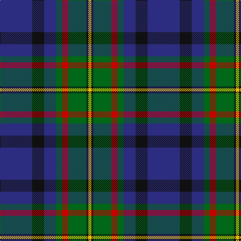

In pattern [BKBGRGKY](/patterns/bkbgrgky/).

This was sourced from house-of-tartan.  It is a [8 stripes tartan](/stripes/stripes8/).

Original link http://www.house-of-tartan.scotland.net/house/TartanViewjs.asp?colr=Def&tnam=309

## Thread count
DB/64 K24 DB24 G12 R12 G36 K4 Y/6

## Palette
Each colour and its ΔE from the base-6 reference it is a variant of.

| Colour | Shade | Base | ΔE (OKLab) |
|---|---|---|---|
| DB | <code style="background-color:#2C2C80;">#2C2C80</code> `#2C2C80` | B <code style="background-color:#2A418A;">#2A418A</code> | 0.06 |
| G | <code style="background-color:#006818;">#006818</code> `#006818` | G <code style="background-color:#006100;">#006100</code> | 0.02 |
| K | <code style="background-color:#101010;">#101010</code> `#101010` | K <code style="background-color:#000000;">#000000</code> | 0.17 |
| R | <code style="background-color:#C80000;">#C80000</code> `#C80000` | R <code style="background-color:#CC0000;">#CC0000</code> | 0.01 |
| Y | <code style="background-color:#E8C000;">#E8C000</code> `#E8C000` | Y <code style="background-color:#F2BF00;">#F2BF00</code> | 0.02 |

# Sample pattern

## Nearest tartans

The nearest existing variants by ΔTartan distance.

1. [MacLaren](/setts/s7/b12k4g4r1g4k1y1~b2c2c80-g408060-k101010-rc80000-yd09800~x4/) — ΔT 0.77
1. [MacMillan Hunting](/setts/s9/b10y3b30y5k8g16r4g16r2~b2c4084-g005020-k101010-rc82828-ye8c000~x2/) — ΔT 0.82
1. [Wellington (Wilson 122)](/setts/s8/g14b11ba3k2ba3b11g14y1~b440044-ba2888c4-g408060-k101010-ye8c000~x2/) — ΔT 0.88
1. [Ferguson of Athol Clan Tartan Tartan Number: 337. Earliest known date: 1850 D.C. Stewart points to the similarity with the Murray of Athol as a common source or association for the tartan. Some of the Fergussons of Athol and the MacLarens were followers of the Murray of Athol. The Ferguson tartan has a white stripe where the MacLaren has yellow. Chiefs of the clan are the Fergussons of Kilkerran, descended from Fergus of Dalriada, who brought the Stone of Scone to Scotland. See products available Copyright © Blair Urquhart, Comrie, 2015](/setts/s7/b24k8g8r2g8k1w2~b2c2c80-g006818-k101010-rc80000-we0e0e0~x2/) — ΔT 0.90
1. [MacLaren Clan Tartan Tartan Number: 342. Earliest known date: pre 1820 The MacLaren differs from The Ferguson only in having a yellow line where the latter has a white. They share the unusual feature of an unbroken band of blue. The present tartan appears under this name in Mclan's plate for Clan MacLaren. The Wilsons of Bannockburn were producing it before 1820 - but only under the name of 'Regent'. The Regency ended when George IV succeeded the throne in that year, the name of the tartan then becoming outdated; but production of the sett continued, as we know from specimens attached to customers' orders for more. Writers of the period tell us that the demand around 1822 for Clan tartans exceeded the authentic supply, and that not only were new setts invented but pre-existing ones acquired new names. Our present tartan may have been one of the latter; no older MacLaren has come to light. (MacLaren Society) See products available Copyright © Blair Urquhart, Comrie, 2015](/setts/s7/b24k8g8r2g8k1y2~b2c2c80-g006818-k101010-rc80000-ye8c000~x2/) — ΔT 0.90
1. [Croy, Jake (Personal)](/setts/s8/b10k7w2wa2k27ba7w2ba7~b505050-ba1870a4-k1c1714-w82cffd-wae8ccb8~x2/) — ΔT 0.90
1. [Snodgrass Family Tartan Tartan Number: 1216. Earliest known date: 1978 Designed for the Snodgrass Clan Association. It is based on the Cunningham tartan, and the colours chosen were, Black, Green and Gold - of the Snodgrass Coat of Arms, Green - for the 'grasy place' (sic) alluded to in the name, and Blue - representing the traditional Highland 'Blue Bonnet'. See products available Copyright © Blair Urquhart, Comrie, 2015](/setts/s8/k3r1y1b11g13b5r1y1~b2c2c80-g006818-k101010-rc80000-ye8c000~x2/) — ΔT 0.94
1. [MacMillan Hunting Clan Tartan Tartan Number: 667. Earliest known date: (1906) The modern Hunting MacMillan incorporates red and yellow stripes from the ancient design with the greens and blues of the Vestiarium version. - J. Cant. If Cant's notes are good, then the Vestiarium reference would place the design much earlier - say 1842. - BU. This version which lacks a black stripe outlining the blue square is not generally used. See products available Copyright © Blair Urquhart, Comrie, 2015](/setts/s9/b10y3b30y5k8g16r4g16r2~b2c2c80-g006818-k101010-rd05054-ye8c000~x2/) — ΔT 0.97
1. [MacFadzean/MacPhedran](/setts/s7/g3b12w1k12g13r2g2~b2c2c80-g408060-k101010-rc80000-wf8f8f8~x4/) — ΔT 0.99
1. [New England (Fashion)](/setts/s6/k2w1k12g5b11r1~b2c2c80-g006818-k101010-rc80000-we0e0e0~x2/) — ΔT 1.00

## Neighbour map

Every grey dot is one of 15726 variants placed by the first two principal components of the ΔTartan feature space (44% of its variance). Red is this tartan; blue dots are its nearest — click one to open its page.

<svg viewBox="0 0 640 380" role="img" style="max-width:100%;height:auto;border:1px solid #e0e0e0;border-radius:4px;display:block" xmlns="http://www.w3.org/2000/svg"><image href="/nn/cloud.v1.png" width="640" height="380"/><a href="/setts/s7/b12k4g4r1g4k1y1~b2c2c80-g408060-k101010-rc80000-yd09800~x4/"><circle cx="233.7" cy="183.1" r="4" fill="#3465a4"><title>MacLaren</title></circle></a><a href="/setts/s9/b10y3b30y5k8g16r4g16r2~b2c4084-g005020-k101010-rc82828-ye8c000~x2/"><circle cx="215.8" cy="173.1" r="4" fill="#3465a4"><title>MacMillan Hunting</title></circle></a><a href="/setts/s8/g14b11ba3k2ba3b11g14y1~b440044-ba2888c4-g408060-k101010-ye8c000~x2/"><circle cx="243.0" cy="187.2" r="4" fill="#3465a4"><title>Wellington (Wilson 122)</title></circle></a><a href="/setts/s7/b24k8g8r2g8k1w2~b2c2c80-g006818-k101010-rc80000-we0e0e0~x2/"><circle cx="260.8" cy="156.8" r="4" fill="#3465a4"><title>Ferguson of Athol Clan Tartan Tartan Number: 337. Earliest known date: 1850 D.C. Stewart points to the similarity with the Murray of Athol as a common source or association for the tartan. Some of the Fergussons of Athol and the MacLarens were followers of the Murray of Athol. The Ferguson tartan has a white stripe where the MacLaren has yellow. Chiefs of the clan are the Fergussons of Kilkerran, descended from Fergus of Dalriada, who brought the Stone of Scone to Scotland. See products available Copyright © Blair Urquhart, Comrie, 2015</title></circle></a><a href="/setts/s7/b24k8g8r2g8k1y2~b2c2c80-g006818-k101010-rc80000-ye8c000~x2/"><circle cx="264.3" cy="158.1" r="4" fill="#3465a4"><title>MacLaren Clan Tartan Tartan Number: 342. Earliest known date: pre 1820 The MacLaren differs from The Ferguson only in having a yellow line where the latter has a white. They share the unusual feature of an unbroken band of blue. The present tartan appears under this name in Mclan's plate for Clan MacLaren. The Wilsons of Bannockburn were producing it before 1820 - but only under the name of 'Regent'. The Regency ended when George IV succeeded the throne in that year, the name of the tartan then becoming outdated; but production of the sett continued, as we know from specimens attached to customers' orders for more. Writers of the period tell us that the demand around 1822 for Clan tartans exceeded the authentic supply, and that not only were new setts invented but pre-existing ones acquired new names. Our present tartan may have been one of the latter; no older MacLaren has come to light. (MacLaren Society) See products available Copyright © Blair Urquhart, Comrie, 2015</title></circle></a><a href="/setts/s8/b10k7w2wa2k27ba7w2ba7~b505050-ba1870a4-k1c1714-w82cffd-wae8ccb8~x2/"><circle cx="264.0" cy="167.8" r="4" fill="#3465a4"><title>Croy, Jake (Personal)</title></circle></a><a href="/setts/s8/k3r1y1b11g13b5r1y1~b2c2c80-g006818-k101010-rc80000-ye8c000~x2/"><circle cx="237.9" cy="167.3" r="4" fill="#3465a4"><title>Snodgrass Family Tartan Tartan Number: 1216. Earliest known date: 1978 Designed for the Snodgrass Clan Association. It is based on the Cunningham tartan, and the colours chosen were, Black, Green and Gold - of the Snodgrass Coat of Arms, Green - for the 'grasy place' (sic) alluded to in the name, and Blue - representing the traditional Highland 'Blue Bonnet'. See products available Copyright © Blair Urquhart, Comrie, 2015</title></circle></a><a href="/setts/s9/b10y3b30y5k8g16r4g16r2~b2c2c80-g006818-k101010-rd05054-ye8c000~x2/"><circle cx="201.0" cy="166.7" r="4" fill="#3465a4"><title>MacMillan Hunting Clan Tartan Tartan Number: 667. Earliest known date: (1906) The modern Hunting MacMillan incorporates red and yellow stripes from the ancient design with the greens and blues of the Vestiarium version. - J. Cant. If Cant's notes are good, then the Vestiarium reference would place the design much earlier - say 1842. - BU. This version which lacks a black stripe outlining the blue square is not generally used. See products available Copyright © Blair Urquhart, Comrie, 2015</title></circle></a><a href="/setts/s7/g3b12w1k12g13r2g2~b2c2c80-g408060-k101010-rc80000-wf8f8f8~x4/"><circle cx="190.7" cy="184.6" r="4" fill="#3465a4"><title>MacFadzean/MacPhedran</title></circle></a><a href="/setts/s6/k2w1k12g5b11r1~b2c2c80-g006818-k101010-rc80000-we0e0e0~x2/"><circle cx="235.3" cy="200.0" r="4" fill="#3465a4"><title>New England (Fashion)</title></circle></a><circle cx="247.7" cy="178.0" r="5" fill="#c00000"/></svg>

ID: /setts/s8/b32k12b12g6r6g18k2y3~b2c2c80-g006818-k101010-rc80000-ye8c000~x2/
