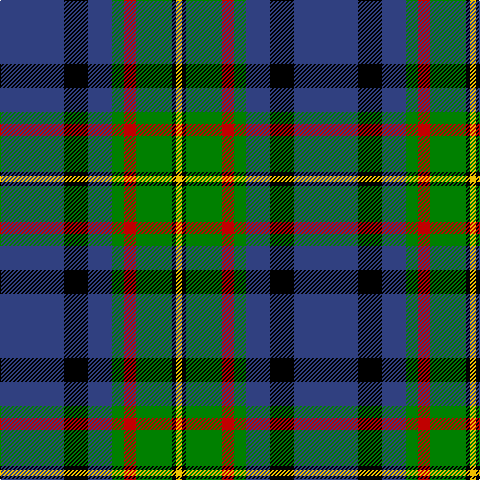

In pattern [BKBGRGKY](/patterns/bkbgrgky/).

This was sourced from weddslist.  It is a [8 stripes tartan](/stripes/stripes8/).

Original link http://www.weddslist.com/cgi-bin/tartans/pg.pl?source=sts

## Thread count
B/64 K24 B24 G12 R12 G36 K4 Y/6

## Palette
Each colour and its ΔE from the base-6 reference it is a variant of.

| Colour | Shade | Base | ΔE (OKLab) |
|---|---|---|---|
| B | <code style="background-color:#304080;">#304080</code> `#304080` | B <code style="background-color:#2A418A;">#2A418A</code> | 0.02 |
| G | <code style="background-color:#008000;">#008000</code> `#008000` | G <code style="background-color:#006100;">#006100</code> | 0.10 |
| K | <code style="background-color:#000000;">#000000</code> `#000000` | K <code style="background-color:#000000;">#000000</code> | 0.00 |
| R | <code style="background-color:#C00000;">#C00000</code> `#C00000` | R <code style="background-color:#CC0000;">#CC0000</code> | 0.03 |
| Y | <code style="background-color:#F0C000;">#F0C000</code> `#F0C000` | Y <code style="background-color:#F2BF00;">#F2BF00</code> | 0.00 |

# Sample pattern

## Nearest tartans

The nearest existing variants by ΔTartan distance.

1. [MacMillan Hunting Clan Tartan Tartan Number: 667. Earliest known date: (1906) The modern Hunting MacMillan incorporates red and yellow stripes from the ancient design with the greens and blues of the Vestiarium version. - J. Cant. If Cant's notes are good, then the Vestiarium reference would place the design much earlier - say 1842. - BU. This version which lacks a black stripe outlining the blue square is not generally used. See products available Copyright © Blair Urquhart, Comrie, 2015](/setts/s9/b10y3b30y5k8g16r4g16r2~b2c2c80-g006818-k101010-rd05054-ye8c000~x2/) — ΔT 0.79
1. [Luker (Personal)](/setts/s9/w8g15k15g5k2g6k40b20r6~b003c64-g006818-k101010-rc80000-we0e0e0/) — ΔT 0.84
1. [Lee (Personal)](/setts/s7/g2k1g12r4g3b9w2~b00008c-g004c00-k000000-r8c0000-wc8c8c8~x4/) — ΔT 0.88
1. [Ferguson of Athol](/setts/s7/b24k8g8r2g8k1w2~b304080-g008000-k000000-rc00000-we0e0e0~x2/) — ΔT 0.90
1. [MacLaren](/setts/s7/b24k8g8r2g8k1y2~b304080-g008000-k000000-rc00000-yf0c000~x2/) — ΔT 0.90
1. [Croy, Jake (Personal)](/setts/s8/b10k7w2wa2k27ba7w2ba7~b505050-ba1870a4-k1c1714-w82cffd-wae8ccb8~x2/) — ΔT 0.91
1. [MacMillan, hunting](/setts/s9/b10y3b30y5k8g16r4g16r2~b304080-g008000-k000000-rd03030-yf0c000~x2/) — ΔT 0.92
1. [Steve Walls](/setts/s10/r3y1b15g16b3r6b6g8b15w3~b202060-g006818-rc80000-wfcfcfc-ye8c000~x2/) — ΔT 0.92
1. [City of Guelph](/setts/s8/g28k4g5b4g5k19ba19ga2~b600030-ba304080-g008000-ga908000-k000030~x2/) — ΔT 0.98
1. [Leslie, Hebridean](/setts/s6/k6g15w2b22r2k4~b304080-g008000-k000000-rd03030-we0e0e0~x2/) — ΔT 1.00

## Neighbour map

Every grey dot is one of 15726 variants placed by the first two principal components of the ΔTartan feature space (44% of its variance). Red is this tartan; blue dots are its nearest — click one to open its page.

<svg viewBox="0 0 640 380" role="img" style="max-width:100%;height:auto;border:1px solid #e0e0e0;border-radius:4px;display:block" xmlns="http://www.w3.org/2000/svg"><image href="/nn/cloud.v1.png" width="640" height="380"/><a href="/setts/s9/b10y3b30y5k8g16r4g16r2~b2c2c80-g006818-k101010-rd05054-ye8c000~x2/"><circle cx="201.0" cy="166.7" r="4" fill="#3465a4"><title>MacMillan Hunting Clan Tartan Tartan Number: 667. Earliest known date: (1906) The modern Hunting MacMillan incorporates red and yellow stripes from the ancient design with the greens and blues of the Vestiarium version. - J. Cant. If Cant's notes are good, then the Vestiarium reference would place the design much earlier - say 1842. - BU. This version which lacks a black stripe outlining the blue square is not generally used. See products available Copyright © Blair Urquhart, Comrie, 2015</title></circle></a><a href="/setts/s9/w8g15k15g5k2g6k40b20r6~b003c64-g006818-k101010-rc80000-we0e0e0/"><circle cx="235.6" cy="156.9" r="4" fill="#3465a4"><title>Luker (Personal)</title></circle></a><a href="/setts/s7/g2k1g12r4g3b9w2~b00008c-g004c00-k000000-r8c0000-wc8c8c8~x4/"><circle cx="245.3" cy="192.9" r="4" fill="#3465a4"><title>Lee (Personal)</title></circle></a><a href="/setts/s7/b24k8g8r2g8k1w2~b304080-g008000-k000000-rc00000-we0e0e0~x2/"><circle cx="231.3" cy="146.0" r="4" fill="#3465a4"><title>Ferguson of Athol</title></circle></a><a href="/setts/s7/b24k8g8r2g8k1y2~b304080-g008000-k000000-rc00000-yf0c000~x2/"><circle cx="233.1" cy="146.5" r="4" fill="#3465a4"><title>MacLaren</title></circle></a><a href="/setts/s8/b10k7w2wa2k27ba7w2ba7~b505050-ba1870a4-k1c1714-w82cffd-wae8ccb8~x2/"><circle cx="264.0" cy="167.8" r="4" fill="#3465a4"><title>Croy, Jake (Personal)</title></circle></a><a href="/setts/s9/b10y3b30y5k8g16r4g16r2~b304080-g008000-k000000-rd03030-yf0c000~x2/"><circle cx="185.7" cy="160.6" r="4" fill="#3465a4"><title>MacMillan, hunting</title></circle></a><a href="/setts/s10/r3y1b15g16b3r6b6g8b15w3~b202060-g006818-rc80000-wfcfcfc-ye8c000~x2/"><circle cx="244.0" cy="170.8" r="4" fill="#3465a4"><title>Steve Walls</title></circle></a><a href="/setts/s8/g28k4g5b4g5k19ba19ga2~b600030-ba304080-g008000-ga908000-k000030~x2/"><circle cx="205.8" cy="176.4" r="4" fill="#3465a4"><title>City of Guelph</title></circle></a><a href="/setts/s6/k6g15w2b22r2k4~b304080-g008000-k000000-rd03030-we0e0e0~x2/"><circle cx="184.4" cy="184.9" r="4" fill="#3465a4"><title>Leslie, Hebridean</title></circle></a><circle cx="218.8" cy="167.3" r="5" fill="#c00000"/></svg>

ID: /setts/s8/b32k12b12g6r6g18k2y3~b304080-g008000-k000000-rc00000-yf0c000~x2/
