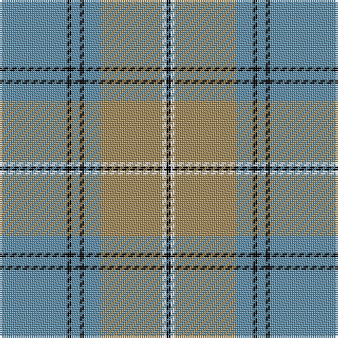

In pattern [BKBKBYWK](/patterns/bkbkbywk/).

This was sourced from register-of-tartans.  It is a [8 stripes tartan](/stripes/stripes8/).

Original link https://www.tartanregister.gov.uk/tartanDetails.aspx?ref=11624

## Thread count
B/32 K2 B4 K2 B8 LT29 W2 K/2

## Palette
Each colour and its ΔE from the base-6 reference it is a variant of.

| Colour | Shade | Base | ΔE (OKLab) |
|---|---|---|---|
| B | <code style="background-color:#5C8CA8;">#5C8CA8</code> `#5C8CA8` | B <code style="background-color:#2A418A;">#2A418A</code> | 0.23 |
| K | <code style="background-color:#000000;">#000000</code> `#000000` | K <code style="background-color:#000000;">#000000</code> | 0.00 |
| LT | <code style="background-color:#A08858;">#A08858</code> `#A08858` | Y <code style="background-color:#F2BF00;">#F2BF00</code> | 0.21 |
| W | <code style="background-color:#F8F8F8;">#F8F8F8</code> `#F8F8F8` | W <code style="background-color:#F7F7F7;">#F7F7F7</code> | 0.00 |

# Sample pattern

## Nearest tartans

The nearest existing variants by ΔTartan distance.

1. [Doune (District)](/setts/s9/r10b11k2b3k2b2k8r40w4~b5c8ca8-k101010-r888888-wf8f8f8~x2/) — ΔT 0.76
1. [Bedford Academy (Corporate)](/setts/s9/r8y4r35b2ba8b2r4b21r4~b242468-ba5c8ca8-r888888-ye8c000~x2/) — ΔT 0.99
1. [Doune District Tartan Tartan Number: 4707. Earliest known date: 01/01/2002 A colour variation of Stewart Bute. See products available Copyright © Blair Urquhart, Comrie, 2015](/setts/s9/r10b11k2b3k2b2k8r40ka4~b5c8ca8-k101010-ka000000-r888888~x2/) — ΔT 1.02
1. [Haddrell (2013)](/setts/s7/r2b4w18ba2w2ba41wa2~b1474b4-ba5c5c5c-rc80000-wc0c0c0-wafcfcfc~x2/) — ΔT 1.37
1. [Kinding (Personal)](/setts/s7/k10b30g3b3g3b3r6~b5c8ca8-g249018-k101010-rc80000~x2/) — ΔT 1.37
1. [Kyle](/setts/s7/g19k2w2k2b5k2b5~b505050-g808080-k101010-we0e0e0~x4/) — ΔT 1.37
1. [Tilburg Hunting (District)](/setts/s7/b6k3b37y41w3y6w3~b1068a4-k101010-we0e0e0-yd8a810~x2/) — ΔT 1.39
1. [Norris (1998) (Name)](/setts/s6/k2w1g5r1b18r2~b5c8ca8-g006818-k101010-r880000-we0e0e0~x2/) — ΔT 1.40
1. [Machair](/setts/s6/y72b16w9b4w5b16~b003c64-we0e0e0-ya08858~x2/) — ΔT 1.46
1. [Carrick Hunting (Personal)](/setts/s8/g13b1g1b1g3ba5k4y2~b780078-ba1474b4-g408060-k101010-ye8c000~x4/) — ΔT 1.49

## Neighbour map

Every grey dot is one of 15726 variants placed by the first two principal components of the ΔTartan feature space (44% of its variance). Red is this tartan; blue dots are its nearest — click one to open its page.

<svg viewBox="0 0 640 380" role="img" style="max-width:100%;height:auto;border:1px solid #e0e0e0;border-radius:4px;display:block" xmlns="http://www.w3.org/2000/svg"><image href="/nn/cloud.v1.png" width="640" height="380"/><a href="/setts/s9/r10b11k2b3k2b2k8r40w4~b5c8ca8-k101010-r888888-wf8f8f8~x2/"><circle cx="373.7" cy="144.6" r="4" fill="#3465a4"><title>Doune (District)</title></circle></a><a href="/setts/s9/r8y4r35b2ba8b2r4b21r4~b242468-ba5c8ca8-r888888-ye8c000~x2/"><circle cx="355.9" cy="164.0" r="4" fill="#3465a4"><title>Bedford Academy (Corporate)</title></circle></a><a href="/setts/s9/r10b11k2b3k2b2k8r40ka4~b5c8ca8-k101010-ka000000-r888888~x2/"><circle cx="365.0" cy="143.1" r="4" fill="#3465a4"><title>Doune District Tartan Tartan Number: 4707. Earliest known date: 01/01/2002 A colour variation of Stewart Bute. See products available Copyright © Blair Urquhart, Comrie, 2015</title></circle></a><a href="/setts/s7/r2b4w18ba2w2ba41wa2~b1474b4-ba5c5c5c-rc80000-wc0c0c0-wafcfcfc~x2/"><circle cx="380.0" cy="133.4" r="4" fill="#3465a4"><title>Haddrell (2013)</title></circle></a><a href="/setts/s7/k10b30g3b3g3b3r6~b5c8ca8-g249018-k101010-rc80000~x2/"><circle cx="337.8" cy="186.7" r="4" fill="#3465a4"><title>Kinding (Personal)</title></circle></a><a href="/setts/s7/g19k2w2k2b5k2b5~b505050-g808080-k101010-we0e0e0~x4/"><circle cx="290.9" cy="191.2" r="4" fill="#3465a4"><title>Kyle</title></circle></a><a href="/setts/s7/b6k3b37y41w3y6w3~b1068a4-k101010-we0e0e0-yd8a810~x2/"><circle cx="286.1" cy="163.3" r="4" fill="#3465a4"><title>Tilburg Hunting (District)</title></circle></a><a href="/setts/s6/k2w1g5r1b18r2~b5c8ca8-g006818-k101010-r880000-we0e0e0~x2/"><circle cx="366.2" cy="155.0" r="4" fill="#3465a4"><title>Norris (1998) (Name)</title></circle></a><a href="/setts/s6/y72b16w9b4w5b16~b003c64-we0e0e0-ya08858~x2/"><circle cx="380.5" cy="181.3" r="4" fill="#3465a4"><title>Machair</title></circle></a><a href="/setts/s8/g13b1g1b1g3ba5k4y2~b780078-ba1474b4-g408060-k101010-ye8c000~x4/"><circle cx="290.8" cy="168.8" r="4" fill="#3465a4"><title>Carrick Hunting (Personal)</title></circle></a><circle cx="340.8" cy="162.6" r="5" fill="#c00000"/></svg>

ID: /setts/s8/b32k2b4k2b8y29w2k2~b5c8ca8-k000000-wf8f8f8-ya08858/
