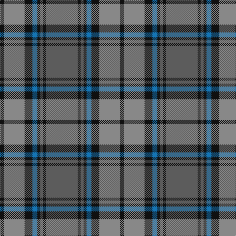

In pattern [BKBKBKRK](/patterns/bkbkbkrk/).

This was sourced from tartans-authority.  It is a [8 stripes tartan](/stripes/stripes8/).

Original link http://www.tartansauthority.com/tartan-ferret/display/8971/

## Thread count
K/8 Na42 K16 B10 K6 N6 K6 N/64

## Palette
Each colour and its ΔE from the base-6 reference it is a variant of.

| Colour | Shade | Base | ΔE (OKLab) |
|---|---|---|---|
| B | <code style="background-color:#1474B4;">#1474B4</code> `#1474B4` | B <code style="background-color:#2A418A;">#2A418A</code> | 0.15 |
| K | <code style="background-color:#101010;">#101010</code> `#101010` | K <code style="background-color:#000000;">#000000</code> | 0.17 |
| N | <code style="background-color:#5C5C5C;">#5C5C5C</code> `#5C5C5C` | B <code style="background-color:#2A418A;">#2A418A</code> | 0.15 |
| Na | <code style="background-color:#888888;">#888888</code> `#888888` | R <code style="background-color:#CC0000;">#CC0000</code> | 0.24 |

# Sample pattern

## Nearest tartans

The nearest existing variants by ΔTartan distance.

1. [Speyside Grey (Fashion)](/setts/s8/b32k3b3k3r5k8ra21k4~b5c5c5c-k101010-r98481c-ra888888~x2/) — ΔT 0.33
1. [Cape Breton University Chemistry Society](/setts/s10/b4r17b4g4b2g4b4g27b4y4~b000080-g546c3a-r943602-yc49d38~x2/) — ΔT 0.82
1. [Antrim, County](/setts/s10/g5b2g18y2b5y2r5b17g2y4~b14283c-g406054-rc04c08-ybc8c00~x2/) — ΔT 0.88
1. [Cork Irish County Tartan Tartan Number: 2253. Earliest known date: 1996 One of a series of Irish District tartans designed by Polly Wittering of the House of Edgar, with colours reminiscent of the Country with soft warm colours dominating. See products available Copyright © Blair Urquhart, Comrie, 2015](/setts/s9/g28r12g4b20y2b3y2b3g7~b141c50-g3c6838-r8c0020-yc48800~x2/) — ΔT 0.93
1. [Auld Lang Syne](/setts/s8/k1b1k1b7g7k1g1w1~b07648c-g503c14-k101010-w82f5fa~x6/) — ΔT 0.94
1. [Stewart of Appin Htg (error)](/setts/s10/g8r3g3r5g26b7ba3b28r3b6~b2c2c80-ba5c8ca8-g006818-rc80000~x2/) — ΔT 0.96
1. [Beck-McSorley](/setts/s8/r1g1r1g7ra7r1ra1rb1~g003820-r9c68a4-ra888888-rbe87878~x6/) — ΔT 0.97
1. [Durie (Clan)](/setts/s9/b12r1b1r1b1r4g12y1g2~b202060-g006818-r880000-ye8c000~x4/) — ΔT 1.01
1. [Kyle](/setts/s7/g19k2w2k2b5k2b5~b505050-g808080-k101010-we0e0e0~x4/) — ΔT 1.06
1. [Stuart/Stewart of Appin](/setts/s10/g8r3g3r5g26b7ba3b28r3b6~b2c4084-ba3c82af-g005020-rdc0000~x2/) — ΔT 1.06

## Neighbour map

Every grey dot is one of 15726 variants placed by the first two principal components of the ΔTartan feature space (44% of its variance). Red is this tartan; blue dots are its nearest — click one to open its page.

<svg viewBox="0 0 640 380" role="img" style="max-width:100%;height:auto;border:1px solid #e0e0e0;border-radius:4px;display:block" xmlns="http://www.w3.org/2000/svg"><image href="/nn/cloud.v1.png" width="640" height="380"/><a href="/setts/s8/b32k3b3k3r5k8ra21k4~b5c5c5c-k101010-r98481c-ra888888~x2/"><circle cx="268.3" cy="192.6" r="4" fill="#3465a4"><title>Speyside Grey (Fashion)</title></circle></a><a href="/setts/s10/b4r17b4g4b2g4b4g27b4y4~b000080-g546c3a-r943602-yc49d38~x2/"><circle cx="278.7" cy="171.9" r="4" fill="#3465a4"><title>Cape Breton University Chemistry Society</title></circle></a><a href="/setts/s10/g5b2g18y2b5y2r5b17g2y4~b14283c-g406054-rc04c08-ybc8c00~x2/"><circle cx="246.9" cy="200.4" r="4" fill="#3465a4"><title>Antrim, County</title></circle></a><a href="/setts/s9/g28r12g4b20y2b3y2b3g7~b141c50-g3c6838-r8c0020-yc48800~x2/"><circle cx="301.7" cy="188.0" r="4" fill="#3465a4"><title>Cork Irish County Tartan Tartan Number: 2253. Earliest known date: 1996 One of a series of Irish District tartans designed by Polly Wittering of the House of Edgar, with colours reminiscent of the Country with soft warm colours dominating. See products available Copyright © Blair Urquhart, Comrie, 2015</title></circle></a><a href="/setts/s8/k1b1k1b7g7k1g1w1~b07648c-g503c14-k101010-w82f5fa~x6/"><circle cx="240.9" cy="211.0" r="4" fill="#3465a4"><title>Auld Lang Syne</title></circle></a><a href="/setts/s10/g8r3g3r5g26b7ba3b28r3b6~b2c2c80-ba5c8ca8-g006818-rc80000~x2/"><circle cx="268.7" cy="194.3" r="4" fill="#3465a4"><title>Stewart of Appin Htg (error)</title></circle></a><a href="/setts/s8/r1g1r1g7ra7r1ra1rb1~g003820-r9c68a4-ra888888-rbe87878~x6/"><circle cx="233.3" cy="200.5" r="4" fill="#3465a4"><title>Beck-McSorley</title></circle></a><a href="/setts/s9/b12r1b1r1b1r4g12y1g2~b202060-g006818-r880000-ye8c000~x4/"><circle cx="264.6" cy="178.5" r="4" fill="#3465a4"><title>Durie (Clan)</title></circle></a><a href="/setts/s7/g19k2w2k2b5k2b5~b505050-g808080-k101010-we0e0e0~x4/"><circle cx="290.9" cy="191.2" r="4" fill="#3465a4"><title>Kyle</title></circle></a><a href="/setts/s10/g8r3g3r5g26b7ba3b28r3b6~b2c4084-ba3c82af-g005020-rdc0000~x2/"><circle cx="291.6" cy="204.0" r="4" fill="#3465a4"><title>Stuart/Stewart of Appin</title></circle></a><circle cx="264.8" cy="193.0" r="5" fill="#c00000"/></svg>

ID: /setts/s8/b32k3b3k3ba5k8r21k4~b5c5c5c-ba1474b4-k101010-r888888~x2/
