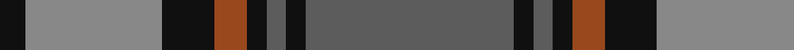
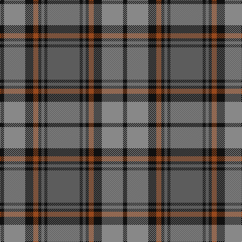

In pattern [BKBKRKRK](/patterns/bkbkrkrk/).

This was sourced from tartans-authority.  It is a [8 stripes tartan](/stripes/stripes8/).

Original link http://www.tartansauthority.com/tartan-ferret/display/8972/

## Thread count
K/8 Na42 K16 T10 K6 N6 K6 N/64

## Palette
Each colour and its ΔE from the base-6 reference it is a variant of.

| Colour | Shade | Base | ΔE (OKLab) |
|---|---|---|---|
| K | <code style="background-color:#101010;">#101010</code> `#101010` | K <code style="background-color:#000000;">#000000</code> | 0.17 |
| N | <code style="background-color:#5C5C5C;">#5C5C5C</code> `#5C5C5C` | B <code style="background-color:#2A418A;">#2A418A</code> | 0.15 |
| Na | <code style="background-color:#888888;">#888888</code> `#888888` | R <code style="background-color:#CC0000;">#CC0000</code> | 0.24 |
| T | <code style="background-color:#98481C;">#98481C</code> `#98481C` | R <code style="background-color:#CC0000;">#CC0000</code> | 0.11 |

# Sample pattern

## Nearest tartans

The nearest existing variants by ΔTartan distance.

1. [Speyside Blue (Fashion)](/setts/s8/b32k3b3k3ba5k8r21k4x2~b5c5c5c-ba1474b4-k101010-r888888/) — ΔT 0.33
1. [Cape Breton University Chemistry Society](/setts/s10/b4r17b4g4b2g4b4g27b4y4x2~b000080-g546c3a-r943602-yc49d38/) — ΔT 0.79
1. [Antrim, County](/setts/s10/g5b2g18y2b5y2r5b17g2y4x2~b14283c-g406054-rc04c08-ybc8c00/) — ΔT 0.83
1. [Cork Irish County Tartan Tartan Number: 2253. Earliest known date: 1996 One of a series of Irish District tartans designed by Polly Wittering of the House of Edgar, with colours reminiscent of the Country with soft warm colours dominating. See products available Copyright © Blair Urquhart, Comrie, 2015](/setts/s9/g28r12g4b20y2b3y2b3g7x2~b141c50-g3c6838-r8c0020-yc48800/) — ΔT 0.89
1. [Beck-McSorley](/setts/s8/r1g1r1g7ra7r1ra1rb1x6~g003820-r9c68a4-ra888888-rbe87878/) — ΔT 1.01
1. [Brave for Men](/setts/s8/k5r5k5r34b33k6b5ba2~b3d3d3d-ba778899-k101010-r906c5a/) — ΔT 1.04
1. [Durie (Clan)](/setts/s9/b12r1b1r1b1r4g12y1g2x4~b202060-g006818-r880000-ye8c000/) — ΔT 1.05
1. [Auld Lang Syne](/setts/s8/k1b1k1b7g7k1g1w1x6~b07648c-g503c14-k101010-w82f5fa/) — ΔT 1.09
1. [Unidentified Plaid #15](/setts/s10/r4b3r32ba30r4g32r3g32r3g3x2~b3c82af-ba2c4084-g005020-rdc0000/) — ΔT 1.09
1. [Robertson of Struan](/setts/s7/r6b2r2b21g20r4g4x2~b2c4084-g005020-rdc0000/) — ΔT 1.10

## Neighbour map

Every grey dot is one of 15726 variants placed by the first two principal components of the ΔTartan feature space (44% of its variance). Red is this tartan; blue dots are its nearest — click one to open its page.

<svg viewBox="0 0 640 380" role="img" style="max-width:100%;height:auto;border:1px solid #e0e0e0;border-radius:4px;display:block" xmlns="http://www.w3.org/2000/svg"><image href="/nn/cloud.v1.png" width="640" height="380"/><a href="/setts/s8/b32k3b3k3ba5k8r21k4x2~b5c5c5c-ba1474b4-k101010-r888888/"><circle cx="264.8" cy="193.0" r="4" fill="#3465a4"><title>Speyside Blue (Fashion)</title></circle></a><a href="/setts/s10/b4r17b4g4b2g4b4g27b4y4x2~b000080-g546c3a-r943602-yc49d38/"><circle cx="278.7" cy="171.9" r="4" fill="#3465a4"><title>Cape Breton University Chemistry Society</title></circle></a><a href="/setts/s10/g5b2g18y2b5y2r5b17g2y4x2~b14283c-g406054-rc04c08-ybc8c00/"><circle cx="246.9" cy="200.4" r="4" fill="#3465a4"><title>Antrim, County</title></circle></a><a href="/setts/s9/g28r12g4b20y2b3y2b3g7x2~b141c50-g3c6838-r8c0020-yc48800/"><circle cx="301.7" cy="188.0" r="4" fill="#3465a4"><title>Cork Irish County Tartan Tartan Number: 2253. Earliest known date: 1996 One of a series of Irish District tartans designed by Polly Wittering of the House of Edgar, with colours reminiscent of the Country with soft warm colours dominating. See products available Copyright © Blair Urquhart, Comrie, 2015</title></circle></a><a href="/setts/s8/r1g1r1g7ra7r1ra1rb1x6~g003820-r9c68a4-ra888888-rbe87878/"><circle cx="233.3" cy="200.5" r="4" fill="#3465a4"><title>Beck-McSorley</title></circle></a><a href="/setts/s8/k5r5k5r34b33k6b5ba2~b3d3d3d-ba778899-k101010-r906c5a/"><circle cx="308.5" cy="182.1" r="4" fill="#3465a4"><title>Brave for Men</title></circle></a><a href="/setts/s9/b12r1b1r1b1r4g12y1g2x4~b202060-g006818-r880000-ye8c000/"><circle cx="264.6" cy="178.5" r="4" fill="#3465a4"><title>Durie (Clan)</title></circle></a><a href="/setts/s8/k1b1k1b7g7k1g1w1x6~b07648c-g503c14-k101010-w82f5fa/"><circle cx="240.9" cy="211.0" r="4" fill="#3465a4"><title>Auld Lang Syne</title></circle></a><a href="/setts/s10/r4b3r32ba30r4g32r3g32r3g3x2~b3c82af-ba2c4084-g005020-rdc0000/"><circle cx="264.5" cy="181.7" r="4" fill="#3465a4"><title>Unidentified Plaid #15</title></circle></a><a href="/setts/s7/r6b2r2b21g20r4g4x2~b2c4084-g005020-rdc0000/"><circle cx="282.4" cy="225.2" r="4" fill="#3465a4"><title>Robertson of Struan</title></circle></a><circle cx="268.3" cy="192.6" r="5" fill="#c00000"/></svg>

ID: /setts/s8/b32k3b3k3r5k8ra21k4x2~b5c5c5c-k101010-r98481c-ra888888/
