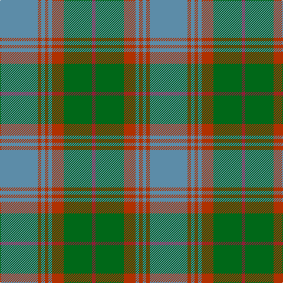

In pattern [BRBRBRGR](/patterns/brbrbrgr/).

This was sourced from register-of-tartans.  It is a [8 stripes tartan](/stripes/stripes8/).

Original link https://www.tartanregister.gov.uk/tartanDetails.aspx?ref=1311

## Attestations

This cloth appears in 2 source records; the oldest owns this page.

- 01/01/1965 — Gammell (Personal) (register-of-tartans, [record](https://www.tartanregister.gov.uk/tartanDetails.aspx?ref=1311))
- 1965 — Gammell (Personal) (tartans-authority, [record](http://www.tartansauthority.com/tartan-ferret/display/597/))

## Register references

External register numbers recorded for this tartan.

- Scottish Register of Tartans: [1311](https://www.tartanregister.gov.uk/tartanDetails.aspx?ref=1311)
- Scottish Tartans Authority (ITI): 597
- Scottish Tartans World Register: 597

## Thread count
B/64 R6 B6 R6 B6 R20 G48 DR/6

## Palette
Each colour and its ΔE from the base-6 reference it is a variant of.

| Colour | Shade | Base | ΔE (OKLab) |
|---|---|---|---|
| B | <code style="background-color:#5C8CA8;">#5C8CA8</code> `#5C8CA8` | B <code style="background-color:#2A418A;">#2A418A</code> | 0.23 |
| DR | <code style="background-color:#901C38;">#901C38</code> `#901C38` | R <code style="background-color:#CC0000;">#CC0000</code> | 0.13 |
| G | <code style="background-color:#006818;">#006818</code> `#006818` | G <code style="background-color:#006100;">#006100</code> | 0.02 |
| R | <code style="background-color:#B03000;">#B03000</code> `#B03000` | R <code style="background-color:#CC0000;">#CC0000</code> | 0.06 |

# Sample pattern

## Nearest tartans

The nearest existing variants by ΔTartan distance.

1. [Johore](/setts/s8/r57w5g20r5y10r5g20w5~g006818-r888888-we0e0e0-yd09800~x2/) — ΔT 0.97
1. [Hebridean Granite Fashion Tartan Tartan Number: 6821. Earliest known date: 2005 For a new House of Edgar collection. Intended to emulate the gray morning suit perhaps. See products available Copyright © Blair Urquhart, Comrie, 2015](/setts/s8/r3y4r4b4r18b3ba36w3~b383838-ba484848-r888888-we0e0e0-yb0b0b0~x2/) — ΔT 1.15
1. [Dama Classic (Fashion)](/setts/s8/y30w3y3w3y12b30r3b5~b5c5c5c-r888888-wf0dcbc-ya0a0a0~x2/) — ΔT 1.22
1. [Bressuire (District)](/setts/s7/r1g4y1g3r4b15w1~b506878-g006818-r880000-we0e0e0-ybc8c00~x4/) — ΔT 1.22
1. [Speyside Grey (Fashion)](/setts/s8/b32k3b3k3r5k8ra21k4~b5c5c5c-k101010-r98481c-ra888888~x2/) — ΔT 1.24
1. [Hawaii (District)](/setts/s8/b4r1y1b12ba4g10y1r3~b5c8ca8-ba4c3428-g406054-rc80000-ye8c000~x4/) — ΔT 1.24
1. [Hebridean Granite (Fashion)](/setts/s8/r3y4r4k4r18k3b36w3~b5c5c5c-k101010-r888888-wf8f8f8-ya0a0a0~x2/) — ΔT 1.24
1. [Crantock](/setts/s8/g24b3g3b3g3b7ga20r3~b4c1864-g647c00-ga004028-rc80000~x2/) — ΔT 1.25
1. [Peter of Lee (Personal)](/setts/s8/r3g1k1g12b12k1b1k1~b1474b4-g408060-k101010-rc80000~x4/) — ΔT 1.25
1. [Universal Ancient International Tartan Tartan Number: 136. Earliest known date: Canada This design is different in warp and weft. The display gives the general appearance only. Produced to celebrate American tourism is Scotland. The colours are taken from the flags of the two nations and the Atlantic Ocean that separates them. See products available Copyright © Blair Urquhart, Comrie, 2015](/setts/s8/b12g2b2g2b2ga8gb8ga1~b5c8ca8-g006818-ga604000-gb289c18~x2/) — ΔT 1.26

## Neighbour map

Every grey dot is one of 15726 variants placed by the first two principal components of the ΔTartan feature space (44% of its variance). Red is this tartan; blue dots are its nearest — click one to open its page.

<svg viewBox="0 0 640 380" role="img" style="max-width:100%;height:auto;border:1px solid #e0e0e0;border-radius:4px;display:block" xmlns="http://www.w3.org/2000/svg"><image href="/nn/cloud.v1.png" width="640" height="380"/><a href="/setts/s8/r57w5g20r5y10r5g20w5~g006818-r888888-we0e0e0-yd09800~x2/"><circle cx="327.8" cy="191.0" r="4" fill="#3465a4"><title>Johore</title></circle></a><a href="/setts/s8/r3y4r4b4r18b3ba36w3~b383838-ba484848-r888888-we0e0e0-yb0b0b0~x2/"><circle cx="301.3" cy="167.1" r="4" fill="#3465a4"><title>Hebridean Granite Fashion Tartan Tartan Number: 6821. Earliest known date: 2005 For a new House of Edgar collection. Intended to emulate the gray morning suit perhaps. See products available Copyright © Blair Urquhart, Comrie, 2015</title></circle></a><a href="/setts/s8/y30w3y3w3y12b30r3b5~b5c5c5c-r888888-wf0dcbc-ya0a0a0~x2/"><circle cx="343.0" cy="202.1" r="4" fill="#3465a4"><title>Dama Classic (Fashion)</title></circle></a><a href="/setts/s7/r1g4y1g3r4b15w1~b506878-g006818-r880000-we0e0e0-ybc8c00~x4/"><circle cx="331.2" cy="176.1" r="4" fill="#3465a4"><title>Bressuire (District)</title></circle></a><a href="/setts/s8/b32k3b3k3r5k8ra21k4~b5c5c5c-k101010-r98481c-ra888888~x2/"><circle cx="268.3" cy="192.6" r="4" fill="#3465a4"><title>Speyside Grey (Fashion)</title></circle></a><a href="/setts/s8/b4r1y1b12ba4g10y1r3~b5c8ca8-ba4c3428-g406054-rc80000-ye8c000~x4/"><circle cx="248.0" cy="183.9" r="4" fill="#3465a4"><title>Hawaii (District)</title></circle></a><a href="/setts/s8/r3y4r4k4r18k3b36w3~b5c5c5c-k101010-r888888-wf8f8f8-ya0a0a0~x2/"><circle cx="289.8" cy="161.8" r="4" fill="#3465a4"><title>Hebridean Granite (Fashion)</title></circle></a><a href="/setts/s8/g24b3g3b3g3b7ga20r3~b4c1864-g647c00-ga004028-rc80000~x2/"><circle cx="266.3" cy="210.4" r="4" fill="#3465a4"><title>Crantock</title></circle></a><a href="/setts/s8/r3g1k1g12b12k1b1k1~b1474b4-g408060-k101010-rc80000~x4/"><circle cx="279.5" cy="185.9" r="4" fill="#3465a4"><title>Peter of Lee (Personal)</title></circle></a><a href="/setts/s8/b12g2b2g2b2ga8gb8ga1~b5c8ca8-g006818-ga604000-gb289c18~x2/"><circle cx="262.8" cy="213.1" r="4" fill="#3465a4"><title>Universal Ancient International Tartan Tartan Number: 136. Earliest known date: Canada This design is different in warp and weft. The display gives the general appearance only. Produced to celebrate American tourism is Scotland. The colours are taken from the flags of the two nations and the Atlantic Ocean that separates them. See products available Copyright © Blair Urquhart, Comrie, 2015</title></circle></a><circle cx="302.0" cy="195.6" r="5" fill="#c00000"/></svg>

ID: /setts/s8/b32r3b3r3b3r10g24ra3~b5c8ca8-g006818-rb03000-ra901c38~x2/
