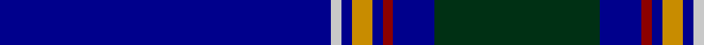

In pattern [BWBYBRBG](/patterns/bwbybrbg/).

This was sourced from register-of-tartans.  It is a [8 stripes tartan](/stripes/stripes8/).

Original link https://www.tartanregister.gov.uk/tartanDetails.aspx?ref=3585

## Attestations

This cloth appears in 2 source records; the oldest owns this page.

- 01/01/1997 — Royal Agricultural Winter Fair (register-of-tartans, [record](https://www.tartanregister.gov.uk/tartanDetails.aspx?ref=3585))
- 1997 — Royal Agricultural Winter Fair (Comm (tartans-authority, [record](http://www.tartansauthority.com/tartan-ferret/display/5408/))

## Thread count
DB/128 N4 DB4 DY8 DB4 DR4 DB16 DG/64

## Palette
Each colour and its ΔE from the base-6 reference it is a variant of.

| Colour | Shade | Base | ΔE (OKLab) |
|---|---|---|---|
| DB | <code style="background-color:#00008C;">#00008C</code> `#00008C` | B <code style="background-color:#2A418A;">#2A418A</code> | 0.13 |
| DG | <code style="background-color:#003014;">#003014</code> `#003014` | G <code style="background-color:#006100;">#006100</code> | 0.17 |
| DR | <code style="background-color:#8C0000;">#8C0000</code> `#8C0000` | R <code style="background-color:#CC0000;">#CC0000</code> | 0.14 |
| DY | <code style="background-color:#C88C00;">#C88C00</code> `#C88C00` | Y <code style="background-color:#F2BF00;">#F2BF00</code> | 0.15 |
| N | <code style="background-color:#C8C8C8;">#C8C8C8</code> `#C8C8C8` | W <code style="background-color:#F7F7F7;">#F7F7F7</code> | 0.14 |

# Sample pattern

## Nearest tartans

The nearest existing variants by ΔTartan distance.

1. [Blue Rust (Corporate)](/setts/s8/b21ba2y1ba2b1r2b1ra6x4~b000088-ba606060-r880000-ra886024-yacacac/) — ΔT 1.20
1. [MacLaurin of Broich (Clan)](/setts/s7/b36k8g3r3g6k1y2x2~b200088-g006818-k101010-r880000-yd09800/) — ΔT 1.26
1. [Marist School, The](/setts/s8/b29ba2b1ba1b1ba1bb8y1x4~b1c0070-ba2c2c80-bb5c8ca8-yd09800/) — ΔT 1.39
1. [S.C.O.T.S.](/setts/s6/b55ba18w3ba2r2ba6x2~b304080-ba000050-rc00020-we0e0e0/) — ΔT 1.40
1. [French Freemasons' Pride (Fashion)](/setts/s6/b128r8ba41bb4ba4bb4~b1c0070-ba2888c4-bb5c5c5c-r901c38/) — ΔT 1.41
1. [Canberra, City of District Tartan Tartan Number: 4449. Earliest known date: pre 2002 Count from a Stathmore Woollen sample. Designed by Peter Burrows and Stewart Smith with tech support from Strathmore. For the exclusive use by Messrs Scottish Flair, Queanbeyan, Australia. Colours represented; DB for the Canberra flag. Gold (yellow) and white for the stars on the Canberra flag. mb for the Canberra Bluebell. See products available Copyright © Blair Urquhart, Comrie, 2015](/setts/s10/k76b22ka1y3ka1b3ka1w2ka1b10x2~b003478-k000034-ka000000-wfcfcfc-yc88c00/) — ΔT 1.42
1. [Parr Family Tartan Tartan Number: 439. Earliest known date: pre 2003 Almost nothing known about this tartan See products available Copyright © Blair Urquhart, Comrie, 2015](/setts/s10/b62r1b2r1b4k14g4w2g6k4x2~b2c2c80-g006818-k101010-rc80000-we0e0e0/) — ΔT 1.43
1. [Blue Rust](/setts/s8/b21ba2w1ba2b1r2b1ra6x4~b000088-ba606060-r880000-ra886024-wffffff/) — ΔT 1.43
1. [Tyneside Blue, North Tyneside Pipe Band](/setts/s7/b62k22w3k2w2k3r1x2~b304080-k000030-rc00000-we0e0e0/) — ΔT 1.46
1. [Nocken (Personal)](/setts/s9/w3k6wa2k6b2k2b32k2ba1x2~b202060-ba5c5c5c-k101010-w98c8e8-wae8ccb8/) — ΔT 1.49

## Neighbour map

Every grey dot is one of 15726 variants placed by the first two principal components of the ΔTartan feature space (44% of its variance). Red is this tartan; blue dots are its nearest — click one to open its page.

<svg viewBox="0 0 640 380" role="img" style="max-width:100%;height:auto;border:1px solid #e0e0e0;border-radius:4px;display:block" xmlns="http://www.w3.org/2000/svg"><image href="/nn/cloud.v1.png" width="640" height="380"/><a href="/setts/s8/b21ba2y1ba2b1r2b1ra6x4~b000088-ba606060-r880000-ra886024-yacacac/"><circle cx="393.1" cy="137.8" r="4" fill="#3465a4"><title>Blue Rust (Corporate)</title></circle></a><a href="/setts/s7/b36k8g3r3g6k1y2x2~b200088-g006818-k101010-r880000-yd09800/"><circle cx="396.9" cy="129.6" r="4" fill="#3465a4"><title>MacLaurin of Broich (Clan)</title></circle></a><a href="/setts/s8/b29ba2b1ba1b1ba1bb8y1x4~b1c0070-ba2c2c80-bb5c8ca8-yd09800/"><circle cx="499.7" cy="142.2" r="4" fill="#3465a4"><title>Marist School, The</title></circle></a><a href="/setts/s6/b55ba18w3ba2r2ba6x2~b304080-ba000050-rc00020-we0e0e0/"><circle cx="466.1" cy="175.3" r="4" fill="#3465a4"><title>S.C.O.T.S.</title></circle></a><a href="/setts/s6/b128r8ba41bb4ba4bb4~b1c0070-ba2888c4-bb5c5c5c-r901c38/"><circle cx="478.1" cy="157.6" r="4" fill="#3465a4"><title>French Freemasons' Pride (Fashion)</title></circle></a><a href="/setts/s10/k76b22ka1y3ka1b3ka1w2ka1b10x2~b003478-k000034-ka000000-wfcfcfc-yc88c00/"><circle cx="467.9" cy="98.2" r="4" fill="#3465a4"><title>Canberra, City of District Tartan Tartan Number: 4449. Earliest known date: pre 2002 Count from a Stathmore Woollen sample. Designed by Peter Burrows and Stewart Smith with tech support from Strathmore. For the exclusive use by Messrs Scottish Flair, Queanbeyan, Australia. Colours represented; DB for the Canberra flag. Gold (yellow) and white for the stars on the Canberra flag. mb for the Canberra Bluebell. See products available Copyright © Blair Urquhart, Comrie, 2015</title></circle></a><a href="/setts/s10/b62r1b2r1b4k14g4w2g6k4x2~b2c2c80-g006818-k101010-rc80000-we0e0e0/"><circle cx="492.0" cy="95.2" r="4" fill="#3465a4"><title>Parr Family Tartan Tartan Number: 439. Earliest known date: pre 2003 Almost nothing known about this tartan See products available Copyright © Blair Urquhart, Comrie, 2015</title></circle></a><a href="/setts/s8/b21ba2w1ba2b1r2b1ra6x4~b000088-ba606060-r880000-ra886024-wffffff/"><circle cx="380.2" cy="132.5" r="4" fill="#3465a4"><title>Blue Rust</title></circle></a><a href="/setts/s7/b62k22w3k2w2k3r1x2~b304080-k000030-rc00000-we0e0e0/"><circle cx="474.1" cy="126.1" r="4" fill="#3465a4"><title>Tyneside Blue, North Tyneside Pipe Band</title></circle></a><a href="/setts/s9/w3k6wa2k6b2k2b32k2ba1x2~b202060-ba5c5c5c-k101010-w98c8e8-wae8ccb8/"><circle cx="404.4" cy="117.6" r="4" fill="#3465a4"><title>Nocken (Personal)</title></circle></a><circle cx="446.5" cy="136.0" r="5" fill="#c00000"/></svg>

ID: /setts/s8/b32w1b1y2b1r1b4g16x4~b00008c-g003014-r8c0000-wc8c8c8-yc88c00/
